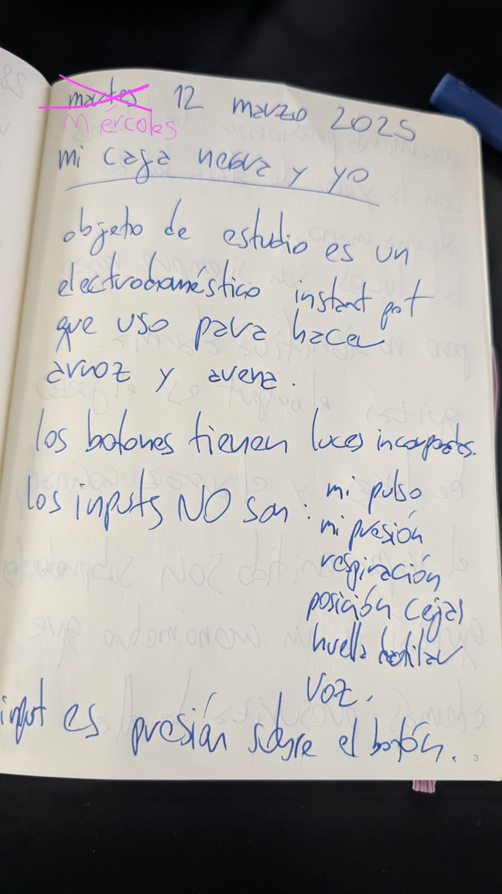
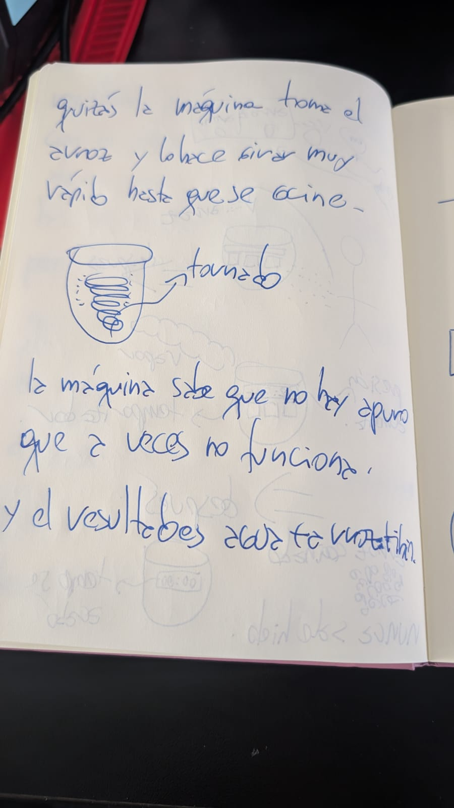
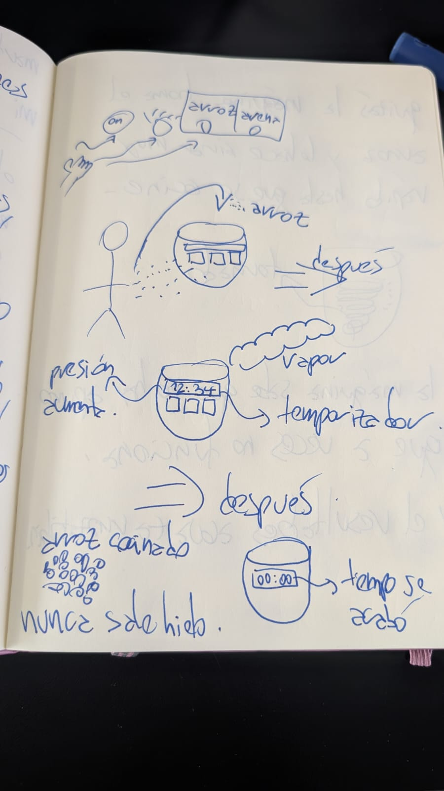
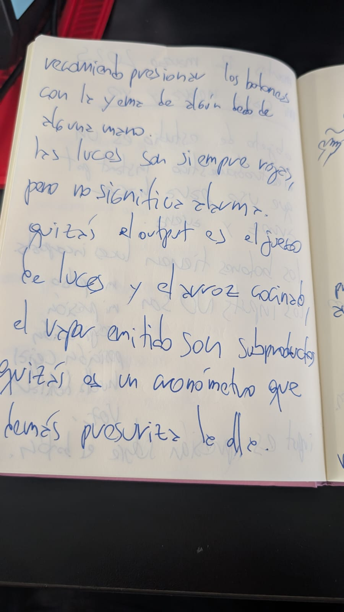

# sesion-01a

## presentación equipo docente

### aarón montoya

profe titular y creador del curso.

educación:

* pregrado: ingeniería civil electricista, Pontificia Universidad Católica de Chile, 2008 - 2013.
* postgrado: máster en arte electrónico, New York University, 2015 - 2017
* postgrado: máster en ciencias y artes mediales, Massachusetts Institute of Technology, 2019 - 2021.
* postgrado: doctorado en artes y humanidades, Universidad de Santiago de Chile, 2025 - hoy.

experiencia docente:

* profe asistente, media jornada, diseño UDP, desde 2023
  * DIS9005 diseño página web, primer semestre 2023
  * DIS9034 programación creativa multimedia, primer semestre 2024
  * DIS8636 taller de interfaz de usuario UI, primer semestre 2023, primer semestre 2024, con profesor Sergio Majluf
  * DIS8637 taller de experiencia de usuario UX, segundo semestre 2023, segundo semestre 2024, con profesor Sergio Majluf
  * DIS8644 taller de diseño de máquinas electrónicas, primer semestre 2025
* profe de ciencias básicas, media jornada, FAU UChile, desde 2022
  * AUD10004 matemáticas aplicadas al diseño, segundo semestre 2023
  * AUD20004 física aplicada al diseño, segundo semestre 2022, segundo semestre 2023, primer semestre 2024, segundo semestre 2024, primer semestre 2025
  * AUD5I022 diseño de interfaces electrónicas, primer semestre 2022, primer semestre 2023
  * AUDIV020 diseño de instrumentos musicales digitales, segundo semestre 2022
  * AUDIV027 inteligencia artificial, segundo semestre 2023, primer semestre 2024, segundo semestre 2024, primer semestre 2025
* profe invitade, DesignLab, UAI
  * DIS145 diseño y construcción de interfaces, primer semestre 2024

enlaces:

* <https://montoyamoraga.io/>
* <https://github.com/montoyamoraga>
* <https://github.com/disenoUDP>
* <https://github.com/FAU-UChile>
* <https://piruetas.xyz/>

### matías serrano

profe asistente y co-creador del curso.

* pregrado: licenciado en artes mención sonido UChile (2011-2016)
* postgrado: magíster en artes mediales, UChile (2021-2023)

experiencia docente:

* 2024 Medios 2. Artes Visuales, Universidad de Chile. Semestre 2 (5 secciones)
* 2024 Taller complementario de electrónica: del dato al objeto. Artes Visuales, Universidad de Chile. Semestre 6 (1 sección)
* 2024 Laboratorio de Arte y Electrónica. Artes Visuales, Universidad Diego Portales. Semestre 6 (1 sección)
* 2024 Aplicaciones Tecnológicas 3: Objeto. Artes Visuales, UNIACC. Semestre 7 (2 secciones)
* 2024 Aplicaciones Tecnológicas 1: Electrónica. Artes Visuales, Uniacc. Semestre 5 (2 secciones)
* 2024 Taller Electrónica en Soportes Alternativos. Artes Visuales, Universidad de Chile. Semestre 5 (1 sección)
* 2023 Taller complementario de electrónica: del dato al objeto. Artes Visuales, Universidad de Chile. Semestre 6 (1 sección)
* 2023 Medios 2. Artes Visuales, Universidad de Chile. Semestre 2 (5 secciones)
* 2023 Taller Electrónica en Soportes Alternativos. Artes Visuales, Universidad de Chile. Semestre 5 (1 sección)
* 2023 Aplicaciones Tecnológicas 1: Electrónica. Artes Visuales, Uniacc. Semestre 5 (2 secciones)
* 2022 Medios 2. Artes Visuales, Universidad de Chile. Semestre 2 (1 sección)

enlaces:

* <http://misaa.cc/>
* <https://instagram.com/misaa.cc/>
* <https://www.instagram.com/nucleoartessonoras/>

### andrés martin

ayudante del curso

* pregrado: diseño UChile

experiencia docente:

* ayudante curso AUD2004 Física aplicada al diseño, Universidad de Chile
* ayudante taller DIS8636 Taller de Interfaz de Usuario UI, Universidad Diego Portales, primer semestre 2024.
* ayudante taller DIS8637 Taller de Experiencia de Usuario UX, Universidad Diego Portales, segundo semestre 2023 y segundo semestre 2024.

### paula landeros

ayudante del curso

* pregrado: estudiante de quinto año de diseño UDP

## máquinas electrónicas

a escala humana

## referentes

* Oficina de Sonido
* Corazón de Robota
* BASTL instruments
* Critter and Guitari
* Hikari Instruments
* CW&T
* Zimoun

## encargo00 - introducción local a la electrónica

este encargo00 es de consumo multimedia para dar contexto al curso y para un diagnóstico de su capacidad de observación en obras multimedia.

* ver película Barrio Universitario, del año 2023, escrita por Fabrizio Copano y Pedro Ruminot. La razón es porque estamos haciendo electrónica desde este lugar, y porque es una parodia al mundo universitario, la robótica, y la desigualdad.
* elegir un disco de la banda Kraftwerk, estudiar su contexto, su historia, los instrumentos usados y creados, las letras.

este encargo será revisado y compartido durante la siguiente sesión 01b, del viernes 14 marzo 2025.

### respuesta ejemplo del equipo docente

por aarón:

vi la película Barrio Universitario y deja una muy mala imagen del barrio, es una parodia muy dura de clases, de la educación chilena, es una crítica social al sistema privado de universidades, y también a los institutos técnicos, en particular a profesores y administradores. Está llena de referencias que quizás nuevas generaciones no notarán, como la inclusión de comediantes chilenos de la década de los 1980s y 1990s, y lo que más destaca es la actuación de Felipe Avello, un comediante con muchas eras distintas en su obra, y en múltiples formatos, incluyendo video arte y performance.

escuché el disco Computerwelt de Kraftwerk, del año 1981. Es una edición alemana del disco, tiene una contraparte en inglés llamada Computer World, una práctica que hicieron en otros discos, de lanzar el mismo disco con letras en distintos idiomas. me impresiona que la primera canción parta con una lista estéril de instituciones, como Interpol y FBI, y lo contrapone con una voz procesada o sintetizada que habla de computadores, marcando de inmediato el tono del disco. la percusión es clínica, tiene el tempo muy marcado, más parecido a una máquina que a una interpretración humana. leí en Wikipedia que a pesar de la temática de computadores, el disco fue hecho de forma análoga, con cinta y con instrumentos electrónicos como el Stylophone que sigue vigente hasta hoy. las canciones están basadas en percusión muy repetitiva y de sonido electrónico, con riffs y melodías muy cuidadas hechas con instrumentos eléctricos. la voz no es la protagonista de las canciones, las letras refuerzan el mensaje de admiración y de precaución hacia la computación.

## encargo01 - mi caja negra y yo

este encargo01 consiste en la elección de un objeto electrónico con el que tengan una relación afectiva.

deben analizar, especular e imaginar sobre su funcionamiento, usando la metáfora de caja negra, inputs y outputs.

la entrega debe tener 2 componentes:

1. textual: deben escribir texto, en prosa o verso, que explica el funcionamiento del objeto de estudio. deben responder a las preguntas "qué pasa adentro", "cuáles son los límites de este objeto", "cómo este objeto logra hacer lo que hace?", "por qué falla este objeto?", etc.
2. visual: deben hacer diagramas especulativos sobre el funcionamiento del objeto de estudio. pueden usar herramientas gráficas que ya conocen, y les invitamos a estudiar diagramas electrónicos de instrumentos electrónicos, como el Atari Punk Console.

este encargo será revisado y compartido durante la siguiente sesión 01b, del viernes 14 marzo 2025.

### ejemplo del equipo docente

encargo00 sobre mi electrodoméstico instant pot, para hacer arroz.

hecho con lápiz y papel.

