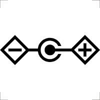

# sesion-12b

viernes 30 mayo 2025

### Fuentes de poder

Usamos baterías de 9v, lamentablemente son caras y contaminantes

Alternativa: Eliminador de voltaje o fuente de poder AC/DC

Powerbank, o más bien todo lo que usb-A o usb-B. Ojo con USB-C porque trabaja con otro estándar

También pueden usar pantallas solares como [éstas](https://listado.mercadolibre.cl/mini-panel-solar#D[A:mini%20panel%20solar]). Para cargar baterías de litio se requiere un aparato intermediario llamado [BMS](https://afel.cl/collections/cargador-balanceador) 

PILAS: AA, AAA, CR2032, etc

Considerar: 

- Voltaje: hay de 4,5; 5, 7, 9, 12, 15, 18, 25 VDC, etc... ESTAS SON DC, como una batería. Debe ser IGUAL al que espero que se utilice

- Polaridad: Si el centro es positivo o negativo

- Tamaño del conector: centro de 2.1mm o 2.5mm

- Corriente: Recordar esta analogía: el voltaje se entrega, la corriente se pide. Siempre usar una fuente de poder de corriente MAYOR a la que quiero utilizar

### Iluminación

- Sabemos usar LEDS. Se queman. Son útiles para saber si algo está funcionando (si se usa en paralelo). Los encontramos en dispositivos electrónicos

- Ampolletas domésticas (220V), son peligrosas, hay que tener cuidado. Para controlarlas, usamos RELÉS

- LEDS de alta potencia. Requieren resistencias también de alta potencia. [Ejemplo](https://articulo.mercadolibre.cl/MLC-563818414-pack-10-led-high-power-3w-blanco-frio-sin-base-max--_JM)

- Tiras LED disponibles en [DEMASLED](https://www.demasled.cl/cintas-led)

## encargo-30

## encargo-31
