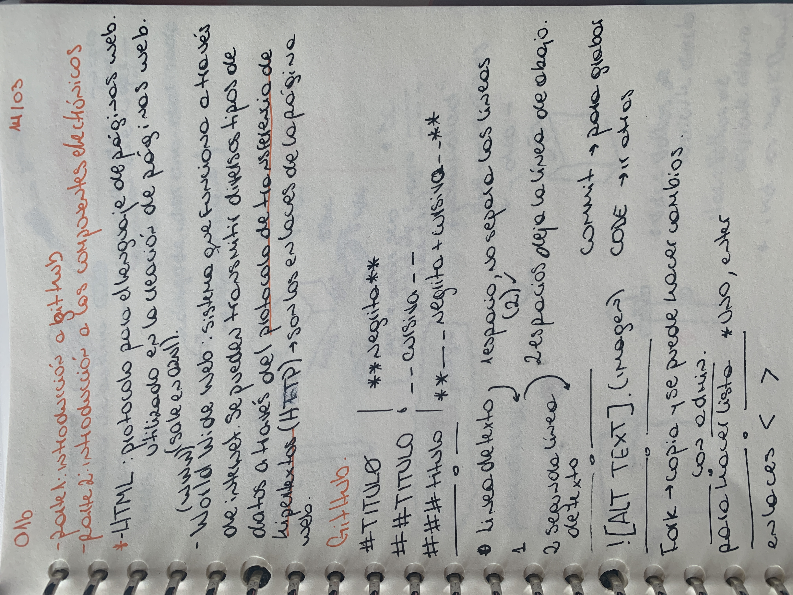
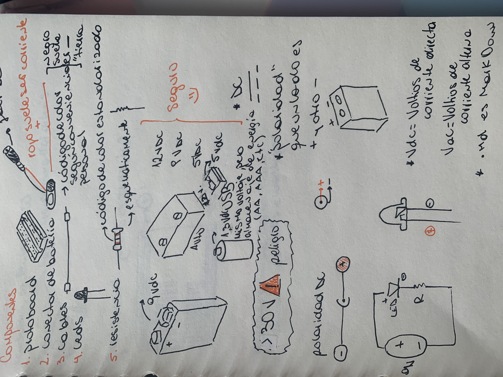
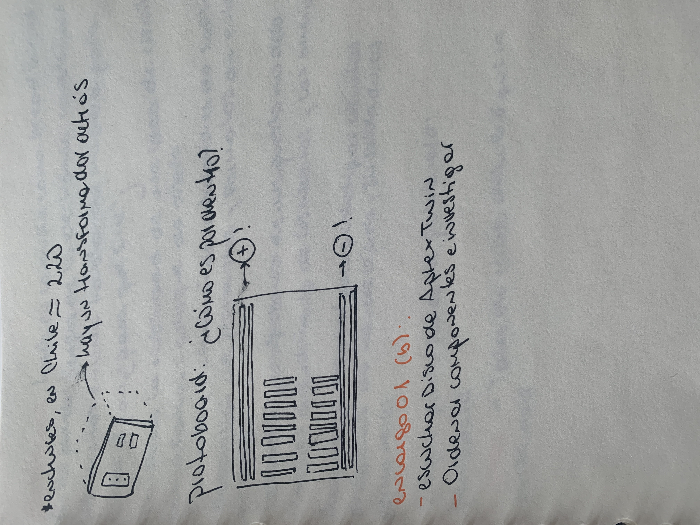
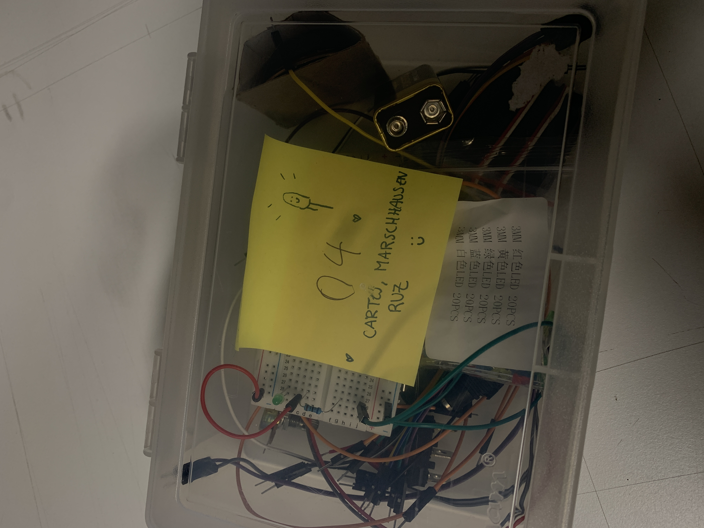
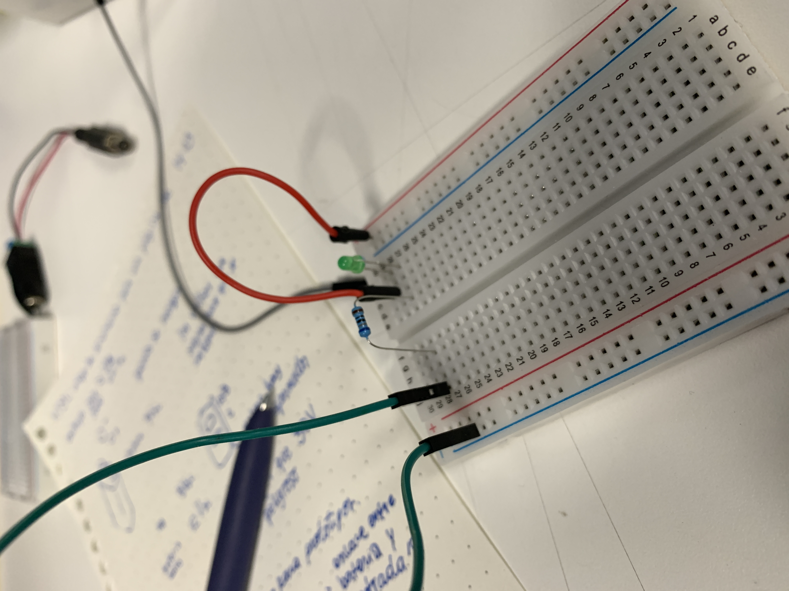
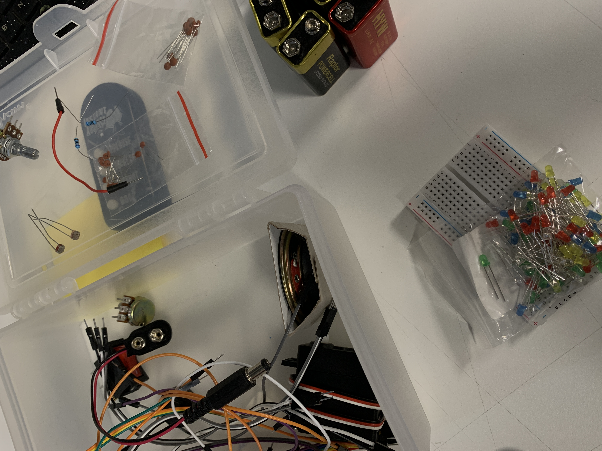
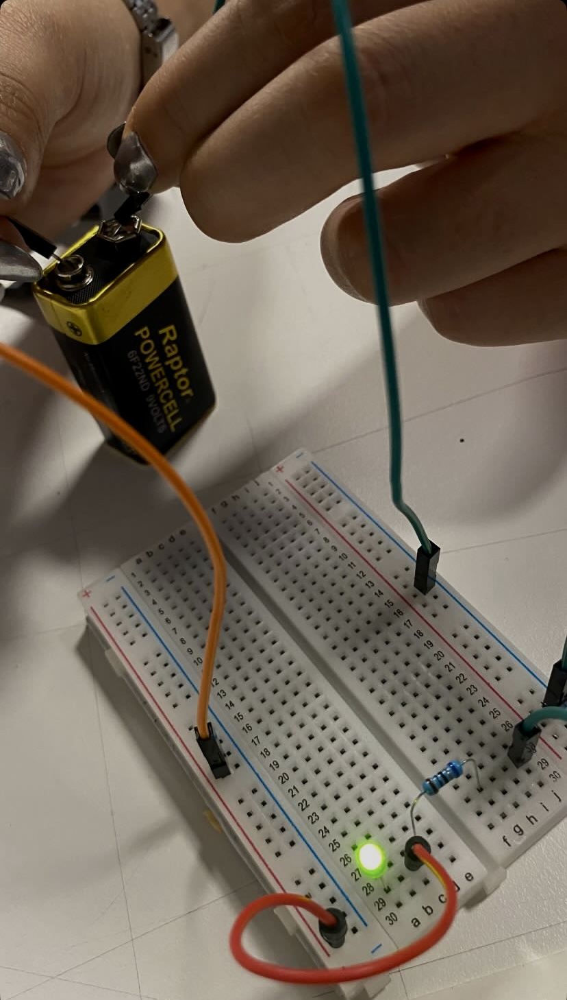
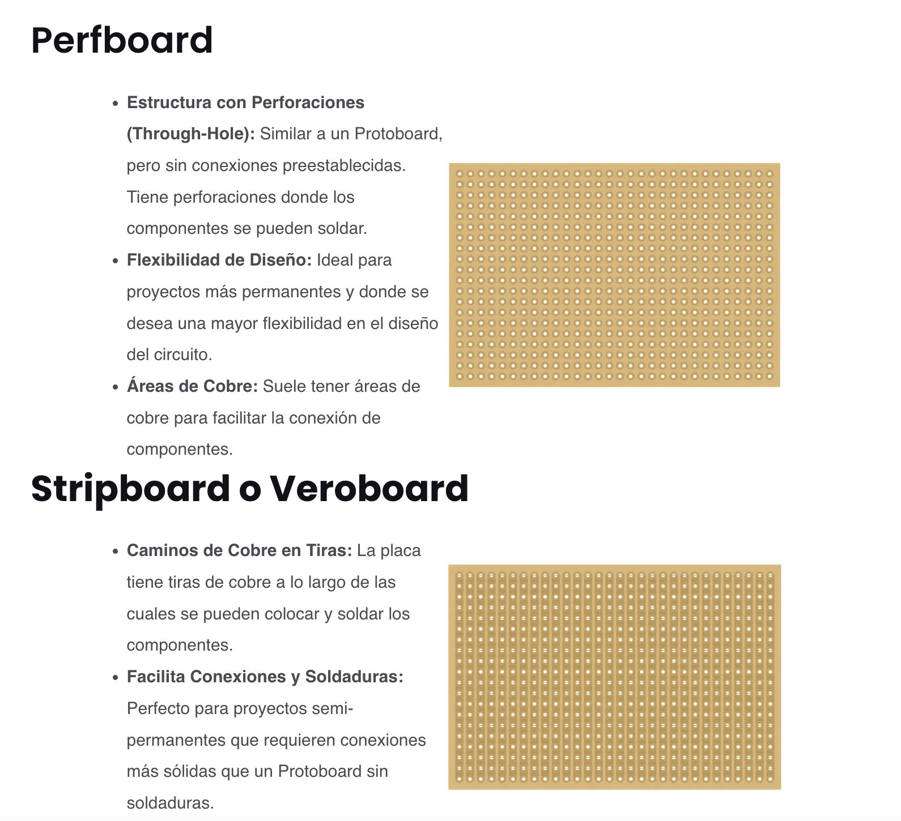

# sesion-01b

## Apuntes

## encargo-02: Aphex Twin

### Aphex twin- syro
  
Richard David James, conocido como Aphex Twin es un músico, productor y DJ británico conocido por su trabajo en la música electrónica desde 1988. Se basa el techno, ambient, acid y jungle y es considerado un pionero el género.

Es el sexto álbum de estudio del artista, se lanzó el 19 de septiembre de 2014. Las pistas se escribieron durante un período largo, el disco presenta composiciones antiguas guardadas y más recientes. (la pista más antigua del álbum tiene alrededor de "seis o siete años").

Syro recibió muy buenas críticas por el afán de innovar y reinventarse, consiguiendo ser nominado para los Grammys en la categoría de "Mejor disco Dance / Electrónica del año". Finalmente fue el ganador de este premio.

Su portada estuvo a cargo del diseñador Ian Anderson, fundador de The Designers Republic y responsable de muchas de las portadas de Aphex en los años 90.

En ‘Syro’ conjuga todas sus facetas, la más ambient, la más drum&bass o la más pop, en una amalgama apasionante en la que conviven armónicamente sampleo y glitches con pianos, timbales, voces humanas y hasta guitarras.

Personalmente, me gustó mucho el disco y su portada me parece interesante, ya que rompe con su estética primordial.
  
## encargo-03: investigar componentes

### Protoboard

Herramienta para prototipar circuitos electrónicos sin soldaduras permanentes. La primera protoboard era una tabla de madera que se utilizaba para cortar pan, la cual la utilizaron para realizar este tipo de pruebas, esta también es conocida como ***breadboard***.

Dentro de esta existen dos tipos principales:

1. Perfboard, es una paca con orificios en forma de línea siguiendo un patrón. Su característica principal es que los agujeros están rodeados por un conjunto de materiales conductores que mejoran la conexión.

2. Stripboard, su diferencia con la anterios es que su patrón consiste en que los agujeros estén interconectados en medio de una fila conformada por un material conductor.

### Tipos de tamaños de protoboard

1. **Placa protoboard grande:** contine 830 puntos de conexión que se dividen en dos segmentos. Uno con 63 líneas con 5 puntos de conexión cada una y 4 líneas, a los extremos, de 25 puntos de conexión para la alimentación de voltaje y tierra del circuito.

2. **Placa protoboard mediana:** cuenta con 400 puntos de conexión divididos en dos segmentos. Uno con 30 líneas con 5 puntos de conexión cada una y 4 líneas, a los extremos, de 25 puntos de conexión para la alimentación de voltaje y tierra del circuito.

3. **Placa protoboard chica:** 70 puntos de conexión divididos en dos segmentos de 17 líneas con 5 puntos de conexión cada una. No tienen líneas para la alimentación del circuito.`

### Conector de batería

Optimiza la conectividad. Este conector proporciona una solución versátil para la alimentación de energía en proyectos electrónicos, permitiéndote una mayor flexibilidad en la disposición y conexión de la batería.

### Pila eléctrica

Es un dispositivo portátil en la que se almacena energía para después proveer de corriente eléctrica a un artefacto que no está conectado a la red eléctrica.

#### ¿Cómo funciona una pila eléctrica?

En el interior de esta hay un líquido que se denomina electrolito. La pila cuenta con dos polos que se llaman electrodos. Una vez se sumerge cada electrodo en el electrolito se consigue una reacción de ***polo positivo o cátodo*** (va a reducir) lo que libera electrones. También,
***polo negativo o ánodo*** (se oxida) va a recoger los electrones que el otro polo está liberando.

**¿Quién fue su creador?**

Alessandro Volta creador de la pila eléctria en 1800, la desarrolló con unas placas de zinc y plata separadas por una tela humedecida con agua salada, que producían corriente.

### **Cables**

Tiene la finalidad de transportar la energía eléctrica de un punto a otro.En función de su aplicación final, los cables pueden tener diferentes configuraciones, basando siempre su diseño según normativas nacionales e internacionales.

Los cables se categorizan por ***tipo de tensión***, las cuales son:
1.Cables de baja tensión.
ejemplos: para paneles eléctricos,de potencia, de goma, etc.
2.Cables de media tensión.
ejemplos: ***RHZ1*** con aislamiento de XLPE, libre de halógenos y no propagador de la llama y/o el incendio; cable de Media Tensión en cobre y aluminio para aplicaciones especiales. Especialmente recomendado para instalaciones donde haya riesgo de presencia de aceites y agentes químicos de tipo hidrocarburos o sus derivados.

### LED

El led (light-emitting diode) es un diodo emisor de luz. En su interior hay un semiconductor que, al ser atravesado por una tensión continua, emite luz, lo que se conoce como electroluminiscencia.

#### ¿Cómo funcionan los LED?

Se basa en la activación de una unión PN, consistente en una estructura básica de componentes electrónicos denominados ***semiconductores*** (fundamentalmente, diodos y transistores inorgánicos). Todo diodo consta de dos patillas de conexión, una larga y una corta. Mientras la larga se conecta al polo positivo, la corta se conecta al polo negativo. Esto es lo que permite el paso de la corriente.

#### Partes del LED

1. Ánodo y cátodo: Se trata de dos patillas de conexión. Mientras el ánodo actúa como polo positivo, en cátodo actúa como polo negativo.

2. Copa reflectora: Se encuentra encima del marco, es la encargada de reflectar la luz del color que emita el semiconductor.

3. Semiconductor: Los LED, dependiendo de su tipología, tendrán uno o tres cristales semiconductores, dependiendo de si pueden emitir un solo color o una combinación en RGB.

4. Hilo conductor: A través de este se transmite la corriente hacia el semiconductor que convertirá esta energía en luz.

5. Cápsula: Capa transparente que cubre y protege el resto de los componentes del diodo LED.

### Resistencias

Es una medida de la oposición al flujo de corriente en un circuito eléctrico.La resistencia se mide en ohmios (Ω).

***Cuanto mayor sea la resistencia, menor será el flujo de corriente.***

La resistencia eléctrica se comporta de forma diferente en función del tipo de corriente:

1. Corriente continua: Su comportamiento se traduce en la transformación de energía eléctrica en calor a través del conocido como efecto Joule, representado por una resistencia en ohmios como unidad de potencia.

2. Corriente alterna: Se alterna entre extremos negativos y positivos a 60 veces por segundo, siendo la potencia el resultado de un valor promedio.

cómo ver resistencias con sus colores <http://te.com/es/products/passive-components/resistors/intersection/resistor-color-codes.html>

### Fuentes

* De Pepeenergy, E. B. (2021, November 23). ¿Qué es la resistencia eléctrica? Blog Pepeenergy. <https://www.pepeenergy.com/blog/glosario/definicion-resistencia-electrica/>

* DigiKey. (n.d.). DigiKey. <https://www.digikey.com/es>

* Fernandez, S. (2022, November 8). ¿Qué es un led? Tipos de Led, aplicaciones y usos. Visual Led. <https://visualled.com/glosario/que-es-un-led/>

* Fluke. (n.d.). ¿Qué es la resistencia? Fluke. <https://www.fluke.com/es-cl/informacion/blog/electrica/que-es-la-resistencia>

* Guillén, R. (2014, September 28). Aphex Twin / Syro. jenesaispop.com. <https://jenesaispop.com/2014/09/28/203951/aphex-twin-syro/>

* Inmesol, B. (2025, January 10). Alessandro Volta, inventor de la pila eléctrica (1745-1827) - Inmesol.

* Inmesol. <https://www.inmesol.com/blog/alessandro-volta-inventor-de-la-pila-1745-1827/>

* Noticias, I. (2024, May 31). Glosario de tecnología: ¿Quién inventó la batería? Infobae. <https://www.infobae.com/tecno/2024/05/31/glosario-de-tecnologia-que-significa-quien-invento-la-bateria/>

* Jacabrera. (2024, 12 septiembre). ¿Qué es y cuáles son las partes del Protoboard? iElectel - Electrónica y Telecomunicaciones.
<https://ielectel.com/que-es-y-cuales-son-las-partes-un-protoboard/>_

* Placas PROTOBOARD / BREADBOARD | Comprar online. (s. f.). <https://rayte.com/10000529-placas-protoboard-breadboard>

* Significado del código de colores en una resistencia. (n.d.). TE Connectivity. <https://www.te.com/es/products/passive-components/resistors/intersection/resistor-color-codes.html>

* Schweber, B. (2021, August 5). Los adaptadores y kits adecuados permiten un Breadboarding flexible y eficiente con componentes modernos. DigiKey. <https://www.digikey.es/es/articles/the-right-adapters-and-kits-enable-breadboarding-with-modern-components?srsltid=AfmBOopMdML4JotksTue0cesw1zDJ7vEuv-m5vTCARhPfuSIAbswJ2or>

* TopCable. (2025, February 4). Tipos de Cables Eléctricos y Características - Top Cable. Cables y consejos eléctricos. By Top Cable. <https://www.topcable.com/blog-electric-cable/tipos-de-cables-electricos/>

* Vozick-Levinson, S. (2018, June 25). Aphex Twin on New ‘Syro’ LP: ‘I’m Feeling Really Horny About It – and Very Smug’ Rolling Stone. <https://www.rollingstone.com/music/music-news/aphex-twin-on-new-syro-lp-im-feeling-really-horny-about-it-and-very-smug-49382/>
