# sesion-01b

14 de Marzo de 2025.

## Apuntes

### Parte 1: Introducción a GitHub.

Foto de mis apuntes.

### Parte 2: Introducción a los componentes eléctricos.

#### Componentes

1. **Protoboard:** Es una placa de pruebas en donde podemos conectar componentes eléctricos sin soldar. Se utiliza para crear un prototipo del circuito que queremos crear.

2. **Conector de batería:** Es un dispositivo a través del cual podemos conectar una batería a un equipo eléctrico.

3. **Cables:** Los Cbles son connductores de electricidad de un punto a otro. Un punto importante a aclarar de estos mismos son sus colores llamativos, a los cuales uno les puede dar sentido para tener un orden, pero lo más común es: rojo=positivo y negro=negativo.

4.  **Leds:** Es un diodo (dispositivo semiconductor unidireccional) emisor de luz que se ilumina al momento en que la energía los "atraviesa". Tiene dos patas, una más larga que la otra; esto nos indica que: pata larga=positivo y pata corta=negativo.
   
5.  **Resistencia:** Regulan y estabilizan el flujo de corriente en los circuitos. Ayudan a mantener un nivel de corriente seguro para evitar que se quemen o echen a perder.

6. **Batería 9V:** Es una pila eléctrica de corriente de 9 voltios. Es la fuente de enrgía que vamos a utilizar en el semestre.

**Ejercicio práctico durante clases:** Consiste en prender un led en la protoboard con cables, resistencia, una bateía y un conector de batería.

El circuito realizado es el siguiente:

Foto de procesos

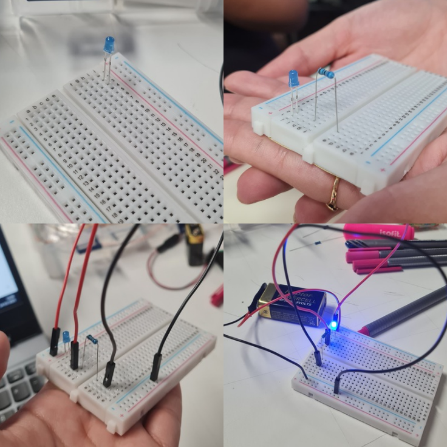

## encargo-02

### Parte 1: Escuchar un disco de **Aphex Twin**, incluyendo contexto, instrumentos usados, entrevistas de la época, nuestras impresiones y opiniones.

Foto de mi croquera.

### Parte 2: Ver documental **Internet's Own Boy** y escribir una reseña sobre la vida de Aaron Swartz.

Foto de mi croquera.

## encargo-03

Estudiar la caja de materiales entregada la clase pasada, hacer un listado de componentes, subir fotos y buscar información básica al respecto, como por ejemplo:

 - ¿Desde cuándo existen los LED azules?
 - ¿Quién inventó las protoboard?

**Componentes:**

1. **Protoboard:** Es una placa de pruebas en donde podemos conectar componentes eléctricos sin soldar. Se utiliza para crear un prototipo del circuito que queremos crear. Por dentro contiene una matriz de conectores eléctricos que hacen posible la experimentación.

Foto de protoboard.

2. **Conector de batería:** Es un dispositivo a través del cual podemos conectar una batería a un equipo eléctrico. Se utiliza para darle “vida” a nuestros circuitos.

Foto del conector de batería.

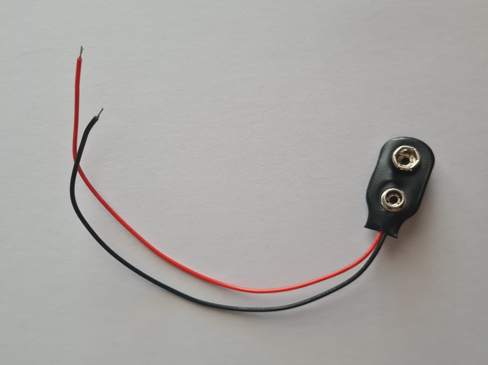

3. **Cables:** Los cables son conductores de electricidad de un punto a otro. Un punto importante a aclarar de estos mismos son sus colores llamativos, a los cuales uno les puede dar sentido para tener un orden, pero lo más común es: rojo=positivo y negro=negativo.

Foto de los cables.

- 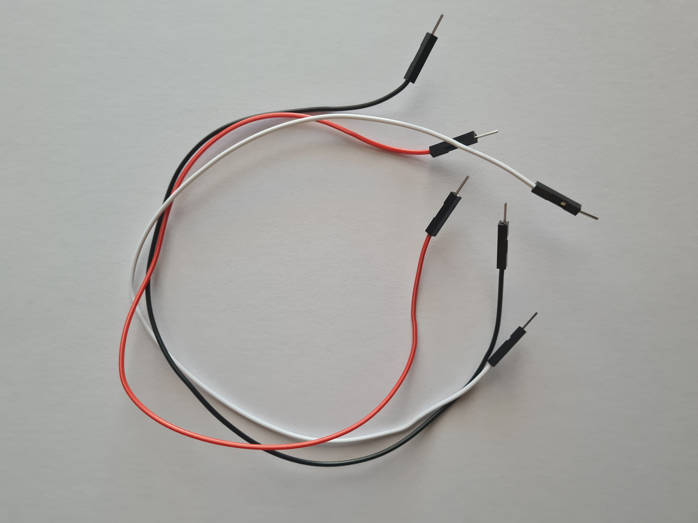

4. **LEDs:** Es un diodo (dispositivo semiconductor unidireccional) emisor de luz que se ilumina al momento en que la energía los "atraviesa". Tiene dos patas, una más larga que la otra; esto nos indica que: pata larga=positivo y pata corta=negativo.

Foto de los LEDs.

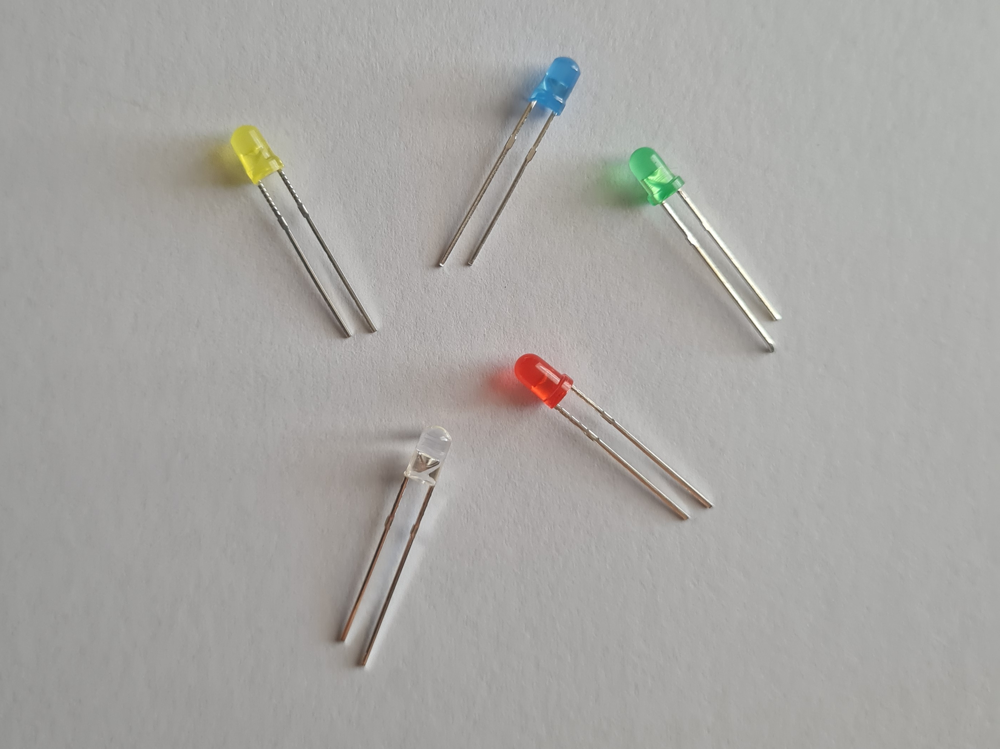

5. **Resistencia:** Regulan y estabilizan el flujo de corriente en los circuitos. Ayudan a mantener un nivel de corriente seguro para evitar que se quemen o echen a perder.

Foto de las resietencias.

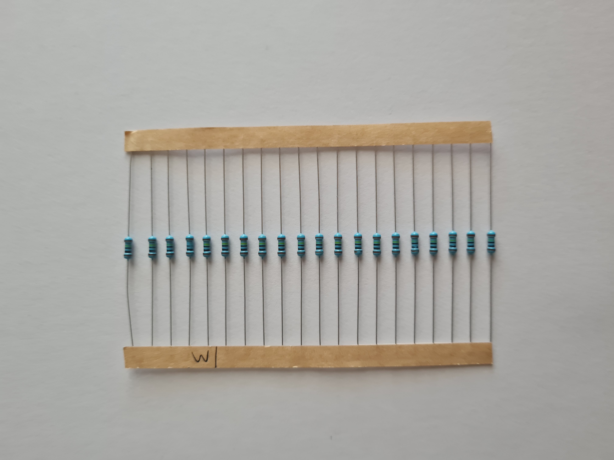

6. **Batería 9V:** Es una pila eléctrica de corriente de 9 voltios. Es la fuente de energía que vamos a utilizar en el semestre.

Foto de la batería de 9V.

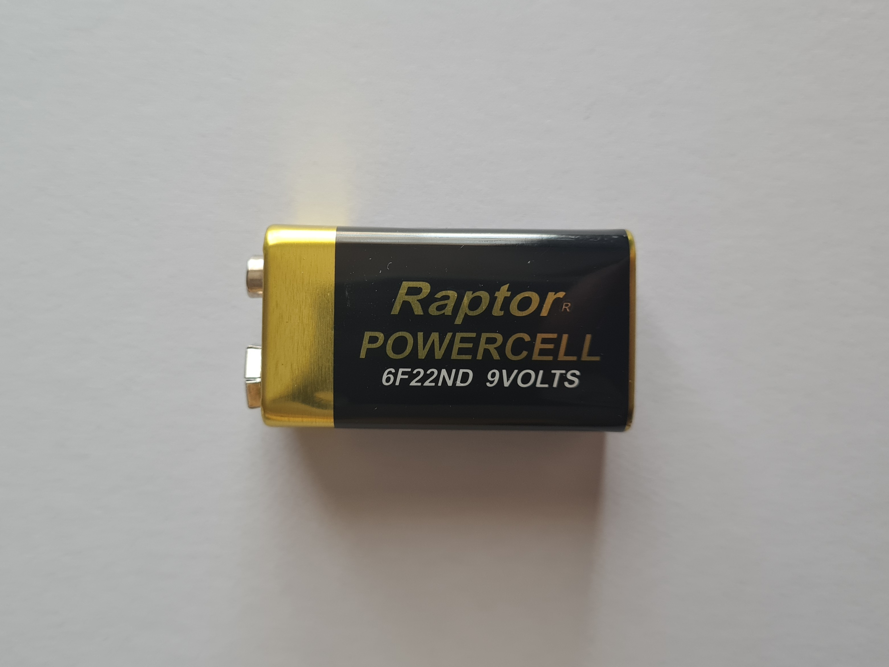

7. **Interruptor basculante:** Dependiendo del lado hacia el que esté inclinado tiene una función distinta, por ende este interruptor se utiliza para iniciar o detener, y encender o apagar el flujo de corriente en un circuito.
 
Foto del interruptor basculante.

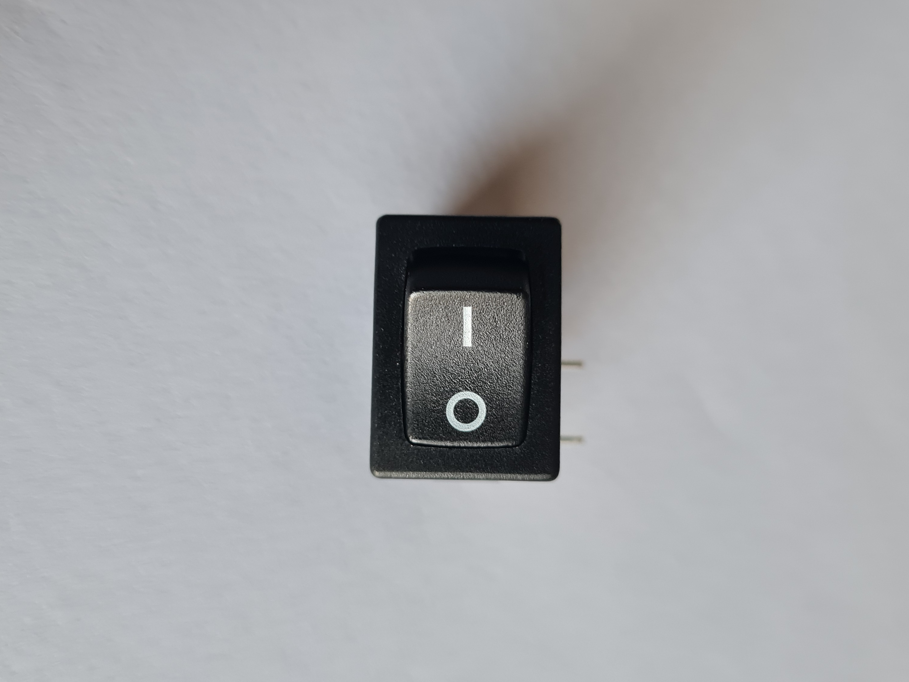

8. **Parlante 0.5W, 8 Ohms:** Reproduce sonidos o melodías por un microcontrolador como podría ser Arduino.

Foto del parlante.

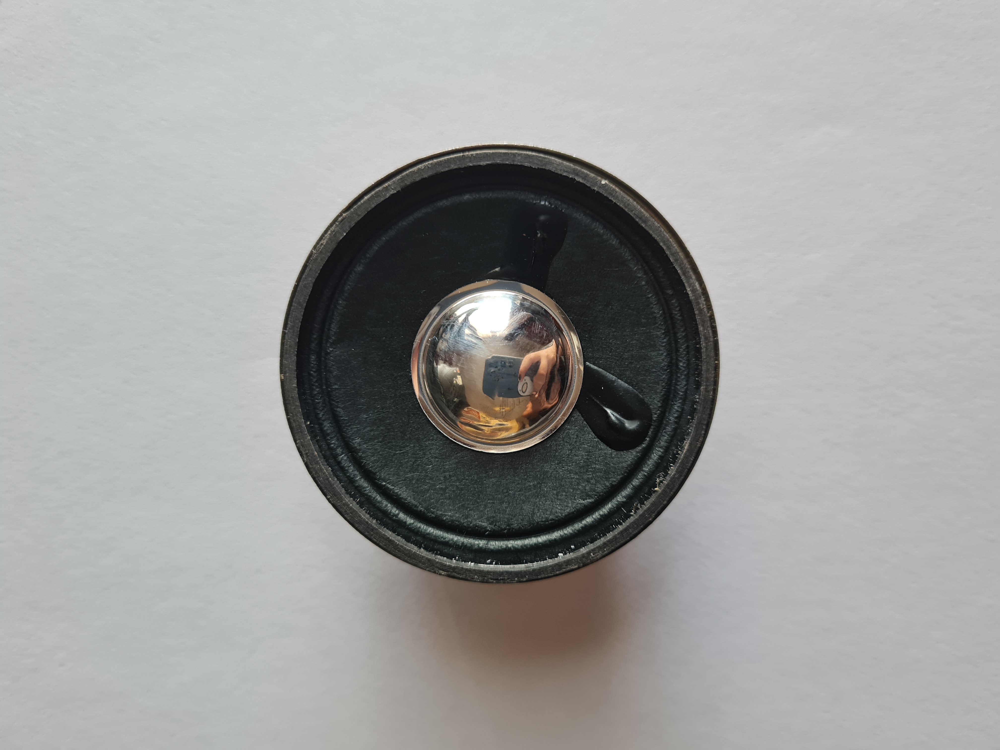

9. **Mini protoboard:** Cumple la misma función que la protoboard normal, solo que en un tamaño reducido.

Foto mini protoboard.

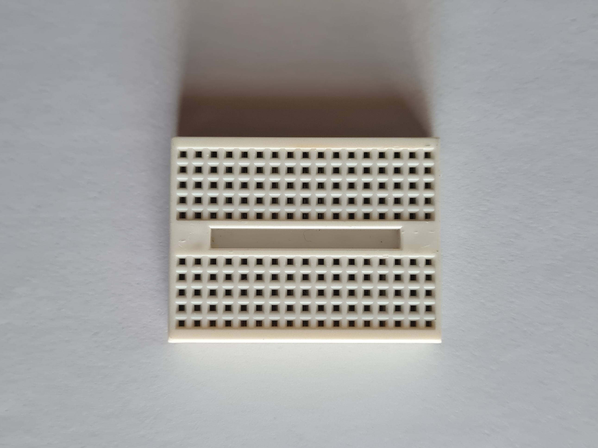

10. **Potenciómetro:** Es un componente utilizado para ajustar la resistencia eléctrica en un circuito. Esto es a través de una perilla regulable para la necesidad que tengamos, como podría ser el regular el voltaje.

Foto potenciómetro.

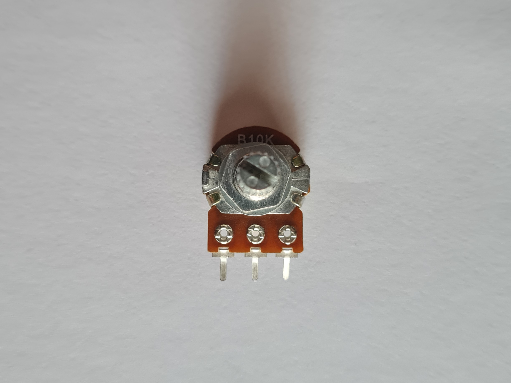

11. **Micro servo motor:** Es un pequeño actuador rotativo diseñado para controlar el movimiento de su eje en cuanto a velocidad, aceleración, torque (fuerza que se utiliza para hacer girar un objeto) y posición.

Foto micro servo motor.

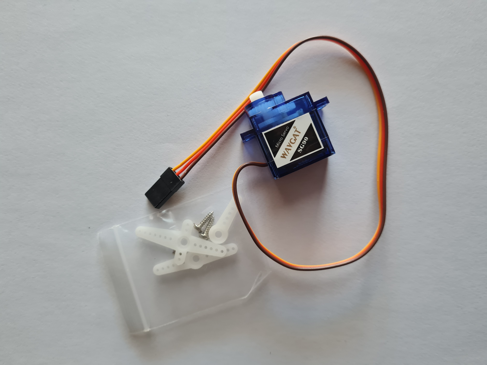

12. **Condensador electrolítico o capacitor:** Es un dispositivo que almacena energía de forma interna cuando se conecta a una fuente de tensión o voltaje.

Foto condensador electrolítico.

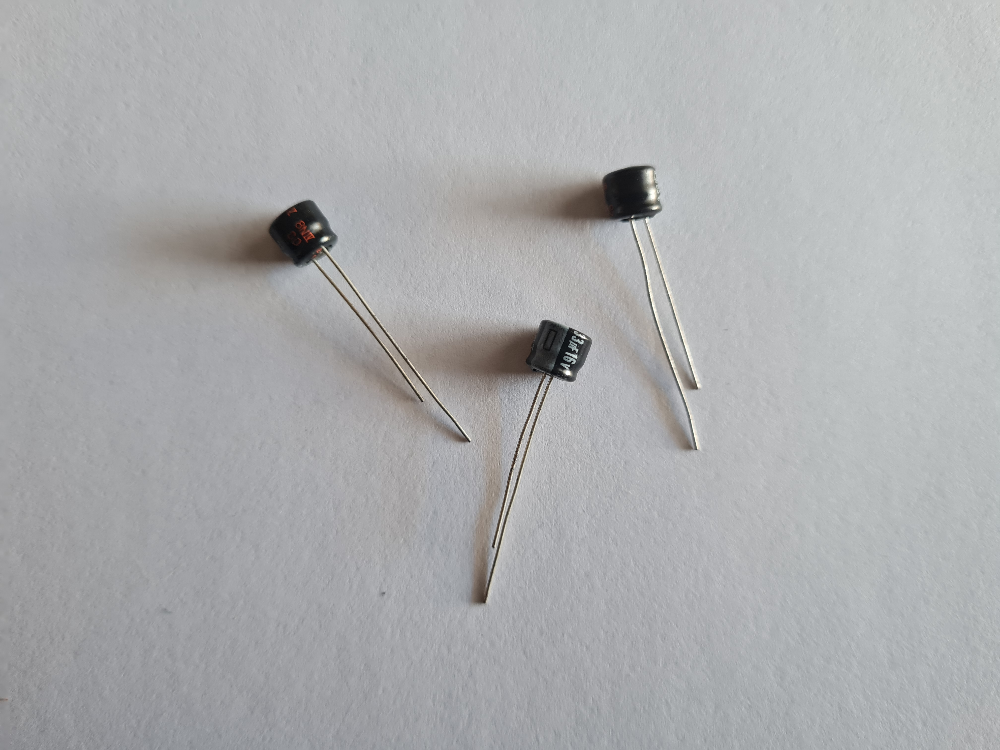

13. **Zumbador piezoeléctrico:** Son componentes eléctricos diseñados para producir sonido. Existen en una variedad de tonos y frecuencias.

Foto de zumbador piezoeléctrico.

14. **Adaptador de conector:** Sirven para adaptar para interconectar dos conectores de puertos distintos.

Foto de adaptador de conector.

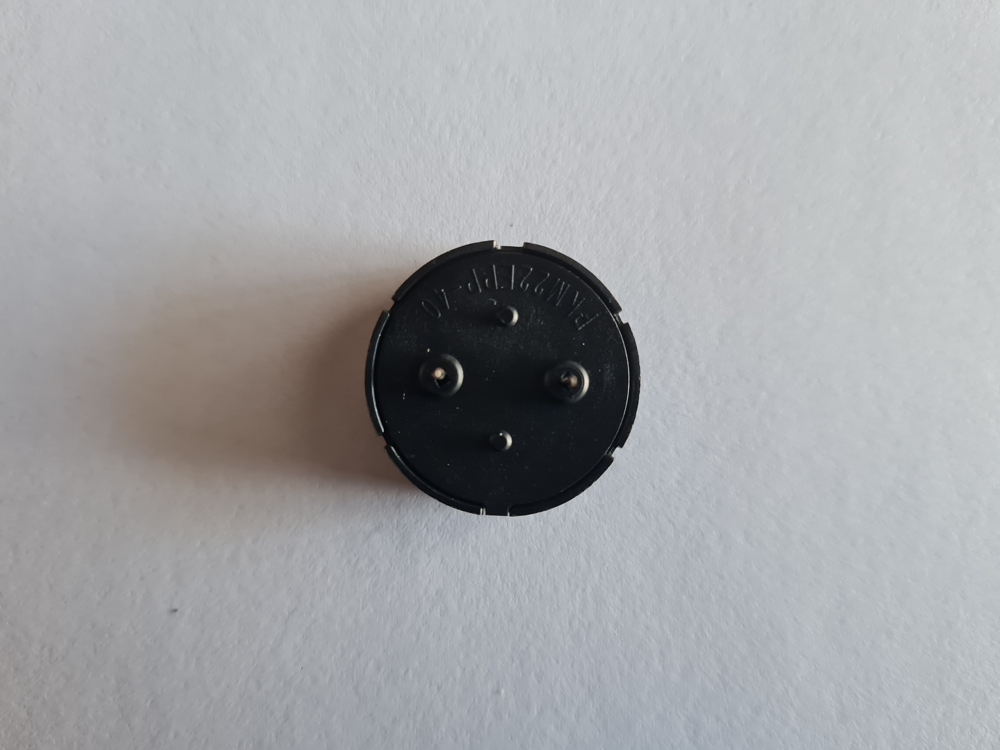

15. **Condensador cerámico  o tipo lenteja:** Al igual que los condensadores más grandes, almacenan energía de igual manera pero en menor escala.

Foto de condensador cerámico.

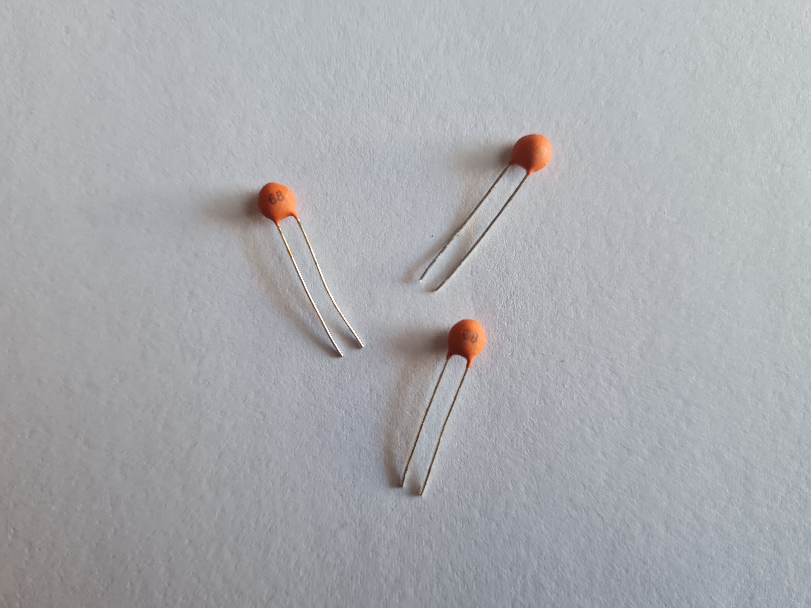

## Preguntas

### ¿Desde cuándo existen los LED azules?

Las luces led como las conocemos fueron creadas en 1962 por Nick Holonyack, un ingeniero eléctrico que gracias a los descubrimientos previos de otros tres individuos (Henry Joseph Round, Oleg Lossew y Georges Destriau), descubrimientos que involucran luz en objetos inorgánicos, diodos reaccionando en forma de luz al ser atravesados por una corriente eléctrica y a la electroluminiscencia causada por el sulfuro de zinc y su exposición tanto a luz ultravioleta como a la luz natural y artificial. 

Gracias a esto es que Holonyack obtuvo las bases para su experimentación, en donde creó un componente de dos terminales que permitían que lo atravesara la corriente eléctrica sin necesidad de un gas. Es así que cada terminal de su diodo tenía una carga distinta (una positiva y una negativa) con un espacio intermedio entre ellas que era el lugar en donde sucede la transición que genera la luz, lo más curioso de esto es que el uso de fosfuro de arseniuro de galio (GaAsP) dió como resultado una luz de color rojo que fue el primer color de LED.

Con el tiempo fue experimentando hasta obtener diversos colores como el naranjo, amarillo, verde, y no fue comercializado hasta 1997.

Para el color azul pasaron 3 décadas antes de que se pudiera desarrollar, fueron décadas de experimentación y fracasos porque lo que se buscaba realmente era la creación de los LED blancos, que no eran posibles de desarrollar sin el color azul como base. Con esta motivación es que un segundo equipo (japonés) comienza a experimentar con nitruro de galio (GaN) hasta que crean un cristal de calidad que permitía obtener los LED azul en el año 1993 gracias a Shuji Nakamura, que años más tarde se convertiría en ganador de un premio nobel por este descubrimiento.

### ¿Quién inventó las protoboard?

Las protoboard fueron creadas gracias a que no existían soluciones estandarizadas para hacer pruebas de circuitos, es entonces que tanto aficionados como ingenieros comenzaron a probar maneras creativas para solventar este problema. Es de esta manera que se introdujeron al mercado en 1970, estaban hechas de plástico blanco con orificios para insertar componentes y así ayudar a muchos principiantes y expertos en la materia que requerían de este producto. Finalmente no se conoce un creador específico para este invento, pero se dice que es Jack Kilby, el ingeniero que inventó el circuito integrado.
