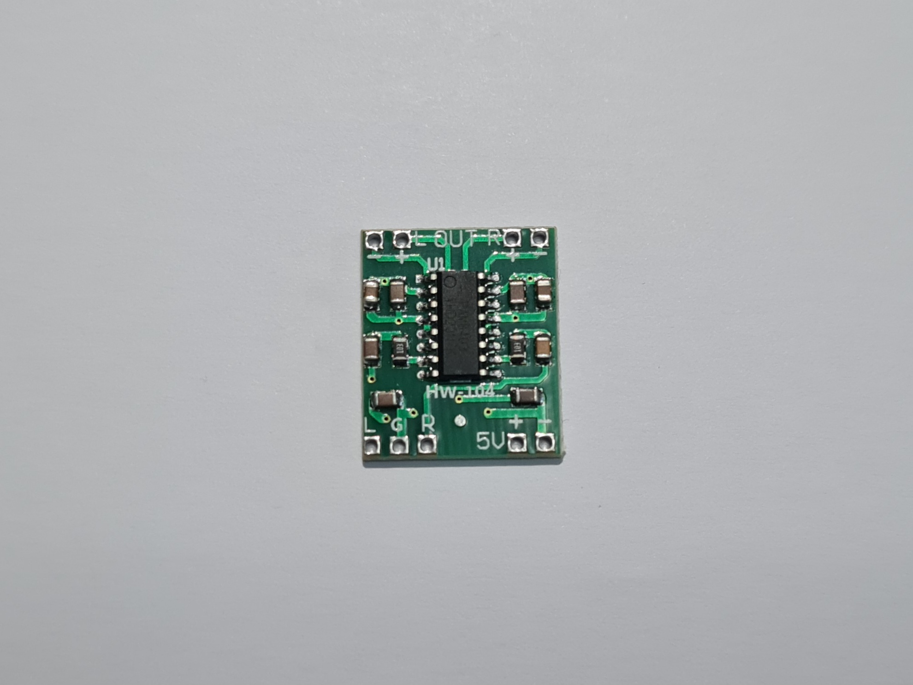
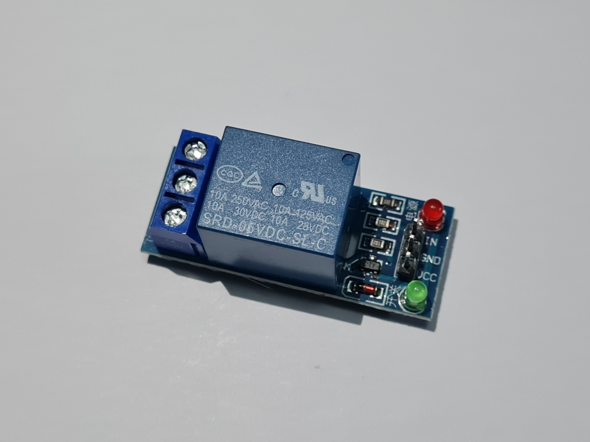
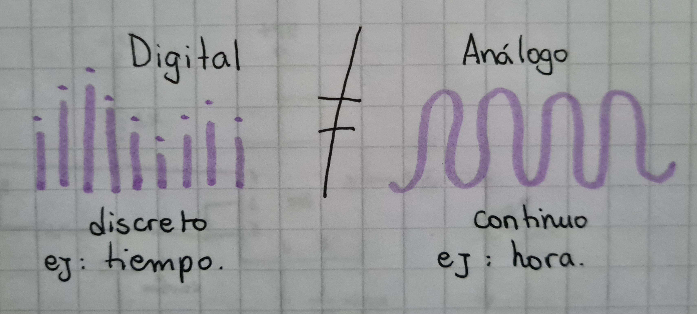
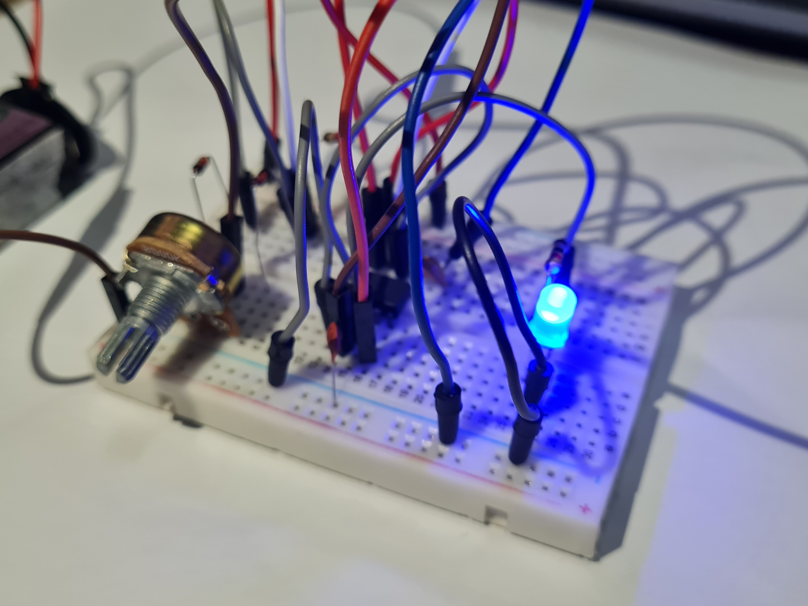

# sesion-09b

09 de Mayo de 2025.

## Entrega de componentes

Componente 1: **Chip 8403**

 - Es una pequeña placa de circuito electrónico diseñada para amplificar señales de audio. Ofrece unna salida de audio clara, nítida y de alta fidelidad.

Foto Chip 8403.

Componente 2: **SRD05 / Relé de 01 canal**

 - Este relé permite controlar el encendido y apagado de cualquier aparato que se conecte a una fuente de alimentación eléctrica externa.

Foto de Relé de 01 canal.

## Configuraciones 555: Repaso

**Astable** = oscilalción/periodicidad.

Foto de mi croquera.

 - in: R y C.
 - out: LEDs, sonido, nov, aviso.

**Monoestable** = timer.

Foto de mi croquera.

 - in: R y C.
 - out: LEDs, sonido, nov, aviso.

Foto de mi croquera.

## Circuito esquemático visto en clases: Pulse Width Modulation

Foto de mi croquera.

## Encargo 18: Realizar esquemático en protoboard

Foto circuito PWM.

Video circuito PWM.

## Encargo 19: Investigar cultura electrónica y Laurie Anderson

¿Quién es Laurie Anderson?

 - Laurie Anderson es una estadounidense nacida en 1947 que, además de ser una artista experiemntal de performance, es una cantante, poeta y dibujante. Dentro de sus performances combina música minimalista, diapositivas y reflexiones irónicas sobre el lenguaje, la política norteamericana, el rol de los sexos y la civilización occidental moderna.

 - Dentro de sus creaciones podemos encontrar el **Violín de Arco de Cinta**, que posee un cabezal magnético en lugar de cuerdas y una cinta de audio en lugar de las cuerdas del arco, además de una carcasa con sensores que activan diversos sonidos de batería electrónica.

Álbum escuchado: **Big Science**

Opinión: Dentro de todos los artistas de la música electrónica que hemos escuchado a través del semestre, es de los más tranquilos hasta ahora, en el sentido de que con el tiempo podría llegar a escuchar esta artista, mas no sé si este estilo de música. Si bien hay cosas que aún me causan ruido, como el hecho de que muchas veces los instrumentos de fondo suenan más que la propia voz y por ende me abruma un poco porque no termino de entender lo que dice, puedo decir que la mayor parte de las canciones de este álbum me parecieron un poco relajantes, siendo así **"Big Science"** mi favorita. Es larga, pero me provoca un sentimiento de paz que me relajó bastante, al punto de dormirme mientras escuchaba el álbum por primera vez (ups).

Debo admitir que la primera canción: **"From the air"**, no la disfuté para nada, me provocó dolor de cabeza y quizás por eso me gustó y relajó tanto la seegunda (que fue mi favorita). 

Como conclusión, sigue sin gustarme la música electrónica, pero es bueno saber que hay exponentes como **Laurie Anderson** que son un poco más de mi agrado, siendo un poco más melodioso y sin tanto ruido, que es algo que agradezco demasiado.

Fotos  de mi autoría.

