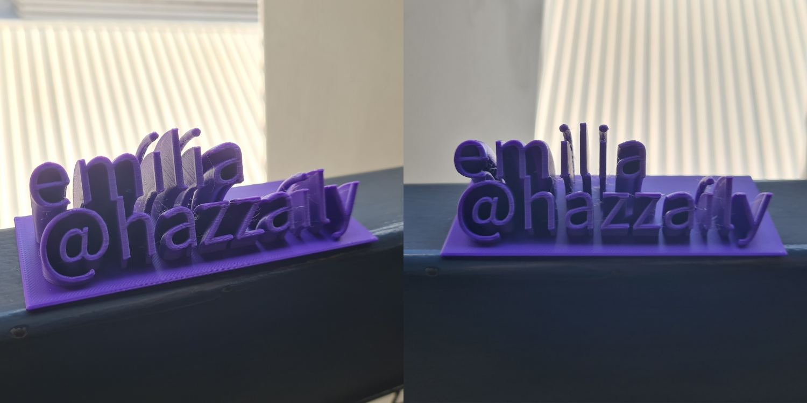

# sesion-12b

30 de  Mayo de 2025.

## Fuentes de poder:

Una alternativa para las baterías de 9V son los eliminadores de voltaje o fuente de poder AC/DC.

También Powerbank, y también USB-B y USB-A. Cuidado con el USB-C.

Otro a utilizar son paneles solares.

Pilas AA y AAA y además 2032.

Puntos a considerar:

 - **Voltaje:** Existen de 4.5; 5; 7; 9; 12; 15; 18; 25 VDC (DC: Corriente continua).
 - **Polaridad:** Depende de si el centro es poositivo o negativo.
 - **Tamaño del conector:** Centros de 2mm o 2.5mm.
 - **Corriente:** El voltaje se entrega, la corriente se pide. Siempre se debe usar una fuente de poder MAYOR a la que quiera utilizar.

## Iluminación:

Mu probablemente requerirán transistores.

 - **Ampolletas domésticas:** Trabajan con 220V, pero se pueden controlar a través del Relé.

 - **LEDs de alta potencia:** Pueden ser de 3W a 5W. Requieren resistores de alta potencia.

 - **Tiras LED:** Igualmente de alta potencia. Puede funcionar con el circuito Pulse Width Modulation y transistor acorde. Dependiendo de la tira de LEDs se puede cortar o no. Sus caracteríasticas eléctricas se calculan, generalmente, por metro.

## Motores:

Para utilizar motores, necesitamos utilizar transistores.

Si es que requiero motores DC que giren más lento debo buscar motorreductoes que cambian su velocidad por giro. 

 - **Motor DC de 6V:** Gira en cuanto le llega la electricidad tan rápido como puede. Se aplica en juguetes, ruedas, ventiladores, vibradores. etc.

 - **Steppermotor o paso a paso:** Es mucho más lento y preciso. Funciona a partir de pequeños pulsos eléctricos que activan ciertas regiones del motor. Hay 2 tipos de stepper: unipolares y bipolares.

 - **Servomotor:** Sabe dónde está, es preciso. y puede ser rápido. A veces es inestable.

 - **Puente H:** Permite cambiar la dirección de un motor DC. Se genera con 4 switchers, o transistores, o con un CI llamado I298n.

 - **Solenoide:** Por principio electromagnético genera movimiento líneal. Se usa en percusiones electromagnéticas y chapas electrónicas.

## Transistores:

Se utilizan como amplificador, como switch, como inversor, o como compuerta lógica.

Principalmente hay dos tipos: bipolares y FET.

 - Ejemplo bipolar: 2n2222

 - Ejemplo MOSFET: IRFZ44n

## Sonido:

- **Parlantes activos y pasivos:** Activos se enchufan, pasivos no, ya que requieren amplificación externa, como el PAM8403. Su intensidad sonora depende de su tamaño (en pulgadas), de su potencia (en watt), de su impedancia (en ohm).

- **Buzzers:** Parlantes muy básicos utilizados principalmente como señal de alarma o aviso. Llega a sonar muy fuerte.

- **Reproductor de audio:** Convierte datos digitales en electricidad sonora.

- **Micrófono:** Convierte sonido en electricidad. Es inverso a un parlante. El mas utilizado es el Electret.

- **Piezoeléctrico:** Convierte movimiento en electricidad.

- **Sintetizadores:** Generan sonidos a partir de señales eleéctricas creadas dentro del mismo aparato.

- **Pedales de guitarra:** Revisar Tonepad

## Entrega "membrete" en impresión 3D

Fotos del membrete en cuestión.

Muchas graciasss, está muy lindo c:

## Encargo 26:

Describir 3 proyectos de máquinas electrónicas que quieran hacer de formal individual. Ordenar por preferencia o interés. 

## Encargo 27:

Dibujar diagrama de comportamiento, flujos de interacción. No especificar chips. Considerar procesos de manera especulativa.

 -  ¿Cuánto tiempo se usará?
 -  ¿Qúe encendidos y apagados tiene?
 -  ¿Cómo se interactúa?
