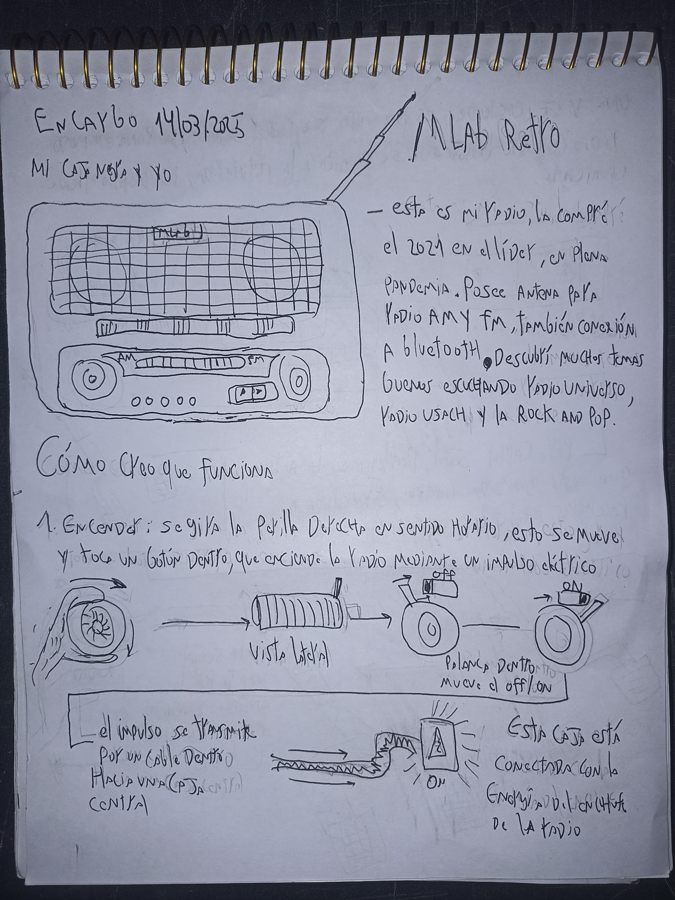
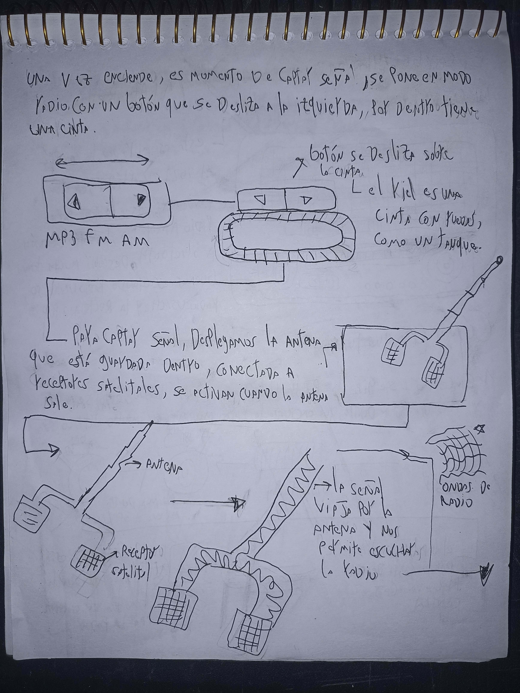
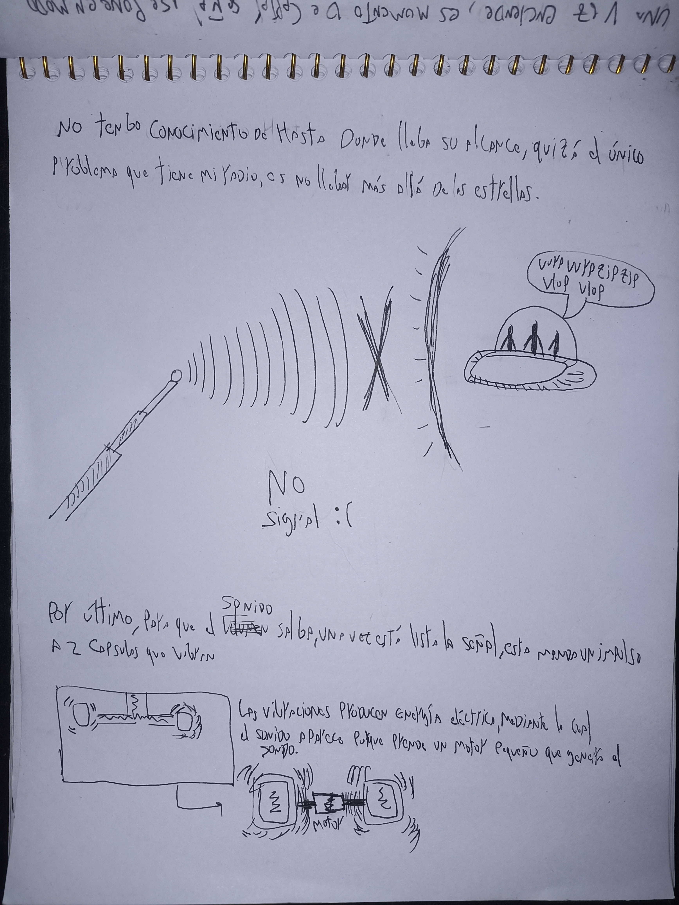

# sesion-01a

## encargo-00

### review barrio universitario

Al momento de ver la película barrio universitario fui con las expectativas bajísimas, y así fue como se me cumplieron al momento de ver el reparto y la dirección. No me pareció una mala película ya que estaba preparado para el tipo de película que era, siento que el mensaje queda clarísimo y la forma en la que se narran los acontecimientos no aburre. Creo que es una buena herramienta mezclar el humor con temas controversiales como lo son los que se muestran en la película, tales como la desigualdad entre universidades públicas y privadas, el tipo de alumnos de cada una y el contraste entre estas realidades. Creo que calza muy bien con la realidad, pese a ser ficción y exagerar algunas situaciones, no se escapa tanto de lo que es real. Lo curioso es que la película es del año 2013 pero pese a eso las situaciones que se muestran, sobretodo el contraste entre universidades y el tipo de personas que estas forman, sigue siendo real. Al momento de terminar la película, pensé en la robótica chilena y creo que nunca he visto difusión de actividades como esas, muy pocas veces en las noticias o medios de difusión se habla sobre eso. Por otra parte, no fui muy serio y crítico al momento de ver la película, me relajé bastante viéndola. Me reí harto porque tenía un humor parecido al mío y además tenía humoristas con los cuáles soy afín, y tal como se dice, al chileno le gustan los chistes cortos y de aparatos reproductores.

### review disco Kraftwerk The Man Machine

Escuché el álbum _Die Mensch-Maschine_ en alemán y en inglés _The Man Machine_. Primero escuché la versión en inglés y después en alemán para ver si es que cambiaban en algo más allá del idioma, no fue así. Este álbum es el sexto de la banda y fue lanzado el 22 de mayo de 1978, se compone de 6 canciones. La primera canción "The robots" nos da el primer acercamiento a la atmósfera del disco, es bastante oscura y distópica con melodías apagadas, siento que nos muestra la llegada de algo nuevo y futurista, en este caso, los robots, sobretodo por la voz sintetizada con vocoder que es para darle efectos a la voz. La segunda y tercera canción "Space Lab" y "Metropolis" se sumergen más en este mundo mecanizado, con percusiones electrónicas y sonidos futuristas, siento que estas 2 canciones establecen un cambio de paradigma de la realidad, como el inicio de la transición del humano máquina. Engloban un ambiente desesperanzador del cambio, de un nuevo camino. En las 3 primeras canciones se observa una composición más fija, letras más acotadas, como si todo fuera cuadrado, oscuro y robótico. En las canciones "The Model" y "Neon Lights" a diferencia de las anteriores, notamos una melodía más alegre, con coros más largos y mayor participación vocal humana y no robot, como si nos diera una pincelada de humanidad antes de la transformación completa a máquinas. Estas 2 canciones poseen un ritmo más humano, relajado, pacífico, también se siente como la aceptación y casi realización de la perfección.

En la penúltima canción "Neon Lights" de la cual se habló anteriormente, siento que se retrata una convivencia en paz del humano con su parte máquina. Se habla de una ciudad hecha de luces de neón, perfecta. En la última canción "The Man Machine" volvemos a la atmósfera oscura, con un teclado o sintetizador con notas bajas al comienzo, se siente como la evolución se completó, la llegada del hombre máquina y la perfección están aquí. En esta canción vuelve la voz sintetizada de robot con vocoder, algo que había desaparecido en las últimas 2 canciones que eran más "humanas". Este efecto da una sensación de coro angelical robótico, como si fuera lo más puro y perfecto que pueda existir. Se repite a lo largo de la canción la frase "The Man Machine, Machine, Machine , Machine", dándonos a entender que ya se es una máquina y que no queda nada más que eso.

El disco a rasgos generales presenta muchísimos instrumentos mezclados, es difícil identificarlos. En un blog de música que leí, se indica que utilizaron los siguientes instrumentos:

1. Prophet 5
2. Moog Micromoog
3. Moog Minimoog
4. Arp (White-Faced) Odyssey
5. Ems Synthi-100 modular syntehetizer system
6. Ems Synthy A Synth
7. Farfisa Professional Piano
8. Orchestron
9. Farfisa Rythm Unit 10
10. Custom Build Electronic Drum Pads
11. Vox Percussion King
12. Eventide Digital Delay
13. Eventide Fl-201 Instant Flanber
14. Roland Re 201 Space Echo
15. Military Speech Syntethizer
16. Schulte Compact Phasing A
17. Mutron Biphase
18. Ems 2000/3000 Series Vocoder
19. Synthon 221 Vocoder

Como última parte del análisis, puedo decir que el disco posee ritmos bastante marcados y cuadrados, repetitivos, pero que se aceleran y desaceleran dependiendo de la canción. La voz posee mezclas de Vocoder y también se escucha al natural en 2 canciones. El álbum me pareció bueno, no sé si es de mi gusto completamente pero la verdad me sorprendió bastante,lo suficiente como para investigar más de la discografía de Kraftwerk, este disco es mucho más que una mezcla al azar de sonidos electrónicos, creo que nunca había escuchado nada parecido.

### encargo-01: Mi caja negra y yo

