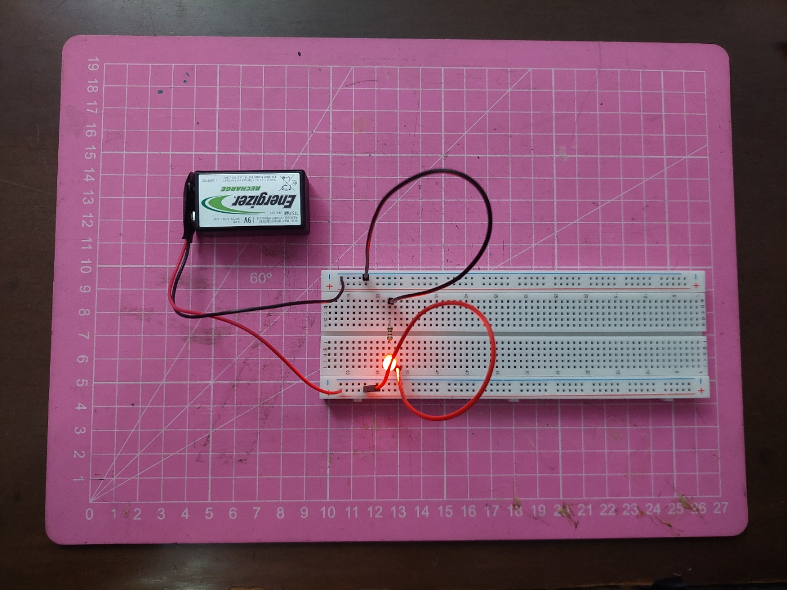
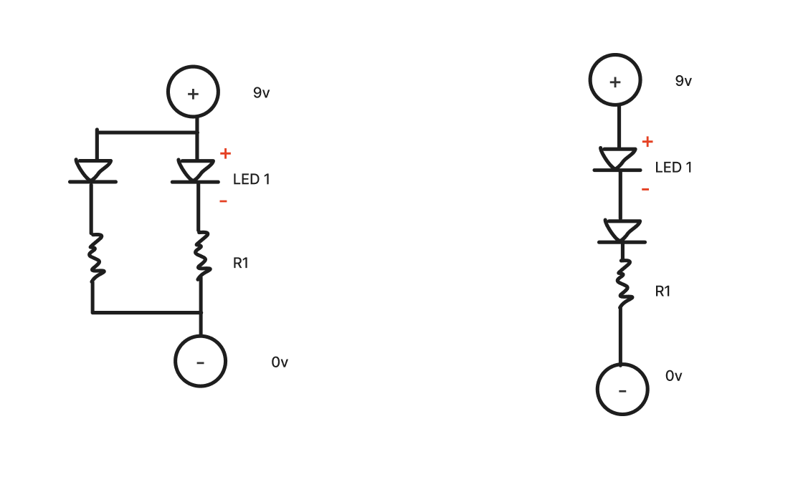
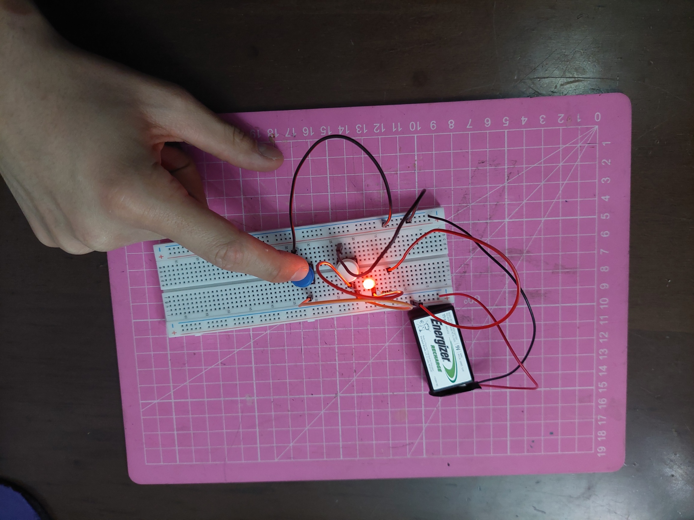

# sesion-02a

## Apuntes

https://www.figma.com/board/2tv4jx75qGZa6Gua2UCVer/taller.maq.electr?node-id=0-1&t=6yhYUOzb6bTK2Cu1-1

## Encargo Musical

pueblo nuevo:
DANCE - Música Inmobiliaria

Elegí este disco principalmente por su título y portada. Estuve unos 10 minutos escuchando pedazos de otros álbumes de la weblabel, sin embargo, después de un par de semanas de escuchar música electrónica experimental, música que yo llamaría “muy electrónica”, buscaba escuchar algo que se asemejara más a los ritmos más funk y rap que me gustan más, -que te hagan mover más el cuerpo que el cerebro-.

Cuando vi el título de este disco me hizo pensar que quizás se acercaría más a lo que yo buscaba.

Mientras lo escuchaba estaba explorando con la protoboard, y las canciones no llamaron mi atención en particular, hasta que llegué a la 3ra canción del disco, “givi tumi”, la cual desde que empieza tiene un ritmo pegadizo y unos sonidos que me recuerdan a 31 minutos. Cerca de los 55 segundos de canción se introduce un nuevo instrumento que me encantó, que es como un piano, y que me recuerda como a la wii.

El álbum en general me gustó, todas las canciones me parecen agradables, la única que añadiría a mi playlist sería el 3er track “givi tumi”.

## AVANCE EXPLORATORIO

Materiales a dispoisición: 

Esta es mi cajita de componentes, la quiero mucho <3

### NIVEL 1

Conexión con un led

### NIVEL 2

Conexión paralela y en serie

# PARALELA

comparten voltaje, se dividen la corriente. (por lo tanto, mientras más leds, menos brilla c/u de ellos)

# SERIE

Comparten corriente, se dividen el voltaje (por lo tanto, si desconecto uno, todos se apagan)

### NIVEL 3

Saqué este ejemplo de google imágenes para agarrar vuelo.

<https://blog.uelectronics.com/electronica/como-prender-un-led-con-un-push-boton-utilizando-el-protoboard-de-400-pts/>

Pruebas:

- Si, en vez poner el led entre el botón y la resistencia, pongo la resistencia entre el botón y el led, sigue funcionando.
- Si el cable de tierra y el led están conectados al mismo pin, el botón permanece prendido.
- Si pongo un cable entre el botón y el led, igual funciona

### NIVEL 4: Dos botones

## Encargo 05: RESISTORES

fuente: <https://eepower.com/resistor-guide/resistor-fundamentals/what-is-a-resistor/#>

Los resistor o resistencia, son componentes pasivos los cuales generan una resistencia al flujo de la corriente. Se mide en Ohm.

Existen 2 tipos de resistor, los variables y fijos.

Fijos: Son los que conocemos como un centro cerámico con 2 pines. Estos cuentan con sistema de color para identificar su valor. Tienen entre 4 y 5 lineas de color, donde cada una significa algo. 

<https://www.digikey.com/en/resources/conversion-calculators/conversion-calculator-resistor-color-code>

Variables: son resistores, en los cuales, la resistencia que ejercen a la corriente puede variar, resistiendo más o menos segun factores externos. Ejemplos son el potenciómetro, LDR, etc.

En un circuito los componentes se pueden utilizar en serie o paralelo, esto afectará a la forma en que comportan los componentes.

Serie: Cuando 2 o más resistencias están conectadas en paralelo, las resistencia de cada una de suma y el total será la resistencia total ejercida en esa parte del circuito.

Paralelo: Cuando 2 o más resistencias están conectadas en paralelo, es más complejo el cálculo, se puede hacer con esta fórmula: (R1*R2)/R1+R2

De acá podemos extraer que, si en algún momento quiero ocupar una resistencia que no tengo, puedo juntar otras para llegar a valores distintos, si las pongo en serie consigo valores mayores a los originales, y en paralelo, valores menores a los originales.
