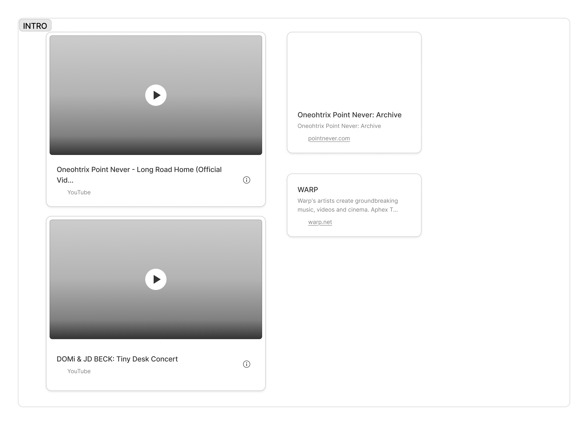
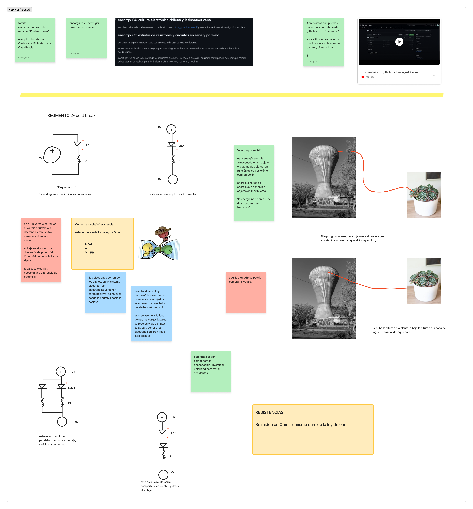
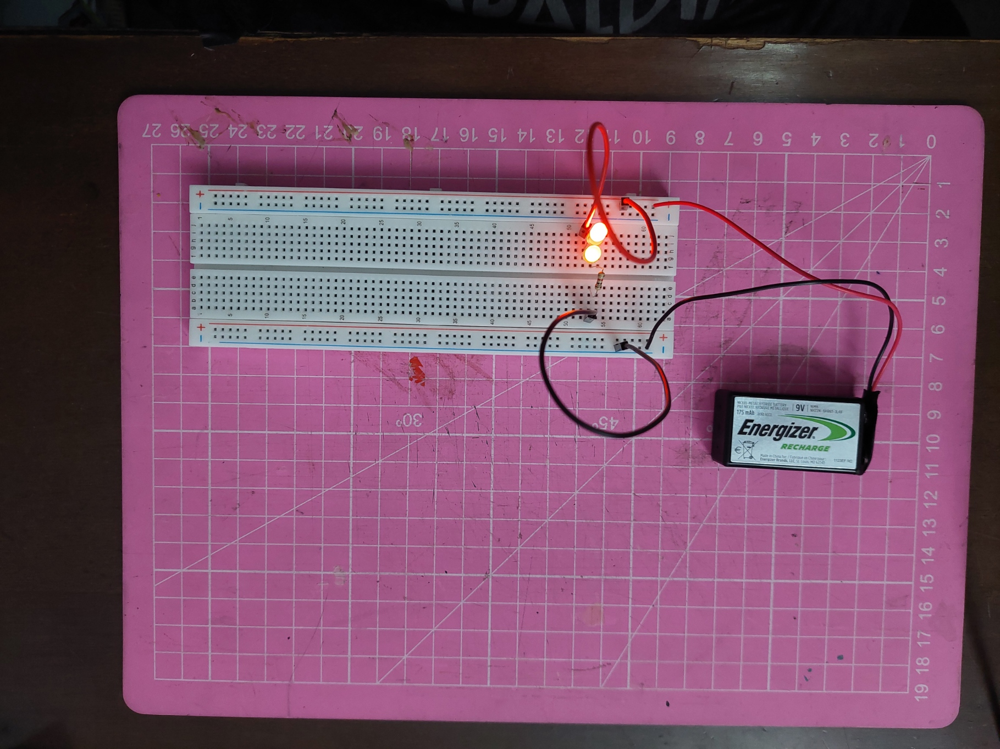
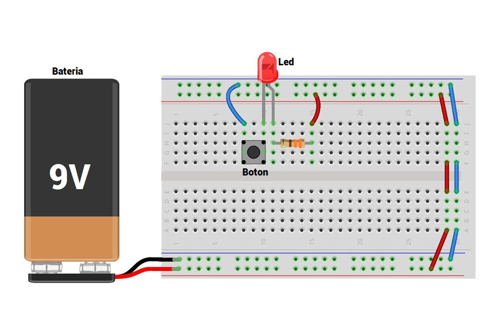
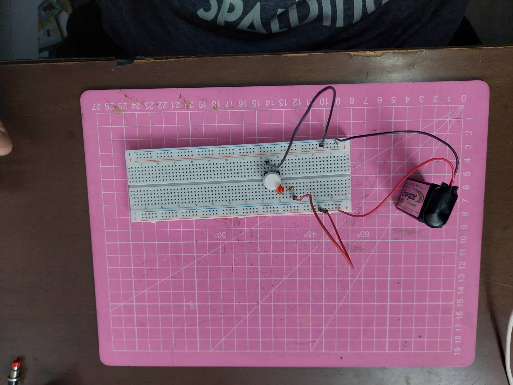
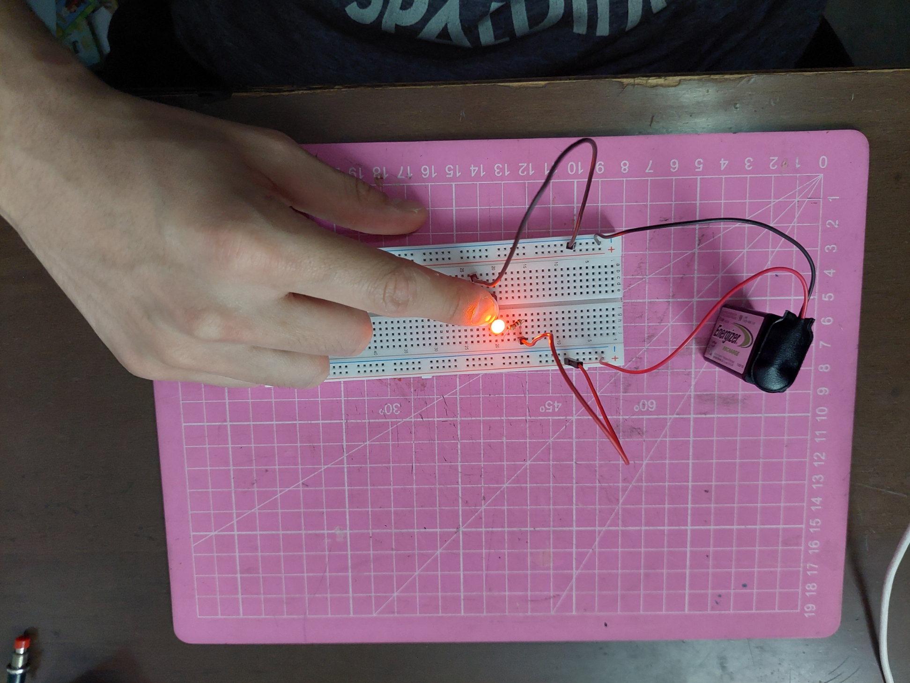

# sesion-02a

## Apuntes

https://www.figma.com/board/2tv4jx75qGZa6Gua2UCVer/taller.maq.electr?node-id=0-1&t=6yhYUOzb6bTK2Cu1-1

## AVANCE EXPLORATORIO

Materiales a dispoisición: 

Esta es mi cajita de componentes, la quiero mucho <3

-foto de los materiales-

### NIVEL 1

Conexión con un led

### NIVEL 2

Conexión paralela y en serie

# PARALELA

comparten voltaje, se dividen la corriente. (por lo tanto, mientras más leds, menos brilla c/u de ellos)

# SERIE

Comparten corriente, se dividen el voltaje (por lo tanto, si desconecto uno, todos se apagan)

### NIVEL 3

Saqué este ejemplo de google imágenes para agarrar vuelo.

<https://blog.uelectronics.com/electronica/como-prender-un-led-con-un-push-boton-utilizando-el-protoboard-de-400-pts/>

Pruebas:

- Si, en vez poner el led entre el botón y la resistencia, pongo la resistencia entre el botón y el led, sigue funcionando.
- Si el cable de tierra y el led están conectados al mismo pin, el botón permanece prendido.
- Si pongo un cable entre el botón y el led, igual funciona

### NIVEL 4: Dos botones

