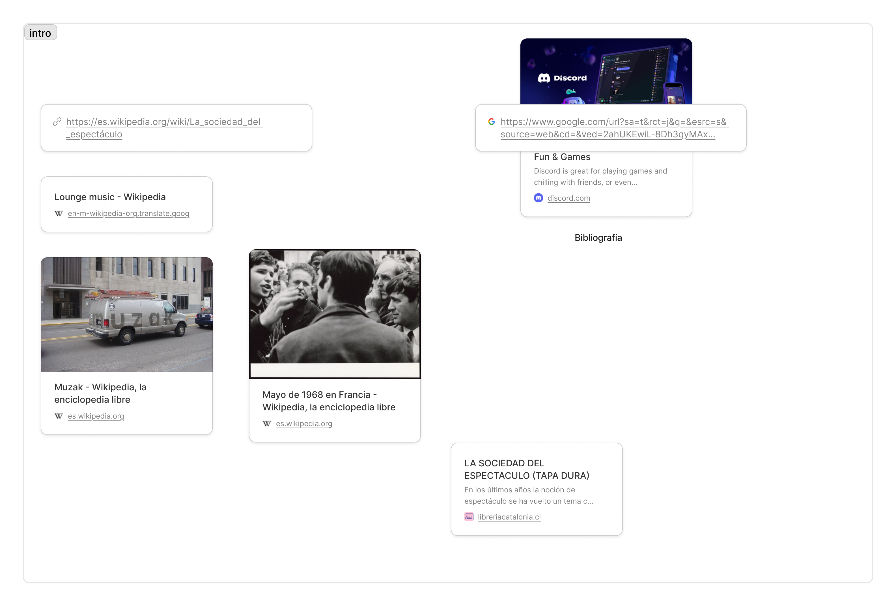

# sesion-03b

## encargo-09: Visita al MAC

Exposición sonora:

El Museo de Arte Contemporáneo es un lugar muy importante históricamente, y un aporte para la cultura nacional.

El edificio fue construido en 1920, por el arquitecto Alberto Cruz Montt. En 1934, el edificio fue traspasado a la Universidad  de Chile, y funcionó como facultad de agronomía hasta la década de los 70.

Posteriormente, fue declarado como Monumento Nacional, y entre 2004 y 2005, fue traspasado al Museo de Arte Contemporáneo, mientras se realizaban remodelaciones en la sede del parque forestal.

Este año se celebran 20 años desde que comenzó a ser una sede del Museo de Arte Contemporáneo. Dada esta instancia, el museo le pidió a Matías Serrano y María Ignacia Valdebenito que generaran una obra que conectara con el contexto de la celebración.

La exposición constaba de una serie de obras colgadas desde el techo. Cada una de esas ellas, colgadas a aprox 150 cm del suelo, compuestas de múltiples objetos que parecían ser basura, unidos. Cada uno de ellos tenía un microcontrolador con un parlante, el cual emitía sonidos ambientales.

Primero, miré la exposición sin leer el contexto. Buscaba entender la obra y sus justificación antes de leerla. Me esforcé en analizarlas con el objetivo de encontrar la motivación y el elemento unificante de todas las obras. No lo encontré.

Unos minutos después, volví a ver la exposición, pero esta vez, escuché a uno de los autores de la obra, Matías Serrano, explicar lo que hay detrás de este proyecto.

Lo que entendí fue:

Ambas sedes del MAC puede metaforizarse como los oídos de una persona. Los artistas exponentes realizaron ejercicios de escucha activa, donde registraban los distintos sonidos que se percibían en ambas sedes del MAC y en el recorrido que los une, por la calle Santo Domingo.

Estos sonidos registrados, se usaban como inspiración y guía para crear módulos expositores, compuestos por objetos encontrados y recolectados durante el recorrido. Cada uno de estos objetos tenía un chip que emitía los sonidos que fueron usados como inspiración para ser creados.

Una vez entendí el contexto de la exposición y todo lo que hay detrás, mi opinión sobre la obra cambió radicalmente, me pareció muy acertada la metáfora de ambas sedes como 2 oídos escuchando en estéreo. También muy hermoso el concepto de crear objetos volumétricos a partir de sonidos, me parece especialmente bello que sea a partir de sonidos de ambiente, pues, al ser ambientales, muchas veces nuestro cerebro “ignora” estos sonidos y, para mí, más que “sonidos” los consideraba “ruido”, es decir, es una especie de interferencia que me obstaculiza escuchar los sonidos “reales”.

De esa experiencia rescato la importancia de entender el contexto y antecedentes de una obra/proyecto, para poder conectar con él. Me acerca a entender la importancia de la curatoría, los apoyos museográficos y las llamadas “hojamac” <https://mac.uchile.cl/wp-content/uploads/2024/10/educamac_hojamac.pdf>

## encargo-08: encargo musical

### Gonzalo Martínez y sus cumbias pensantes

 <https://www.youtube.com/watch?v=MGBKucEQzwk>

 <https://www.youtube.com/watch?v=owdi6iuhx9k>

 <https://www.musicapopular.cl/artista/dandy-jack/>

 <https://es.wikipedia.org/wiki/Gonzalo_Martínez_y_sus_congas_pensantes>

 Disco lanzado en el año 1997 (aunque en el empaque dice 1998). El conjunto musical estaba compuesto por Jorge González y Dandy Jack (Martín Schopf).

 Martin Schopf es un músico chileno, cuya carrera musical se ha desarrollado principalmente en Alemania, tras ser exiliado junto a su madre producto de la dictadura militar en Chile. Dado el contexto musical de Martín, tenía muchas influencias electrónicas, principalmente alemanas, por lo que su música se carcateriza por estas influencias europeas de los 80s.

 En la década de los 90, Dandy le propone a Jorge González, músico reconocido y consolidado en Chile y Latinoamérica, que colaboren en un proyecto musical en forma de disco.

 La forma de abordar este disco para Dandy fue, "la única forma de acercar al público chileno a la mpusica electrónica, es acercar la música electrónica al pueblo chileno". Por lo que su proyecto se componía de *covers* de cumbias chilenas, acercándose hacia lo electrónico y el sonido digital.

 Cuando se publicó este proyecto, estranándose en formato CD y cassette, no tuvo éxito. Vendió menos de 3mil copias. En 2014 se reeditó este disco simultaneamente en 3 paíse, Chile, Colombia y Estados Unidos. La reedición tuvo un cambio de portada, y se redujeron la cantidad de tracks de 10 a 8.
