### sesion-06a

## Entrega Proyecto 01: 

# LDA: Light Dependent Awelita

# Premisa:

- Elegir Temática

- Definir Usuario
 
- Definir Función

## Elegir Temática: 

<https://www.555-timer-circuits.com>

Miramos los distintos ejemplos en esta página, y destacamos los que más nos llamaron la atención.

<https://www.555-timer-circuits.com/dark-detector.html>

 Este proyecto consiste en un circuito que sensa la luz a través de un LDR. Una alarma se activa cuando el nivel de luz detectado es menor a cierta cantidad determinada por la configuración del sistema.

## Definir Usuario:

USER PERSONA

- Nombre: Gloria Fernández

- Edad: 89 años
- Género: Femenino
- Estado civil: Viuda
- Ciudad: Chillán

Biografía: 

Gloria vive una casa con su hijo, su nuera y sus dos nietos. Trabajó de como educadora de párvulos hasta los 72 años. Todos los días desayuna entre las 10:30 y las 12:00, almuerza entre las 13:30 y las 16:30, y toma once entre las 19:30 y las 22:00. el horario en el que realiza sus *hobbies* va desde las 14:00 hasta las 21:30.

Motivación:

Busca realizar actividades que la ayuden a distraerse y a hacer que el tiempo pase más rápido. puede pasar horas entretenida con actividades como leer, tejer, bordar, armar rompecabezas y resolver sopas de letras.

## Definir Función a Partir de la Problemática: 

Problemática: 

Identificamos una problemática en aquella situación cuando una persona, en este caso un adulte mayor, realiza actividades que requieren concentración, durante extensos periodos. Cuando estos períodos coinciden con la puesta del sol, el usuario sigue realizando su actividad a oscuras.

Esto ocurre porque la disminución de la luz es paulatina, y sucede a una velocidad que permite que nuestro ojo se vaya acostumbrando a ella automáticamente. Por eso a veces pareciera que oscureció de golpe en la noche 

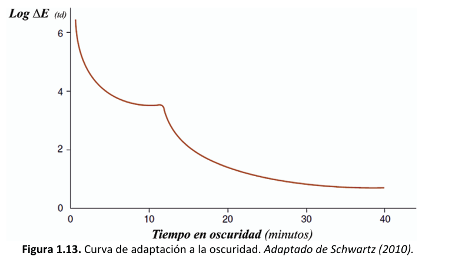

<https://uvadoc.uva.es/handle/10324/22376>

Si bien, no hay estudios que comprueben que hacer atividades a oscuras dañe la vista, hacer actividades a oscuras requiere un mayor esfuerzo, por lo tanto te cansa más y dificulta hacerlo por períodos prolongados.

Definición Función: 

Imagen generada por Ia mediante chatGPT

Un objeto que cuando se oscurezca emita una alarma para alertar al usuario, y que este recuerde encender una luz para que no suene. Esta alarma sonará durante 300s y después el istema se suspenderá hasta que vuelva a detectar luz.

# Diseño: 

## Investigación 1: Iluminación

<https://pin.it/83V7VnPhr>

La luz es un fenónemo que scede como efecto secundario de la radiación electromagnética. Esta es percibida por el ojo humano dentro de un espectro visible con longitudes de onda entre 380 y 750mm.

<https://es.wikipedia.org/wiki/Luz>

La intensidad de la luz se mide en lúmenes(lx), se mide con un instrumento llamado luxómetro.

Para trabajar / leer se recomiendan entre 300-500lx

| Ejemplo de valores lux         |            |
|--------------------------------|------------|
| Luz solar                      | 40.00 lx   |
| Lugar de trabajo en la oficina | 300-500 lx |
| Sala de estar                  | 50-200 lx  |
| Noche de luna                  | 0,3 lx     |
  
## Investigación 2: ¿Cómo lograr que suceda?

Podemos seprar en 2 nuestros objetivos del funcionamiento electrónico del objeto:

- Emitir sonido cuando sense

- Que el sonido no sea permanente

Para cada uno de los objetivos que tenemos ya tenemos un circuito conocido.

Con el circuito  Dark Detector podemos hacer que el cirtuito emita una alarma cuando haya poca luz.

Con el circuito monoestable podemos lograr que cuando se recibe un estímulo, este quede corriendo durante un tiempo y después apagarse.

La idea es "fusionar" ambos circuitos para lograr que la parte del Dark Detector(A) "controle" a la parte monoestble (B)

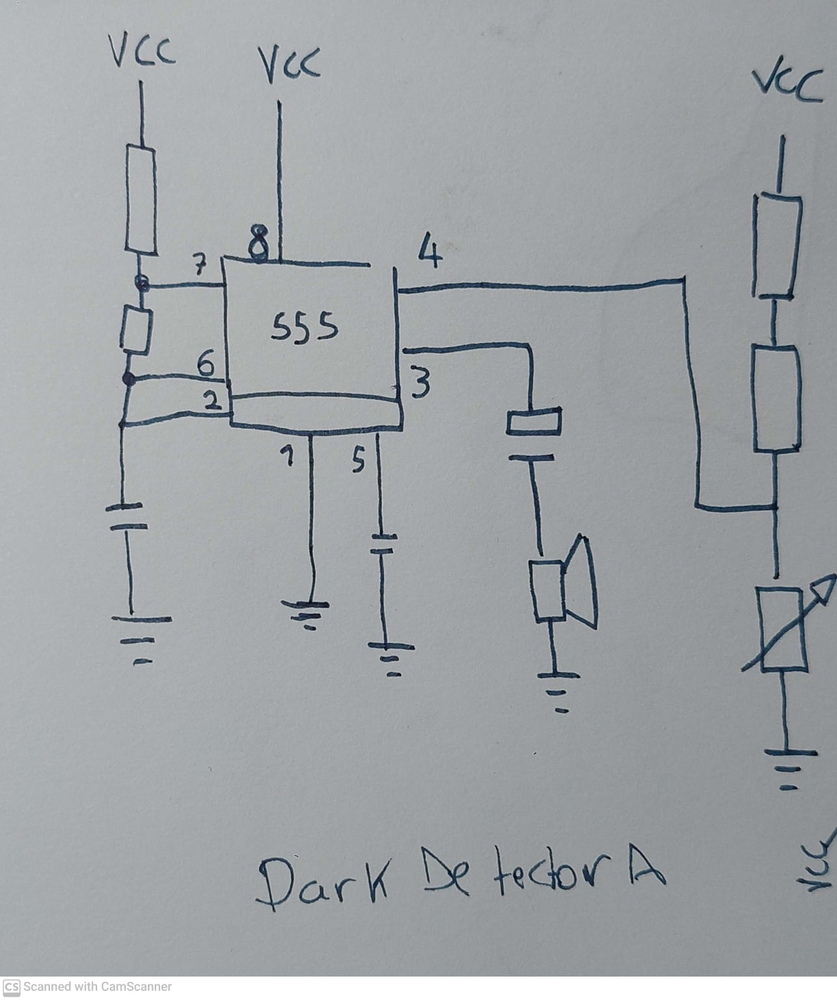

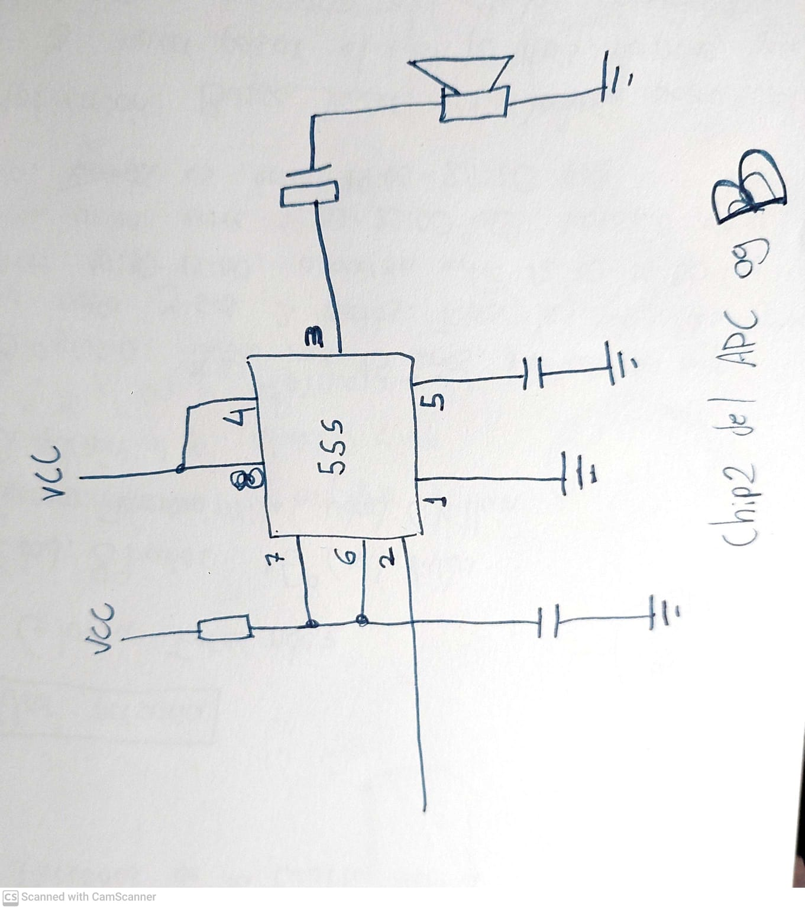

## Redefinición

Tras múltiples intentos no logramos

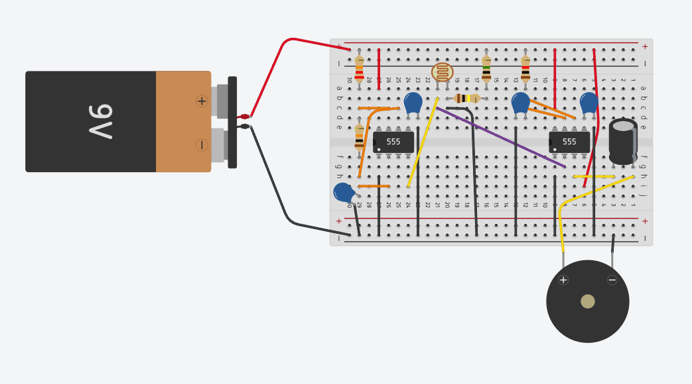

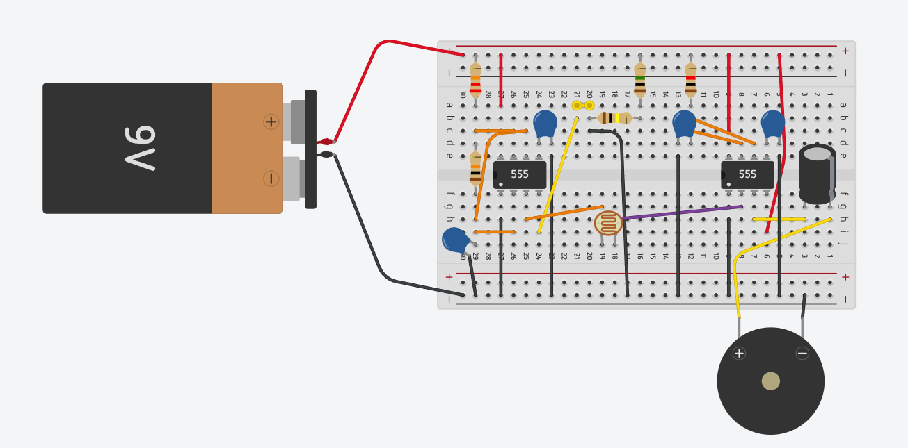

Tras no lograr llevar a cabo la idea original, decidimos optar por quedarnos con la parte que teníamos funcionando.

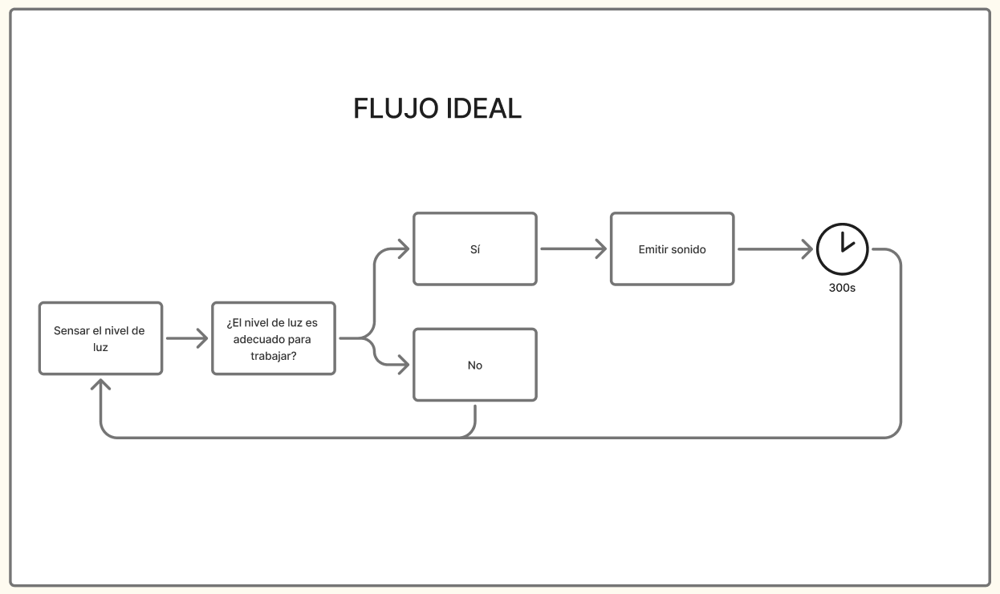

# FABRICACIÓN: 

## Cables:

En esta etapa tomamos medidas de los componentes, y los tuvimos en cuenta para el diseño de la carcasa

## Carcasa: 

Hicimos un modelo 3D mediante Rhinoceros 3D

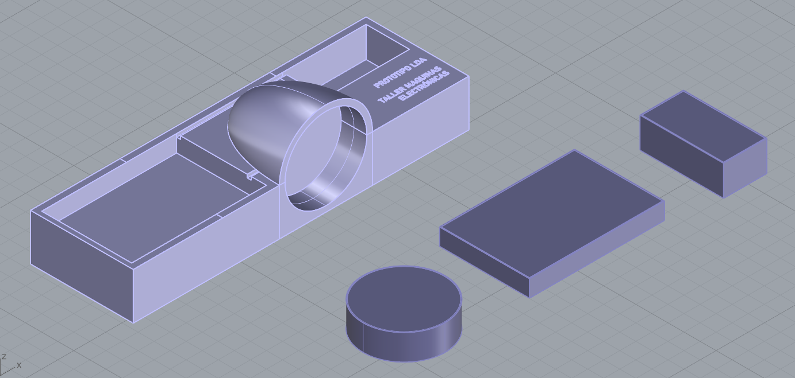

Impresión 3D

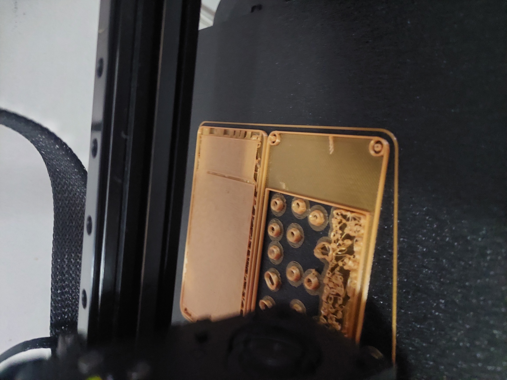

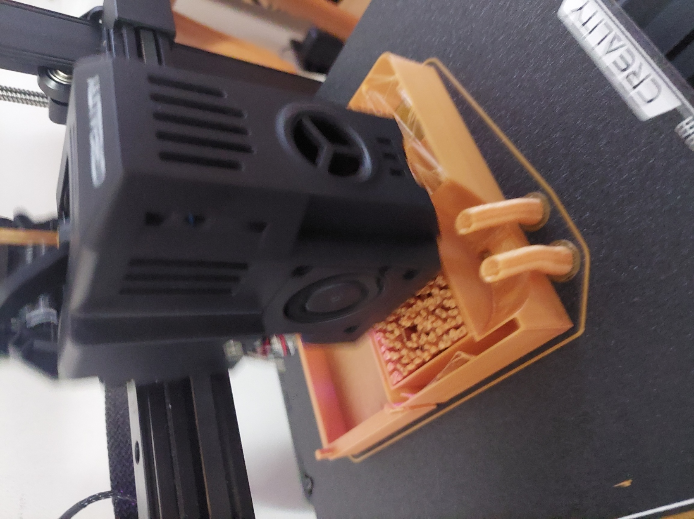

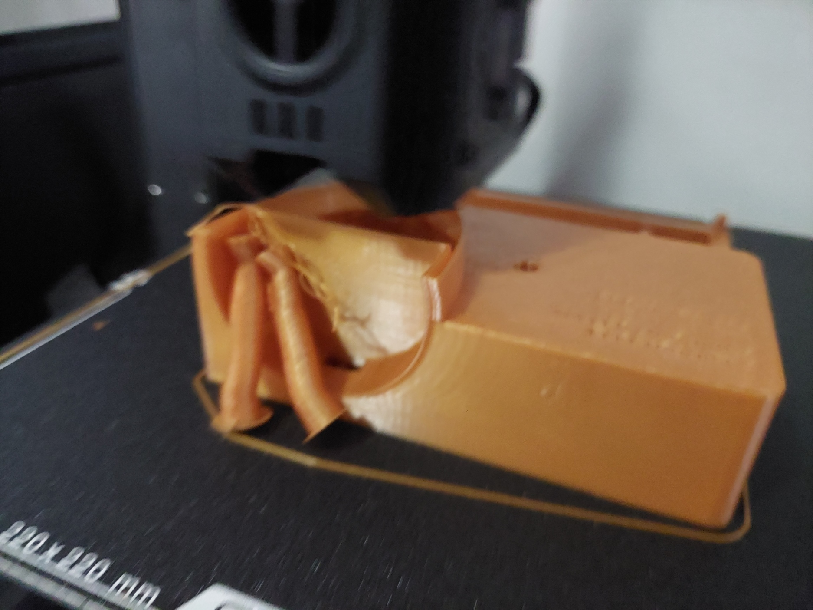

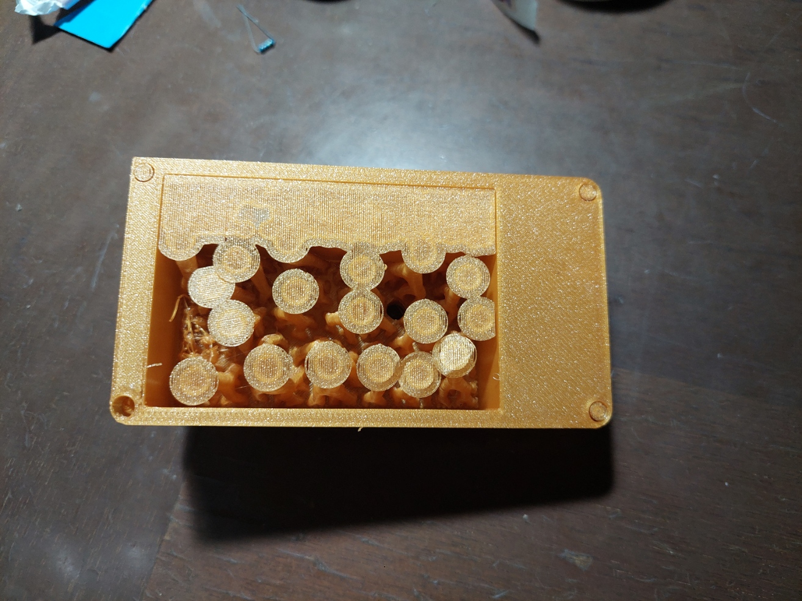

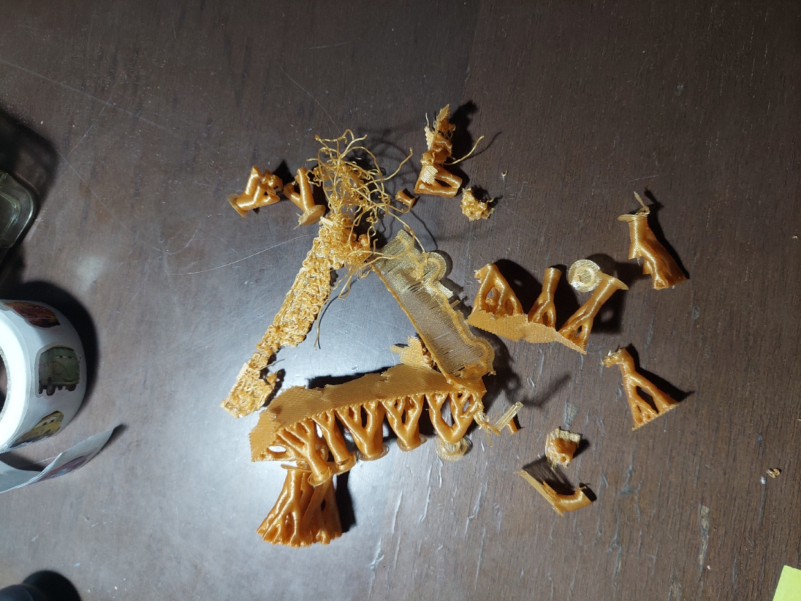
