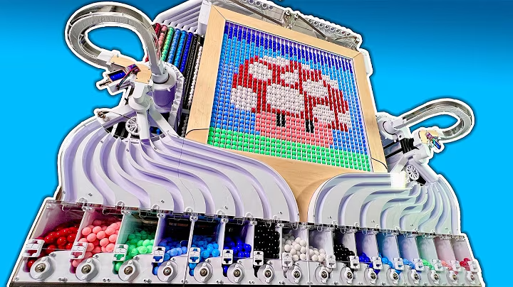
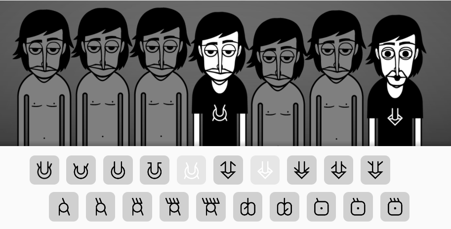

# sesion-12b

## Propuesta 1: **gravity bit**

#### descripción general

un display de 8x8 pixeles, que permite al usuario representar sus imagenes favoritas de películas, videojuegos, y más. gravity bit permite 64^4 configuraciones diferentes.

#### contexto de uso y target

escritorio, sala de estar.

aficionados a la electrónica, gamers.

#### funcionamiento técnico

consiste es un sistema de motores que llevan los pixeles(canicas plásticas) hasta la parte superior de _gravity bit_, al dejar caer la canica, esta recorre todo el display, en forma de "s" hasta quedar en el primer lugar disponible.

en proceso creativo: se baraja la opción de añadir un sección que sea capaz de diferenciar las canicas y sortearlas por color. 

#### interfaz

la interfaz se compone de 4 botones, cada uno asociado a un color. el usuario deberá presionar los botonoes en un orden predeterminado para lograr representarla imagen deseada.

#### componentes

motores, sensor de color, botones, y más.

#### dificultades técnicas

- la resolución de 8x8 pixeles, la cual quizás es muy baja para representar imágenes

- la fuerza de los motores debe ser suficiente para empujar hacia arriba múltiples canicas a la vez 

- la parte de sortear color puede que aumente considerablemente el tamaño del _gravity bit_
  
#### referencias

##

## Propuesta 2: **vAso**

#### descripción general

dispositivo electrónico, el cual a través de su morfología puede amplificar el volumen de sonidos emitidos por un celular. a su vez en el display de leds interactúa directamente con los sonidos emitidos por el celular.

#### contexto de uso y target

escritorio, oficina, outdoor, lugares donde se corta la luz constantemente.

estudiantes, trabajadores de oficina, gente con afinidad por el outdoor.

#### funcionamiento técnico

la amplificación de sonido se produce gracias a la forma cónica por donde pasa el sonido.

el dispositivo cuenta con un micrófono, con el cual capta el sonido y en base a este genera distintas interacciones de los leds.

#### interfaz

la interfaz se compone de 6 leds los cuales varían en combinación según la fuente de sonido detectada.

#### componentes

leds, micrófono, entrada usb c y más.

#### dificultades técnicas

- mantener el tamaño pequeño, y que el objeto mantenga su aspecto "elegante"

- hay que comprobar si escuchar música de esta manera gasta menos batería que con un parlante bluetooth
  
#### referencias

[video referente led interface](https://www.youtube.com/watch?v=MKOKng-PpdE&t=205s)

##

## Propuesta 3: **pf.ts.k**

#### descripción general

dispositivo electrónico, el cual puede reproducir varios drums, el usuario puede variar el sonido y tempo de estos.

#### contexto de uso y target

el pf.ts.k puede ser usado como una herramienta para pensar y de prototipado, útil para el proceso creativo, especialmente en las primeras fases.

escritorio, decoración para sala de estar, estudios de música, contexto outdoor.

aficionados a la música, gente aprendiendo sobre música, niñes.

#### funcionamiento técnico

el dispositivo tiene 5 sonidos configurados, los cuales pueden sonar simultáneamente. éstos pueden ser manipulados por el usuario mediante la interfaz. 

#### interfaz

la interfaz está compuesta por 5 secciones, cada una  corresponde a un "instrumento" diferente. cada segmento cuenta con: 1 potenciómetro lineal, el cual permite ajustar el volumen del instrumento correspondiente, al marcar el valor mínimo, el sonido será 0. y 1 potenciómetro radial que permite ajustar el tempo del instrumento. la perilla tiene marcas en su exterior que indican valores de interés(3/4, 4/4, etc).

#### componentes

4 potenciómetro lineales, 4 potenciómetros radiales, 4 speaker

#### dificultades técnicas

- manejar los valores del potenciómetro para que no se desfase con la interfaz gráfica

- lograr sonidos que se perciban como "de calidad"

- eventualemente agregar puerto mini jack para audífonos

#### referencias

[enlace incredibox, página que permite hacer musica a principiantes]([https://www.youtube.com/watch?v=MKOKng-PpdE&t=205s](https://www.incredibox.com/es/demo/))

## extras

- [figma donde se ve más proceso](https://www.figma.com/board/2tv4jx75qGZa6Gua2UCVer/taller.maq.electr?node-id=0-1&t=BGeXfCc5m7jDF3CI-1 "link a mi figma").

- https://www.markdownguide.org/basic-syntax/#links

