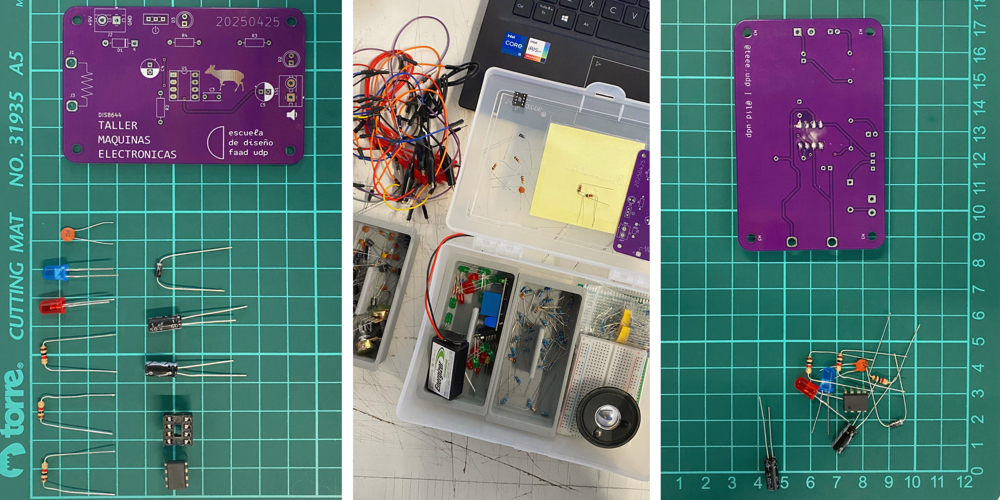
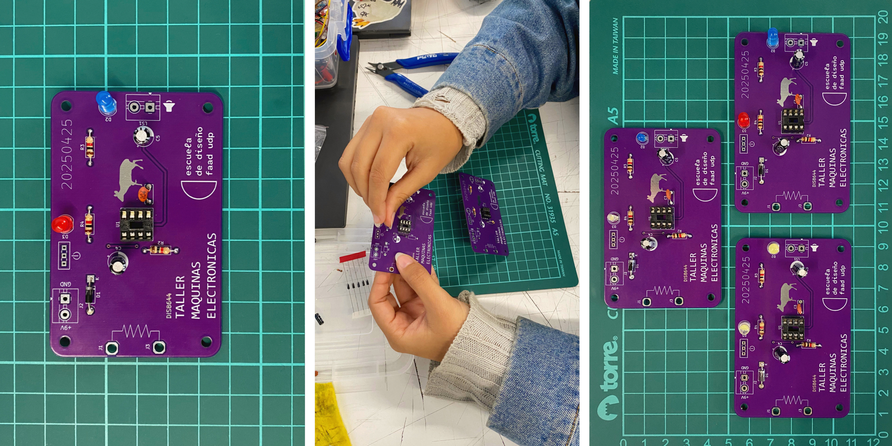

# sesion-10b

## Trabajo en clase

### Cosas que hablamos en la mañana / Viernes 16 de Mayo

- Dead Internet Theory
- TikTok opera en Estados Unidos y los datos de los usuarios se envían a China.
- Circuit bending es la personalización de circuitos, donde se modifican juegos infantiles o sintetizadores.
- Nicolás Collings, el sonido proviene de romper los circuitos electrónicos.
- Circuit bent Speak and Spell <https://youtu.be/Y-M9mXLl9gM?si=lVejOtLXzZZFFr8s>
- Hack of the Month Club, jumping speakers <https://youtu.be/6ZxxuDNQuMQ?si=KUrd1tIN_m32f4_6>

### Bom udpudu

|Referencia  |Valor   |Huella                   |Qty|OBS               |
|------------|--------|-------------------------|---|------------------|
|U1          |~       |Socket 8 pines           |1  |                  |
|R2,R3,R4    |1k      |Resistencias             |3  |                  |
|D1          |1n4007  |Diodo                    |1  |                  |
|C3          |100n    |Condensador cerámico     |1  |104               |
|C4          |1u      |Condensador electrolítico|1  |                  |
|C5          |47u     |Condensador electrolítico|1  |                  |
|D2,D3       |LED     |Led 5mm                  |2  |                  |
|J2          |TBLOCK_2|Terminal Block 2         |1  |                  |
|LS1         |SPK     |Terminal Block 2         |1  |                  |
|SW1         |SW_SPDT |Switch spdt              |1  |                  |
|U1          |NE555   |DIP-8                    |1  |Va en el socket U1|
|Clip batería|9v      |                         |1  |                  |
|Parlante    |8ohm    |                         |1  |                  |
|J1,J3       |CAIMAN  |Cables caimán            |2  |                  |

### PCB udpudu

- Llegaron las PCBs Udpudu que habían encargado a China hace algunas clases y nos mostraron una lista de personas a las que se las van a regalar, con y sin soldar.
- En esta clase tuvimos que seleccionar los componentes y probar cómo queríamos que sonara el circuito en la protoboard.
- Una vez que todos los componentes estaban elegidos y funcionaban correctamente, los ordenamos para soldarlos con estaño.

- Formamos un grupo de tres personas y trabajamos de manera fordista: una posicionaba los componentes, doblando las patillas para que quedaran más firmes, y los soldaba; otra cortaba el sobrante de los componentes, y la tercera tomaba fotos y registraba el proceso.
- Alcanzamos a soldar todos los componentes que teníamos, pero faltó el switch SPDT, que aún no había llegado.
- Como faltaron algunas partes, no alcanzamos a probarla, así que en una próxima clase vamos a hacerlo.

