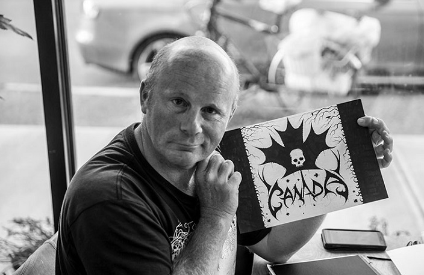

# sesion-09b

## Primer bloque
- Los profes nos comentaron que Christophe Szpajdel "Lord of the Logos", dariá una charla en la facultad de derecho. Este es conocido por diseñar logotipos para bandas de black y death metal.
  
- Configuración - Modos de 555 - ASTABE = oscilación - MONOSTABLE = timer

- MIC HIDROFONO: Los hidrófonos convierten ondas sonoras en señales eléctricas para captar sonidos bajo el agua, útiles en investigación, monitoreo de fauna marina y vigilancia submarina.
- POWER SUPPLY

## Segundo bloque
- Junto a algunos compañeros asistimos a la charla de Christophe Szpajdel.
- Me perdí la clase, pero colocare cosas de la charla

## The lord the of logos
### Christophe Szpajdel.

Desde hace años que me ha gustado escuchar música rock, especialmente géneros como el metal y el heavy metal. Desde hace tiempo, algo que siempre ha captado mi atención es el estilo tan particular de los logos que usan muchas de estas bandas. La mayoría de ellos son complejos, extraños, difíciles de leer e incluso grotescos, pero al mismo tiempo resultan fascinantes y únicos. Me preguntaba por qué este tipo de estética visual es tan común dentro del metal.

Aprovechando que "The Lord of the Logos" venía de visita a dar una charla en la universidad, no quise perder la oportunidad de asistir. Aproveche para entender el significado y la intención detrás de estos logos tan característicos. Gracias a su charla, pude entender que estos diseños no son solo una cuestión estética, sino que también reflejan la identidad, el tono y la filosofía de cada banda. Suelen comunicar fuerza, oscuridad, caos o rebeldía, valores muy presentes en el metal, y en muchos casos, el hecho de que sean ilegibles no es un error, sino una declaración de pertenencia a una subcultura específica.

## encargo-18: de tinkercad a protoboard
les pedimos que por favor tomen el circuito que simulamos en tinkercad y lo traspasen a su protoboard, usando los componentes que tienen en su kit de materiales.

## encargo-19: cultura electrónica y laurie anderson
estudiar la obra de laurie anderson, incluir citas y referentes usados, explicar qué y por qué les gusta o no de su trabajo.
ALBUM escuchado: Big Science.

De entrada para este encargo comence escuchando "Big science", este es el album con el cual hace su debut. 

