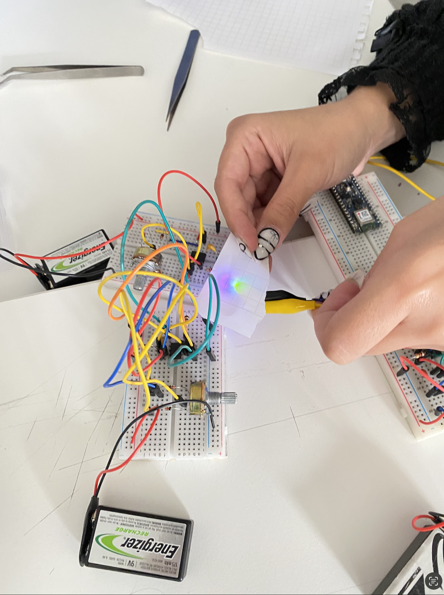
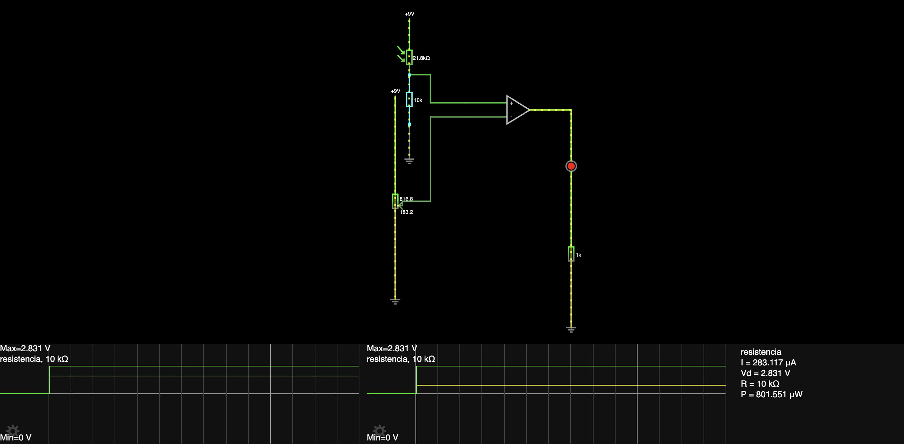
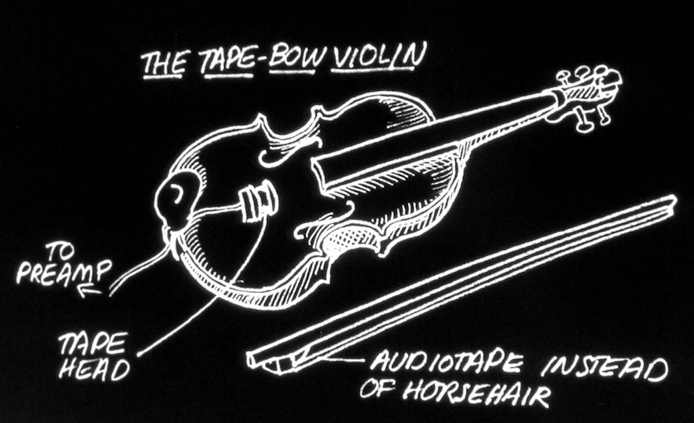
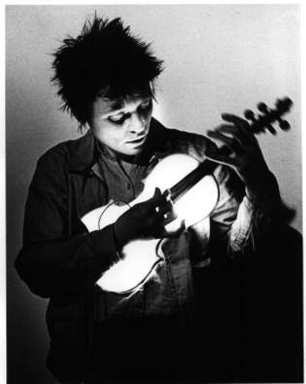

# sesion-10a

13-05-2025

Trabajar en grupos de 3 personas y armar cada uno el circuito PWM, cada persona debe tener un LED de color distinto, luego se combinarán los colores. Luego con un papel se apunta con cada LED y cada circuito al papel, generando un efecto lumínico que combina los colores. Con este ejercicio somos capaces de ver el efecto de RGB.

* Bajando la resistencia se aumenta la intensidad del led

* Este es el primer circuito diseñado en KiCad

LED RGB: tiene 4 patitas, en un mismo encapsulado pueden verse los 3 colores

Pantalla de 7 segmentos: contiene 7 leds, y cada uno se asocia a un segmento, que muestran y forman números o algunos símbolos, se pueden encender o apagar para formar los caracteres deseados.

## LM324 (4 op-amp)

chip de 14 patas 

op-amp: caja negra llena de transistores. Es un circuito integrado (CI) que amplifica señales eléctricas, especialmente voltajes diferenciales

V+: Entrada no inversora

V−: Entrada inversora

Vout: Salida

VS+: Fuente DC positiva

VS−: Fuente DC negativa

## falstad

Permite hacer y simular circuitos, visibilizar su scope, además de variar sus resistencias y velocidad

analog and hibrid chips: 555

## encargo_18: de tinkercad a protoboard

trapasar el circuito simulado en tinkercad a la protoboard

## encargo_19: cultura electrónica y laurie anderson

Laurie Anderson es una artista multidisciplinaria, reconocida por su trabajo en música experimental, performance, poesía, artes visuales y tecnología. 

Personalmente, conocia la obra  "O Superman", pero no conocía a profundidad quien era la creadora ni sus otros trabajos. Lo que más me sorprendió fue su trabajo (re) diseñando distintos intrumentos musicales, pero sobre todo modificando violines de tal forma que ninguno se parece entre si en cuanto al sonido que produce, sin embargo siguen siendo el mismo intrumento que se utiliza de la misma manera que un violín tradicional. Puedo decir que mis favoritos son: Tape bow violin, Neon Violin y The Talking Stick. Como anécdota personal, yo solía tocar el violín, pero por distintas razones (sindrome del impostor) lo dejé a pesar de que es algo siempre quise hacer, por lo que investigar sobre Laurie Anderson hace que quiera volver y retomar el violín, y poder experimentar y crear cosas.

Me impresiona y cambia mi perspectiva de como se tocan los instrumentos y que transmiten, no solo para quien escucha, sino que también para quien lo toca, llevando la música a algo más allá que tiene que ver con el cuerpo en sí, el movimiento de este al momento de tocar un intrumento y la relación directa que tiene la fluidez del cuerpo con la creación de sonido.

De las obras que más me gustaron destaco son, Self-playing violin – Duets on ice, donde ella toca el violin en patines con cubos de hielo hasta que se derrita y pierda el equilibrio poniendo fin a la pieza que toca. También el hecho de que le enseñara a su perro ciego a tocar el piano, lo que hizo que le devolviera la felicidad y su vida social, y al momento de morir su perro, Laurie creó un violín con sus cenizas al cual llamó "the sweetness of music".

aquí dejo una página que contiene un video de Laurie explicando los instrumentos que creó, su inspiración y algunas anécdotas.

https://vimeo.com/589418427/bcaf06cd4b

