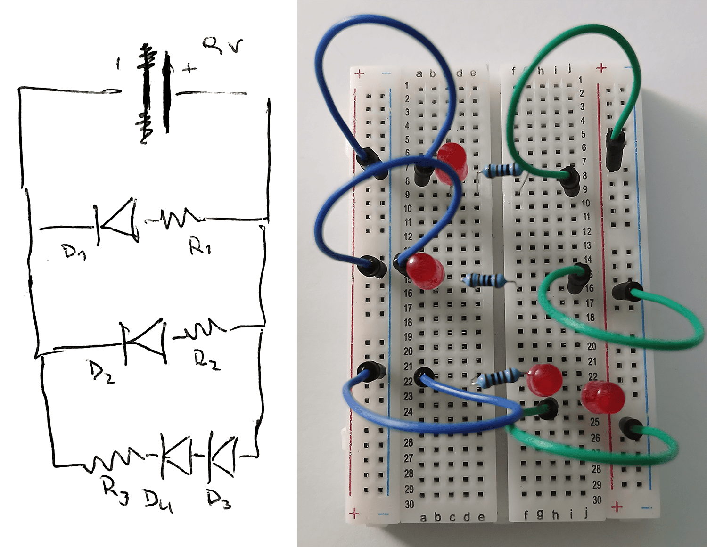
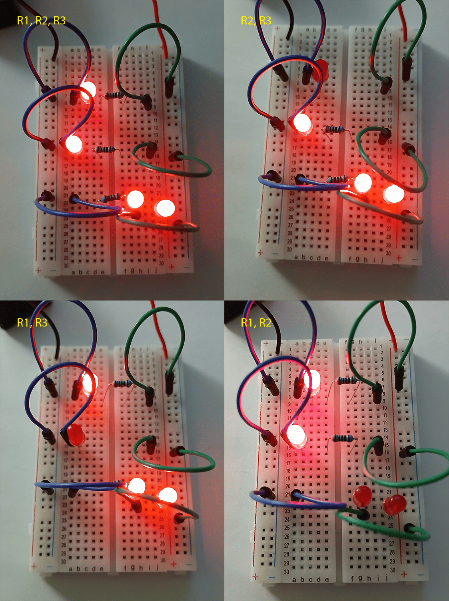
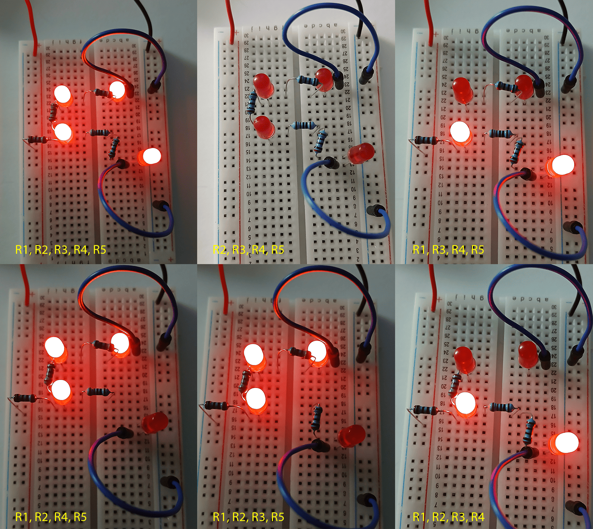
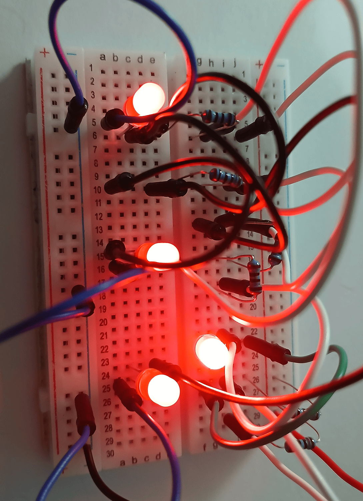
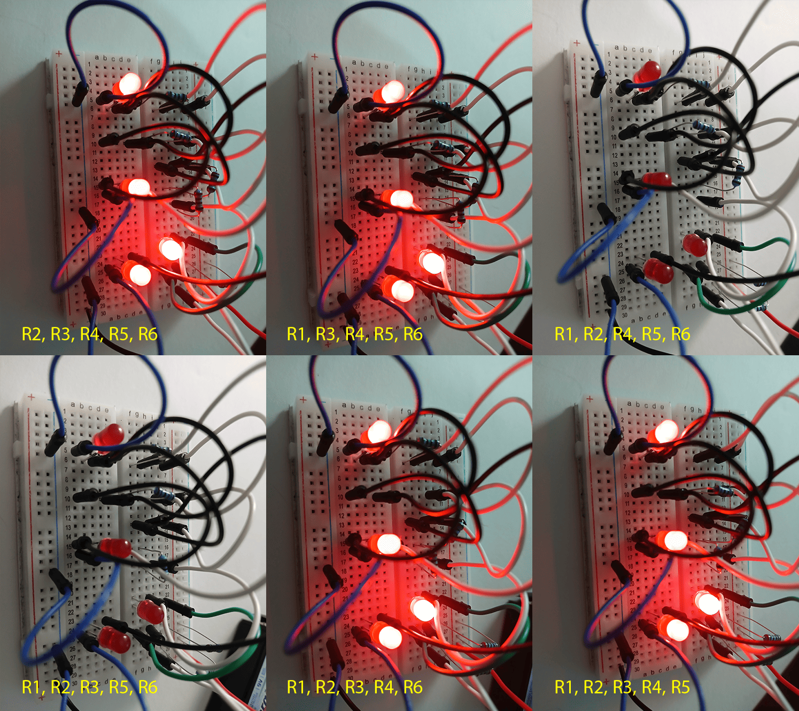
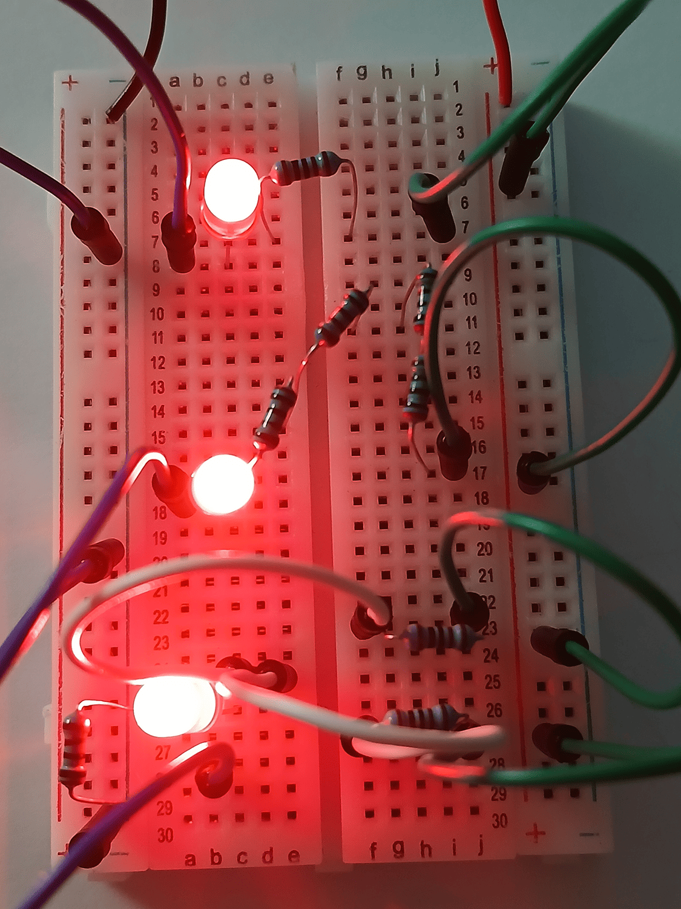
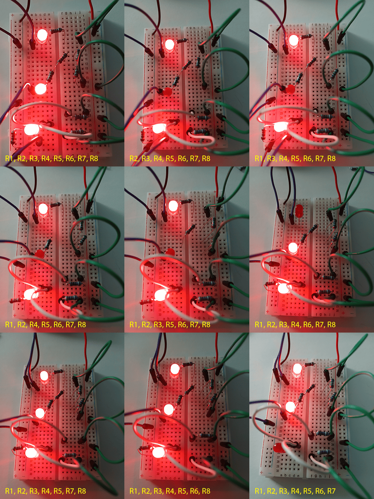

# sesion-02b

[21 de marzo del 2025]

## Apuntes

> Charla pre-clase
> - Alguien escuchó *El poder corrompe* (2009) de Daniel Jeffs y dijo que sonaba como una copia de Kraftwerk, “todo es una copia de Kraftwerk” según Aaron
> - ¿Qué es la composición? (en diseño y música)
> - Phoenix (banda francesa). Daft Punk se separaron de ellos
> - Escuchamos un poco de *Dance* (2017) de Música Inmobiliaria, específicamente el track #3 “givitumi”
> - Misaa habló de la tutupá y nos mostró un [video](https://youtu.be/RQ8Tu6p6V1Y) de la exposición que tuvo en el MAC
> - Leer [intro-elec.md](/00-docentes/sesion-02a/intro-elec.md)

***

Con el circuito inicial, podemos conocer el BOM (**B**ill **O**f **M**aterials) y la “tabla de verdad”

Esquema de circuito y circuito realizado en clase

Como las 3 resistencias son iguales, el brillo de los LED es el mismo. Si modificamos una resistencia, el brillo de los LED asociados a esa resistencia debería cambiar

- Con el **BOM** se documentan los componentes o materiales que se van a usar al fabricar algo

|Type|Qty|Name|Value|
|--|--|--|--|
|Resistencia|3|R1, R2, R3|1k Ω|
|LED|4|D1, D2, D3, D4|Variable|
|Batería|1|BAT|9V|
|Protoboard|1|
|Cables|6|

- Con la **Tabla de verdad** podemos saber el “valor de verdad” de una combinación propuesta y todas sus variaciones

||D1|D2|D3|D4|
|--|--|--|--|--|
|R1|O|I|I|I|
|R2|I|O|I|I|
|R3|I|I|O|O|

> Tabla de verdad para el circuito ejemplo, se documenta con O los diodos apagados y con I, los encendidos al retirar las resistencias

Esquema de circuito 1

- BOM

|Type|Qty|Name|Value|
|--|--|--|--|
|Resistencia|4|R1, R2, R3, R5|220 Ω|
|Resistencia|1|R4|1k Ω|
|LED|4|D1, D2, D3, D4|Variable|
|Batería|1|BAT|9V|
|Protoboard|1|
|Cables|2|

- Tabla de verdad

||D1|D2|D3|D4|
|--|--|--|--|--|
|R1|O|O|O|O|
|R2|I|O|O|I|
|R3|I|I|I|O|
|R4|I|I|I|O|
|R5|I|O|O|I|

Esquema de circuito 2

- BOM

|Type|Qty|Name|Value|
|--|--|--|--|
|Resistencia|6|R1, R2, R3, R4, R5, R6|220 Ω|
|LED|4|D1, D2, D3, D4|Variable|
|Batería|1|BAT|9V|
|Protoboard|1|
|Cables|13|

- Tabla de verdad

||D1|D2|D3|D4|
|--|--|--|--|--|
|R1|I|I|I|I|
|R2|I|I|I|I|
|R3|O|O|O|O|
|R4|O|O|O|O|
|R5|I|I|I|I|
|R6|I|I|I|I|

> R1 y R2 están en paralelo, así que al sacar una de esas resistencias no se apaga el circuito, lo mismo con R5 y R6. Por el otro lado, R3 y R4 están en serie, así que se por medio de esas resistencias se corta la conexión a tierra

Esquema de circuito 3

- BOM

|Type|Qty|Name|Value|
|--|--|--|--|
|Resistencia|5|R1, R2, R3, R4, R8|220 Ω|
|Resistencia|3|R5, R6, R7|1k Ω|
|LED|3|D1, D2, D3|Variable|
|Batería|1|BAT|9V|
|Protoboard|1|
|Cables|8|

- Tabla de verdad

||D~1~|D~2~|D~3~|
|--|--|--|--|
|R1|I|O|I|
|R2|I|O|I|
|R3|I|O|I|
|R4|I|O|I|
|R5|O|I|I|
|R6|I|I|I|
|R7|I|I|I|
|R8|I|I|O|

> R1, R2, R3 y R4 están en serie así que la corriente a D2 siempre se corta. R6 y R7 están en paralelo, así que al sacar una de esas dos resistencias, la corriente continúa por la otra resistencia hacia D3

