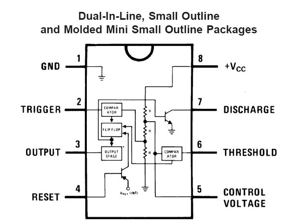
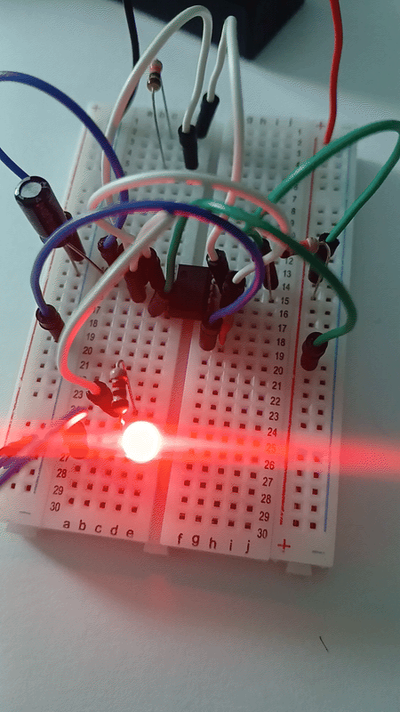

# sesion-03a

25 de marzo del 2025

## Encargo 06 - Cultura electrónica europea de los 1980s y 1990s

### Five on the open-ended Richter scale (1987) de Einstürzende Neubauten

Einstürzende Neubauten se destaca por crear música experimental a partir de sonidos poco convencionales. En este disco, utilizaron una variedad de objetos que se pueden encontrar en fábricas u obras de construcción, como planchas de metal y tuberías, herramientas eléctricas, resortes, y bidones u otros objetos grandes, junto a la manipulación de la misma cinta de grabaciones.

Si bien este álbum tiene un enfoque más atmosférico a comparación del resto, sigue siendo ruidoso y experimental. Con canciones como *Zerstörte Zelle* y *Kein bestandteil Sein*, muestran cómo usan estos objetos para crear una sensación tensa y oscura. *Morning Dew*, por ejemplo, es un cover de una canción folk, y Neubauten logra hacerla casi irreconocible con su sonido industrial característico.

## Encargo 07 - Chip 555

Los chips 555 pueden ser usados en modo **monoestable** o **astable**. En modo monoestable, cada vez que el timer 555 se activa, el output sube a high por un *momento*, y luego baja a *low* esperando otra señal que lo active. En modo astable, el timer se activa por sí solo periódicamente y se convierte en un oscilador.

- (1) GND: Referencia de voltaje para el chip. Generalmente se conecta a tierra.

- (2) TRIGGER: Activa el timer cuando el voltaje cae bajo 1/3 de VCC

- (3) OUTPUT: La salida del timer. Entrega señales altas o bajas según modo de funcionamiento.

- (4) RESET: Reiincia el chip si se pone en bajo. Normalmente se conecta a VCC para no resetear por error.

- (5) CONTROL VOLTAGE: Permite ajustar externamente los niveles de referencia internos del timer 555. Si no se usa, se suele conectar un condensador de 10nF a tierra.

- (6) THRESHOLD: Compara el voltaje de carga del condensador con 2/3 de VCC.

- (7) DISCHARGE: Se conecta a una resistencia y descarga el condensador. Es la clave para controlar el tiempo en modo monoestable y astable.

- (8) VCC: Carga positiva del chip (entre 4.5V y 15V).

