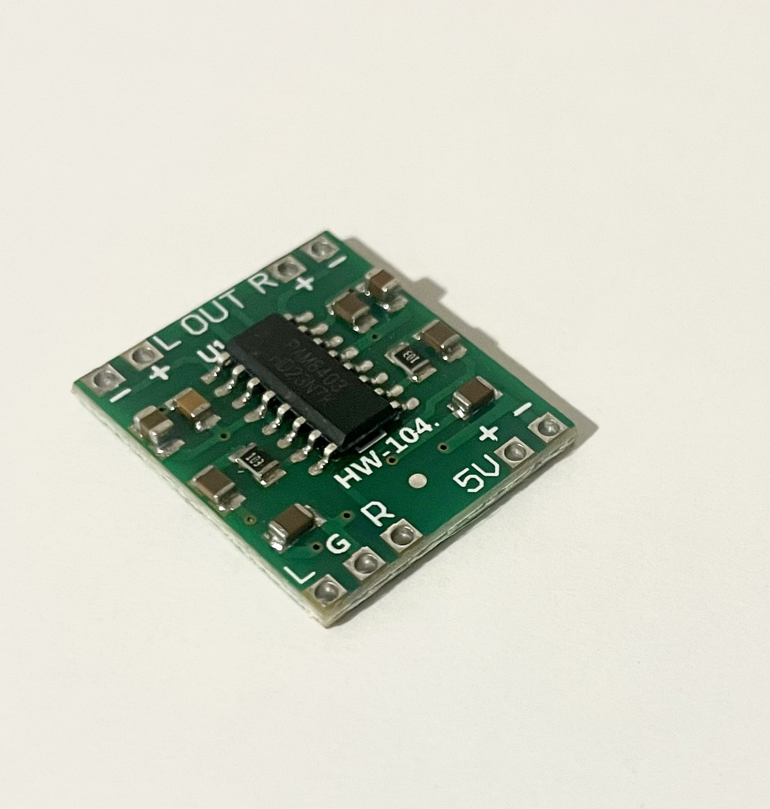
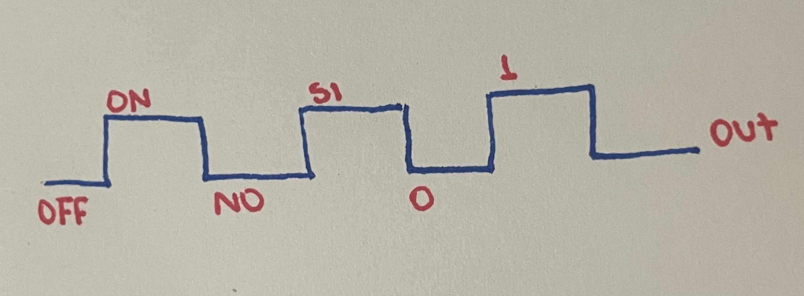
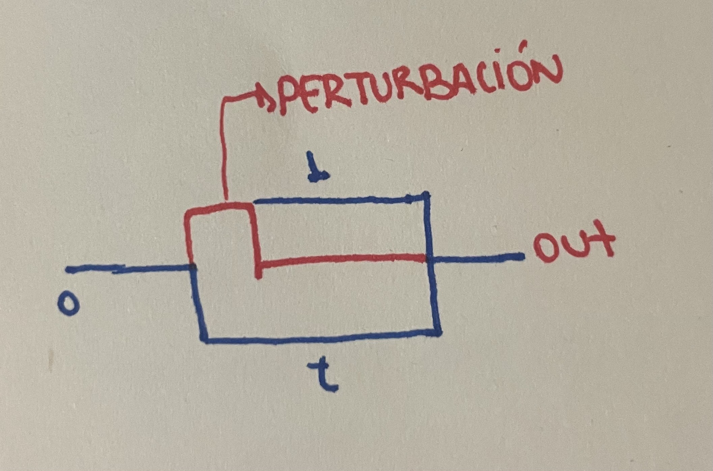
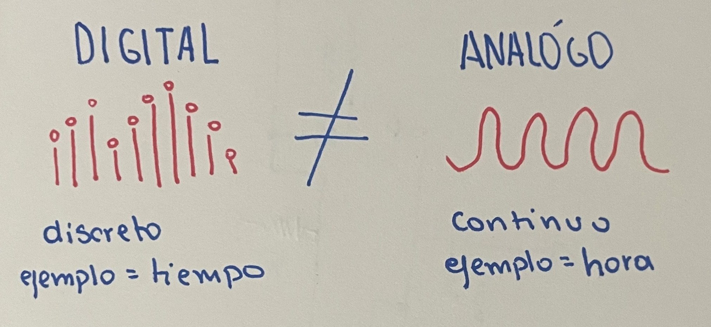
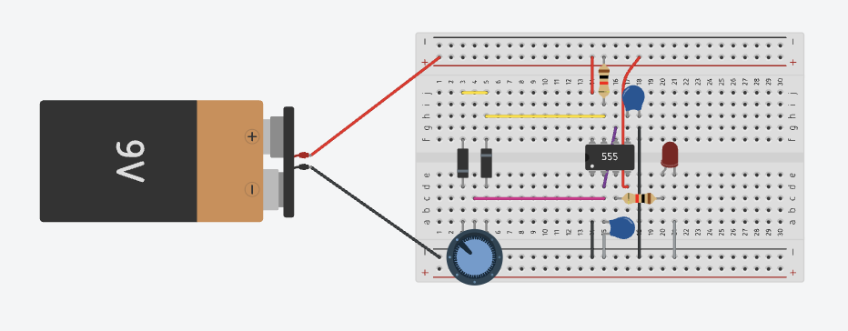
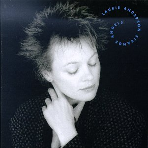

# sesion-09b

Viernes 09 de Mayo del 2025.

## Componentes nuevos entregados en clases

- **Chip 8403**

Foto componente 1 

(foto tomada con mi celular)

¿Qué es?

Es un amplificador de audio estéreo Clase D, donde la potencia se une a una eficiencia excepcional en un diseño sorprendentemente compacto.

¿Qué es un amplificador audio estéreo clase D?

Este amplificador se caracteriza por emplear técnicas de conmutación, ya sea en la etapa de salida, en la alimentación, o de forma integral en todo el diseño.

- **SRD05 / Relé de 01 canal**

Foto componente 2

(foto tomada con mi celular)

¿Qué es?

Este dispositivo facilita el control de encendido y apagado de equipos de corriente alterna, proporcionando aislamiento y conmutando cargas resistivas de manera eficiente.

## Apuntes clases

Repaso de los circuitos vistos en clases con el chip555.

- circuito astable (in = R y C)  = oscilación (periodicidad)

Foto de mi bitácora

out = LEDS, sonido, nov

- circuito monostable (in = R y C)= timer

Foto de mi bitácora

out = LEDS, sonido, nov

Foto de mi bitácora

## Circuito esquematico visto en clases

Foto de mi bitácora

## Circuito pwm en TinkerCad

## encargo-18: Realizar circuito de clases en protoboard

Registro propio

## encargo-19: Investigar cultura electrónica y laurie anderson.

**Contexto**

Laurie Anderson nació el 5 de junio de 1947 en Glen Ellyn, Illinois, Estados Unidos.

**Laurie Anderson**

Imagen sacada desde wikipedia https://es.wikipedia.org/wiki/Laurie_Anderson

**¿Quién es Laurie Anderson?**

Es una cantante, violinista, poeta, dibujante y artista experimental de performance. En sus performances, combina música minimalista, diapositivas y reflexiones irónicas sobre el lenguaje, la política estadounidense, los roles de género y la sociedad occidental moderna. 

"Es una artista inclasificable porque su espíritu vanguardista la ha llevado a moverse con naturalidad en la performance, la música, la poesía o la escultura." (Mdelreal, 2018)

Algo que me llamo la atención de ella que ha creado diversos instrumentos, uno de ellos es un violín con un arco que usa cinta magnética y un cabezal magnético en lugar de cuerdas. 

Violín con arco de cinta magnética, este instrumento se llama **"Violin Tape-bow"**

Imagen sacada desde https://proyectoidis.org/instrumentos-inventados-por-laurie-anderson/

Este instrumento, fue creado en 1977, es un violín alterado para usar un arco de cinta magnética. La cinta magnética de grabación reemplaza la crin tradicional en el arco, y un cabezal de cinta magnética se encuentra en el puente. Anderson ha revisado y perfeccionado este dispositivo a lo largo de los años.

## Disco escuchado: Strange Angels

Imagen rescada de wikipedia https://en.wikipedia.org/wiki/Strange_Angels_(Laurie_Anderson_album)

**Contexto:** Strange Angels es el quinto álbum en general y el cuarto álbum de estudio de la artista y cantante Laurie Anderson, lanzado por Warner Bros. Records en 1989. Con este lanzamiento, Anderson intentó alejarse de su imagen anterior como artista de performance hacia un ámbito más musical. 

- Género: Pop/Rock
- Estilos: Rock alternativo/indie , experimental , rock experimental.

Infromación rescatada de https://www.allmusic.com/album/strange-angels-mw0000205501

**Opinión del disco:** por lo que pude investigar es el primer disco en el cual Laurie canta, dejando un poco de lado ese estilo más hablado y experimental que la hizo famosa . Fue una sensación de cercania y tiene canciones con melodías lindas pero sin perder eso irónico y observador que la caracteriza. Es como si se hubiera propuesto mostrar otro lado suyo: más musical, más humano, pero igual de raro y original. Para poder llegar a esta opinión, debido a que es el primer disco en el cual Laurie se "atreve a cantar de verdad" tuve que compararlo con otro disco que fue "Big Science", el cual fue su debut y también el primero de un contrato de siete álbumes que Anderson firmó con Warner Bros. Records. La verdad no escuche este disco completo pero si una que otra canción, ya que solo queria saber cual era la difencia, me percate que en este disco (Big Science) existen sonidos repetitivos y sintetizadores etéreos y que la voz de Laurie es de un tono frío, las frases son con ironía y simbolismo.

## Referencias bibliograficas

- Mdelreal. (2018, 26 julio). Laurie Anderson (1947). Mujeres Bacanas. https://mujeresbacanas.com/la-eterna-pionera-laurie-anderson-1947-es-una/
- colaboradores de Wikipedia. (2025, 3 abril). Laurie Anderson. Wikipedia, la Enciclopedia Libre. https://es.wikipedia.org/wiki/Laurie_Anderson
- Wikipedia contributors. (2025, 22 abril). Strange Angels (Laurie Anderson album). Wikipedia. https://en.wikipedia.org/wiki/Strange_Angels_(Laurie_Anderson_album)
- Strange Angels - Laurie Anderson | Album | AllMusic. (1970b, enero 1). AllMusic. https://www.allmusic.com/album/strange-angels-mw0000205501
- Wikipedia contributors. (2024, 26 febrero). Big Science (Laurie Anderson album). Wikipedia. https://en.wikipedia.org/wiki/Big_Science_(Laurie_Anderson_album)
