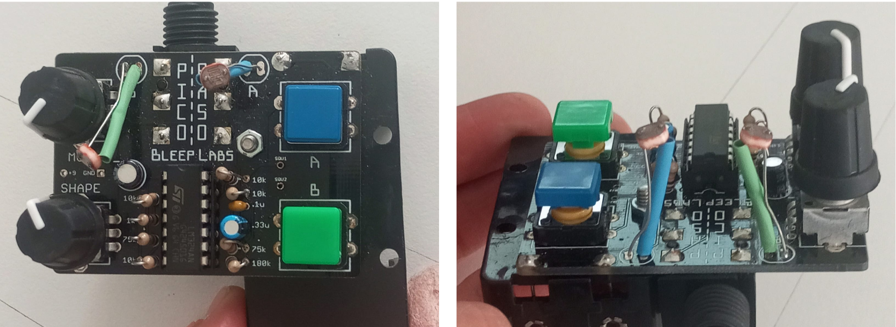
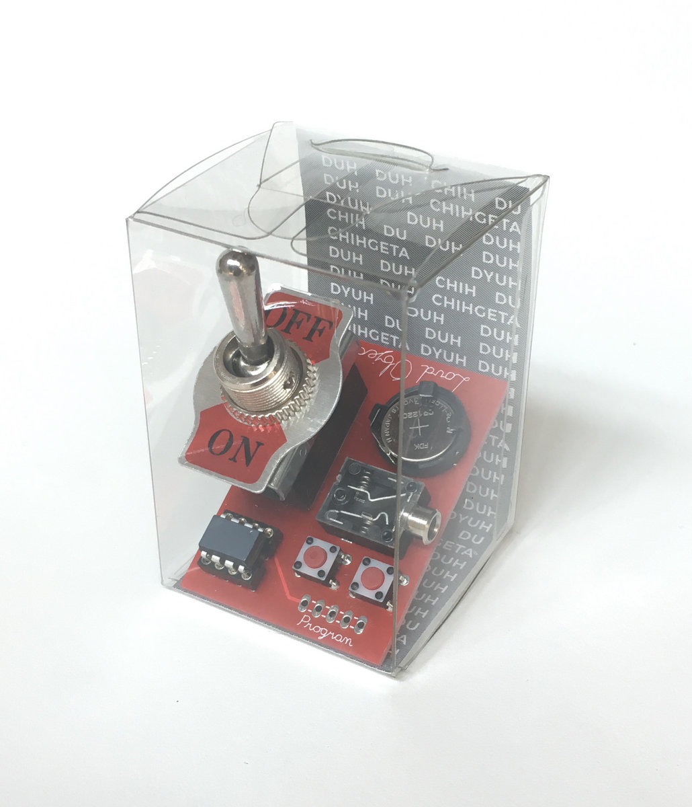
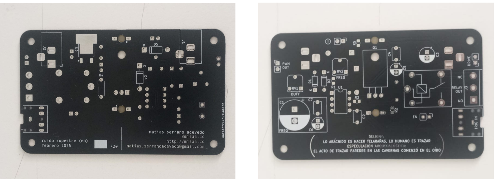
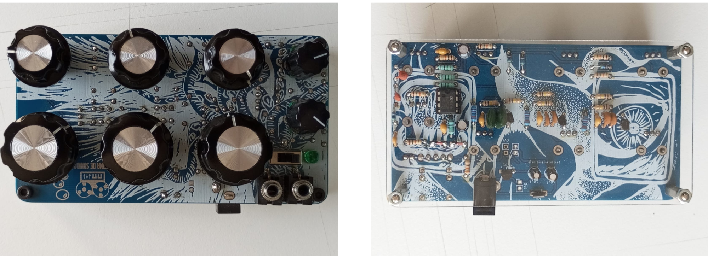
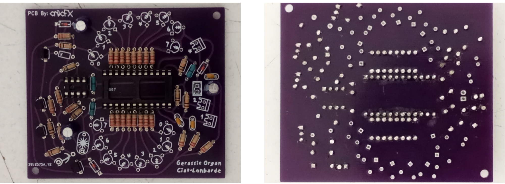
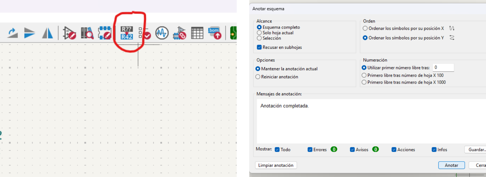
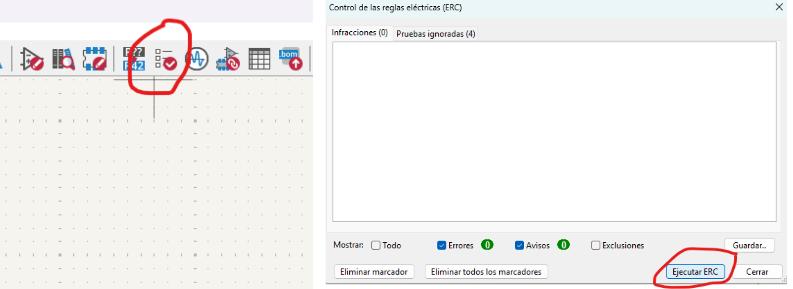
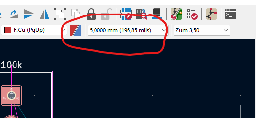

# sesion-07a

martes 22 de abril

### - **[Bleep Labs](https://bleeplabs.com/)**

### - [loud objects](https://loudobjects.bandcamp.com/merch)

> no le saqué fotito ;_; saqueé esta de la página de loud objects

### - **tarjeta de presentación misaa**

 

### - **subaquatic**

### - **gerassic organ**

- [bandcamp](https://bandcamp.com/)
- [uva robot](https://uvarobot.bandcamp.com/) - mezclaron dos palabras que la gente no mezclaría
- Diego Lorenzini
- Los varios artistas
- [roy macdonald](https://github.com/roymacdonald)
- rafael lozano-hemmer
- [open frameworks](https://openframeworks.cc/) - programación nivel dios, cuando la programación no alcance tus sueños
- [future sketches](https://www.media.mit.edu/groups/future-sketches/overview/)
- [Simulador de ciruitos](https://www.falstad.com/circuit/circuitjs.html)

- Googlear componentes:
  - victronics <https://www.victronics.cl/>
  - mouser <https://www.mouser.cl/>

- CSV - archivo de tablas (se puede usar con excel - probar con GitHub)
- La caverna de Platón
- <https://clacktronics.co.uk/> TODO MUY LOCO - ME ENCANTA
- una placa al mes si eres miembro <https://boldport.com/club>
- mandar a hacer las placas <https://jlcpcb.com/>

La belleza de la protoboard *"Me gusta que las cosas puedan fallar"* - Aarón

-----

# kicad

Palabra importantísima - **COMPONENTE**

tiene 3 características: - **Valor** / - **Símbolo** / - **rating** (cuanto aguanta el componente) / - **footprint** (huella - guía visual - dimensiones físicas del componente)

- R_pot = potenciómetro
- Resistencia que usamos = 6.3mm
- Condensador axial no tenemos
- Condensador de disco los nuestros
- [Diodo](https://www.mouser.cl/ProductDetail/onsemi-Fairchild/1N4148?qs=i4Fj9T%2FoRm8RMUhj5DeFQg%3D%3D)
- Potenciómetro RK163

### comandos

- Añadir símbolos **[A]***
- Rotar **[R]**
- Mover **[M]**
- Deseleccionar **[Esc]**
- Valor **[V]**
- Dublicar **[comand + D]**
- Wire (cable) **[W]**
- Marca de no conectado **[Q]**
- Información completa del componente **[E]**
- Reflejo en eje X **[X]**
- Reflejo en eje y **[Y]**
- Tecto **[T]**
- Buscar **[Ctrl + F]**
- **Ctrl + S** GUARDAR *"yo no confío en nadie, sólo en mi ctrl + S 5 veces cada 5 segundos"* - Misa
- visor 3D **[Alt + 3]**

## esquema

qué componentes hay, cómo se ocupan, cómo se interconectan, qué valores tienen

- Círculo en la punta de un componente = el componente está disponible para ser conectado

- **THT** = through hole technology - método para montar los componentes en una PCB, se meten las patitas de los componentes en los orificios de la placa y soldándolos por el lado contrario

- **Anotar esquema (la barra de arriba) :** rellena indicadores de referencia de los símbolos del esquema

*"No es necesario leer tanto"* - Misa

- **Control de reglas eléctricas (barra de arriba) ERC :** muestra errores en las conexiones del esquema

- **Asignación de huellas (barra superior) :** herramienta que asigna un objeto real al símbolo

- **ajustar grilla :** distancia de puntos guía

## dibujo SCH (esquemático)

## huellas

Pitch = [P] = distancia entre patitas

- Asignación de huellas (barra superior) : herramienta para determinar un componente al símbolo (en la sesion-07b están los componentes que solemos usar)
  - Biblioteca del centro = Mis componentes
  - Seleccionar mi componente a cambiar --> en la sección derecha sseleccionar las medidas

## ruteo

## 7 capas

- **F.Cu** (capa superior de cobre)
- **Edges.Cut** (corte del borde)
- **B.Cu** (capa inferior de cobre)
- **F.Silkscreen** (capa superior de grabado)
- **B .Silkscreen** (capa inferior de grabado)
- **F.Mask** (placa superior protectora - color)
- **B.Mask** (placa inferior protectora - color)
- Visor 3D **[Alt + 3]**
- Seleccionar TODO **[Alt + A]**
- Modificar la pista **[G]**
- Seleccionar toda la pista **[U]**
- Rellena todo **[B]** (area de relleno)
