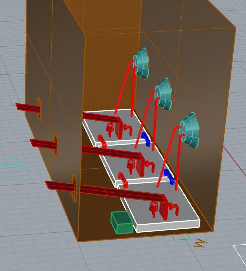
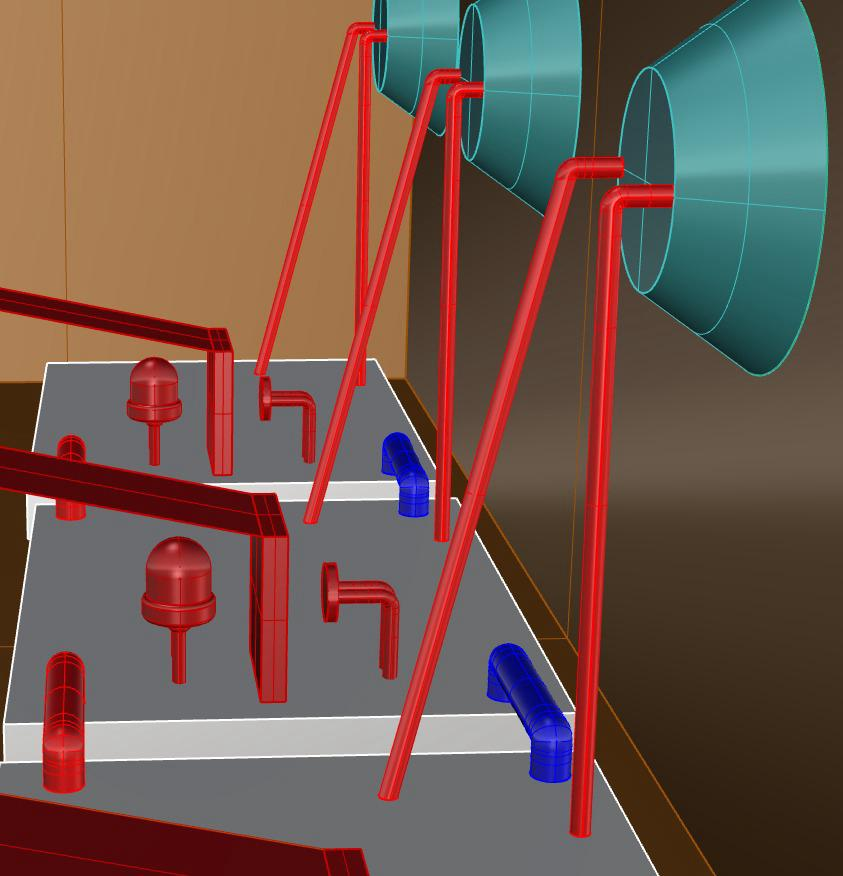
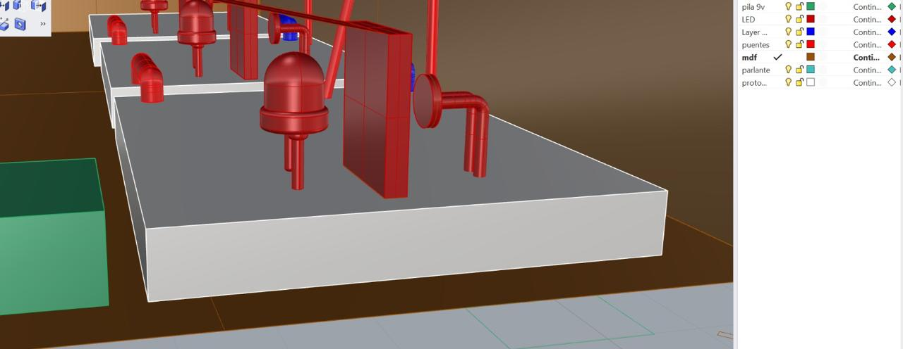
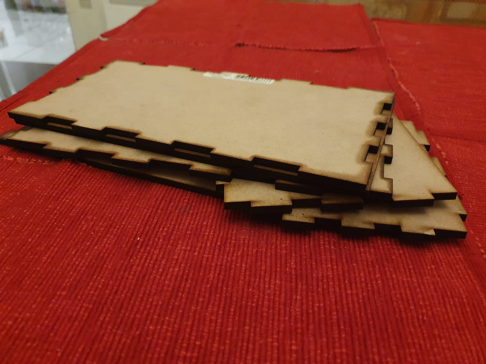
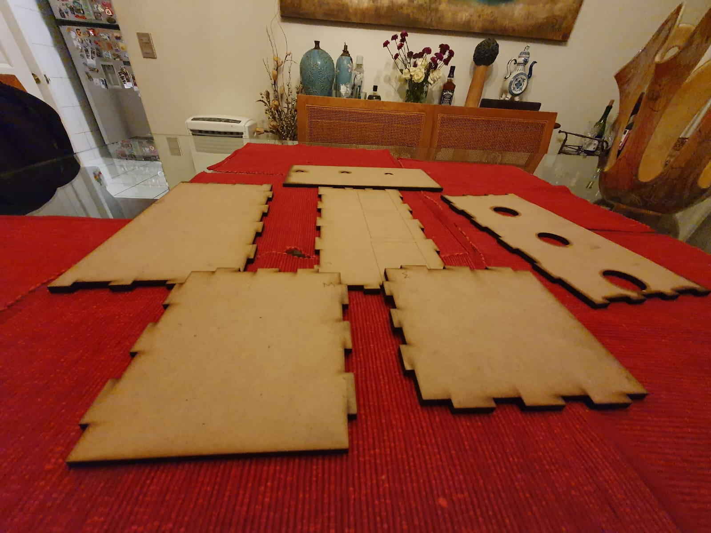

# sesion-06a

# PROYECTO 01 - Grupo 09 

**Integrantes:**
- Bastián Solís Cavieres
- Carlo Martinez Arzola
- Martin Silva Reyes

# NOMBRE DEL PROYECTO: *Caja Sonora Interactiva*

Antes que nada, tomamos como base el circuito del 'Atari Punk Console', es decir, primero partimos con el circuito inicial del APC, el cual modificamos principalmente para alterar la frecuencia del parlante mediante el uso de botones e interruptores.

Circuito Inicial del APC (Atari Punk Console)

# Imagenes del Proyecto:

La idea de nuestro proyecto es crear una caja sonora interactiva, que cuente con tres barritas impresas en 3D. Al presionarlas, estas se elevan y actúan como una barrera entre un LED y un LDR. De este modo, cada vez que una barrita sube, se modifica la cantidad de luz que llega al sensor, lo que permite ajustar el sonido según la presión ejercida.

Como se puede observar en la imagen a continuación, las barritas (representadas en rojo en el esquema) están ubicadas entre el LED y el LDR. Al levantarlas, actúan como una barrera que regula la cantidad de luz que llega al sensor. Esto provoca que el LDR reciba más o menos luz, lo que a su vez modifica el sonido emitido por las bocinas.

Dado que el LED está muy cerca del LDR, cualquier cambio en la cantidad de luz es fácilmente detectado por el sensor. Esto permite que la bocina emita distintas frecuencias de sonido según la posición de las barritas. De esta forma, nuestro proyecto funciona como una caja sonora interactiva.

# Estructura hecha con Corte Láser

# Estructura por dentro

La idea principal de nuestra caja es que sea interactiva, por lo que cuenta con tres agujeros por donde saldrán las bocinas que emiten el sonido. Por esta razón, el corte láser fue diseñado de esta forma, permitiendo que el sonido se proyecte adecuadamente hacia el exterior.

Aquí se puede apreciar cómo la bocina queda posicionada en el agujero, permitiendo que el sonido se proyecte hacia el exterior.

Se muestra una vista superior del interior de nuestra caja, la cual contiene un circuito APC. La idea final es incorporar tres protoboards para implementar el sistema de bocinas en los 3 agujeros.

Nuestra caja incorpora bisagras que permiten abrirla fácilmente, lo cual facilita el acceso al interior para insertar la batería de 9V necesaria para el funcionamiento del proyecto.

Aca se aprecia más de cerca el funcionamiento de nuestro APC, con el LED azul encendido como parte de una prueba para verificar que todo funcionara correctamente.

# Bills of Materials - CAJA MADERA

| Materiales                   | Cantidad | Precio   | Especificaciones                         |
|-----------------------------|----------|----------|------------------------------------------|
| MB Pack Sujeta Cuadros      | 1        | $11.490  | Kit para montaje y sujeción de estructuras |
| Corte placa MDF 5.5mm 30x30 cm | 1     | $3.303   | Placa MDF de 5.5 mm cortada a láser, 30x30 cm |
| Bisagra Lin 38 2½"           | 2        | $1.990   | Bisagras metálicas pequeñas para caja    |

