# sesion-10b

*16 de Mayo de 2025*

Siempre debemos posicionar en el bom el orden componentes que soldaremos primero en nuestra placa

## bom udpudu

|Referencia  |Valor   |Huella                   |Qty|OBS               |
|------------|--------|-------------------------|---|------------------|
|U1          |~       |Socket 8 pines           |1  |                  |
|R2,R3,R4    |1k      |Resistencias             |3  |                  |
|D1          |1n4007  |Diodo                    |1  |                  |
|C3          |100n    |Condensador cerámico     |1  |104               |
|C4          |1u      |Condensador electrolítico|1  |                  |
|C5          |47u     |Condensador electrolítico|1  |                  |
|D2,D3       |LED     |Led 5mm                  |2  |                  |
|J2          |TBLOCK_2|Terminal Block 2         |1  |                  |
|LS1         |SPK     |Terminal Block 2         |1  |                  |
|SW1         |SW_SPDT |Switch spdt              |1  |                  |
|U1          |NE555   |DIP-8                    |1  |Va en el socket U1|
|Clip batería|9v      |                         |1  |                  |
|Parlante    |8ohm    |                         |1  |                  |
|J1,J3       |CAIMAN  |Cables caimán            |2  |                  |

## Encargo 22 y 23

* Paso 1: Vamos a identificar y ordenar nuestros componentes, según lo que indica en el BOM, asegurándonos de que sean de los valores adecuados.

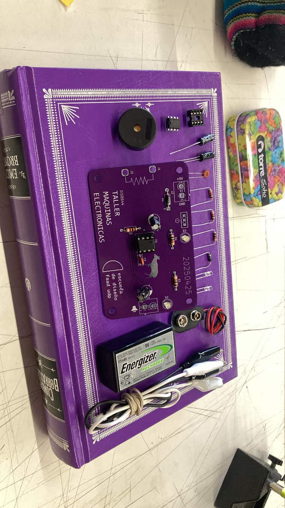

* Paso 2: Como primer componente a soldar, tomamos nuestro DIP Socket de 8 patas, que será colocado al centro, donde está la serigrafía de U1. Este componente no tiene polaridad, así que no causa problema en qué dirección sea fijado, mientras que las 8 patas sean insertadas en los agujeros correspondientes de la PCB.

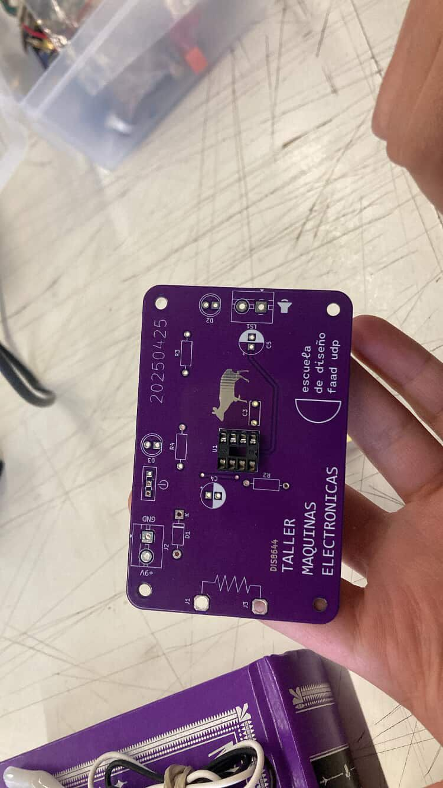

Como era el primer componente que soldamos en esta PCB, la hicimos a mano alzada, sin soportes que sostuvieron ni el componente ni la PCB para que estuviese estable, pero en los componentes siguientes identificamos el problema y lo abordamos con nuestros elementos de la clase.

**MUY IMPORTANTE**
Debido a que después el chip que irá dentro de este socket es un chip 555, es muy importante que ninguna de las soldaduras de las patas del socket vaya a tocarse entre sí, debido a que esto causará un cortocircuito, que haría que no funcione el chip, pudiendo llegar a quemarlo, y de esta manera dejase de funcionar el circuito.

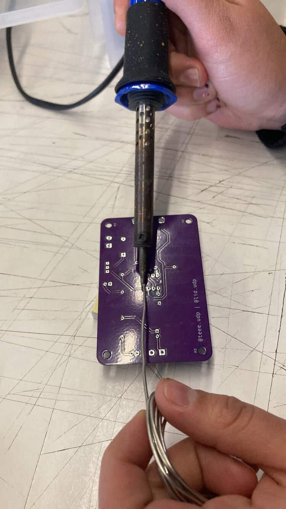

Esto también debería estar presente para todas las soldaduras de aquí en adelante para no causar accidentes, ni tener que comprar nuevos componentes para reemplazar los no funcionales.

* Paso 3: Ahora vamos a pasar a soldar las resistencias, donde vamos a ocupar masking tape por la parte superior de la placa, para que quede fija en la posición más cerca posible de la superficie de la placa y después proceder a soldar. Estas 3 resistencias de 1k irían en las posiciones de R2, R3 y R4.

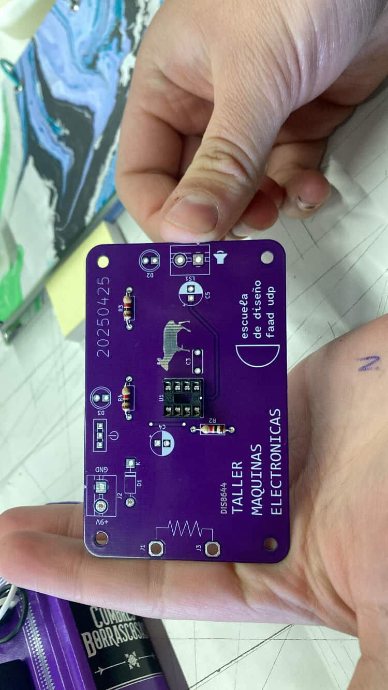

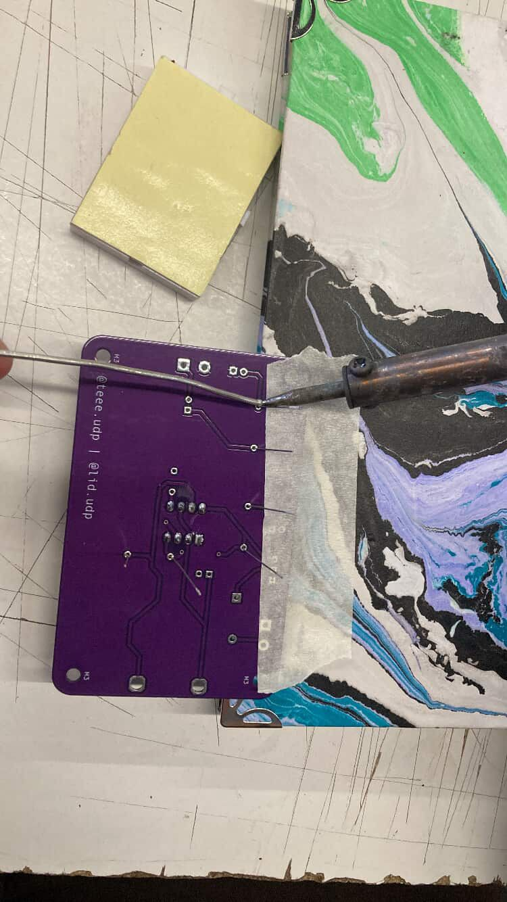

Ya que las resistencias no tienen polaridad, no hay que preocuparse con la dirección en la que son soldadas.

En este punto agarramos un cuaderno y fijamos el borde de la PCB a un lado de este cuaderno, para que no se “escape” mientras cada componente está siendo soldado.

* Paso 4: Nuestro diodo será el primer componente de nuestro circuito que tiene polaridad, así que nos aseguramos de que la parte blanca/plateada donde está la franja siga el sentido que está establecido en la serigrafía, que sería con el lado negativo hacia la derecha en la huella D1 del PCB.

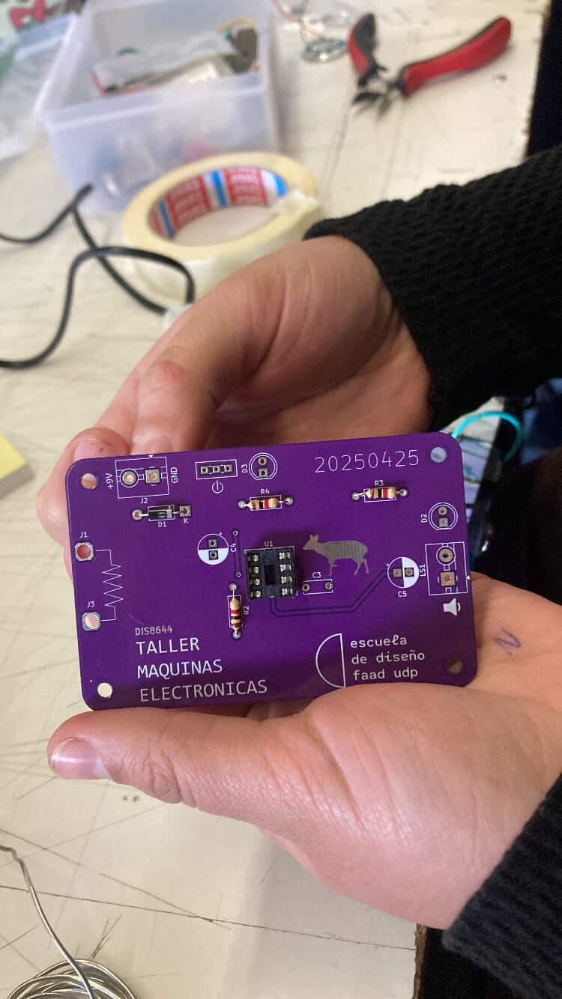

* Paso 5: Ahora soldamos el condensador cerámico 104 en la serigrafía C3, justo a la derecha del DIP Socket y justo debajo del Pudú.

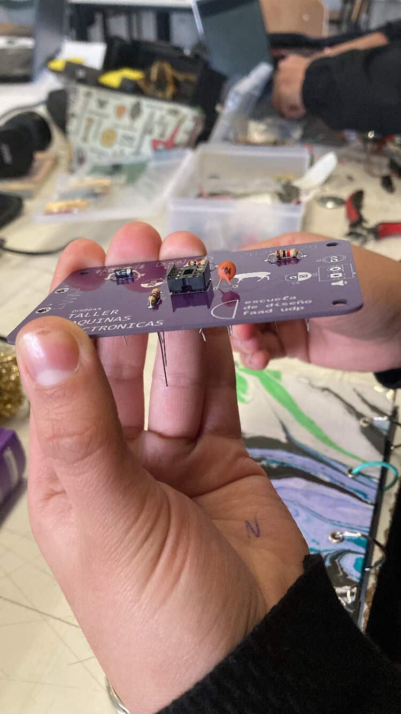

Este componente no tiene polaridad, así que se solda sin necesidad de colocarlo con una dirección específica.

Por su tamaño y forma fue mas difícil de posicionar y sostener al momento de soldar

* Paso 6: Soldamos el condensador electrolítico de 1 µF en la posición de C4, asegurándonos de que su polaridad sea correcta, que el lado negativo según lo indicado por la serigrafía presente en la PCB; en este caso, el lado negativo estaría en la orientación hacia abajo.

* Paso 7: Soldamos nuestro condensador electrolítico de 47 µF de la misma manera que el anterior condensador electrolítico en la serigrafía C5, donde el negativo quedaría al lado derecho en este caso.

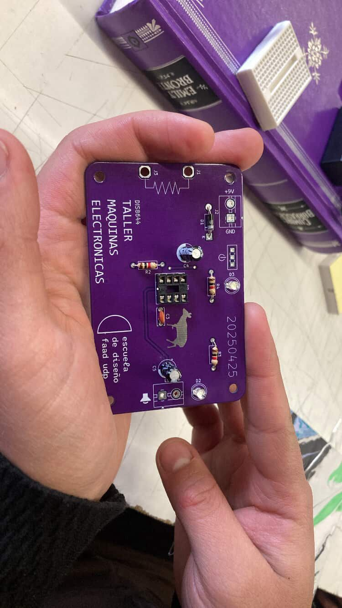

* Paso 8: Agarramos nuestros LEDs, donde nos aseguraremos que la pata más corta (negativa) quede en el agujero inferior que tiene forma cuadrada, que corresponde a D2 y D3. 

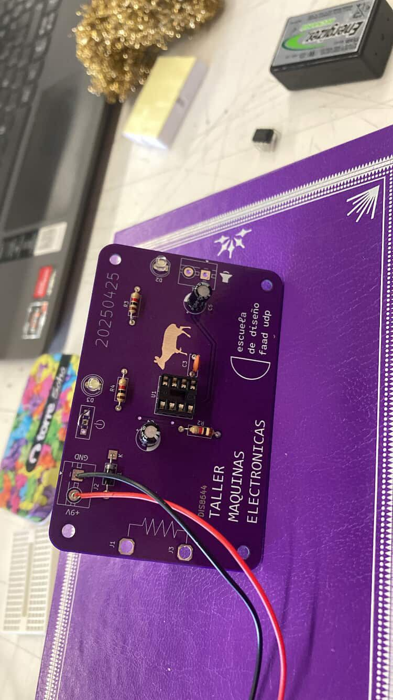

* Paso 9: Para el componente que corresponde a la serigrafía J2, ya que no teníamos el terminal block para soldar y de esta manera alimentar el circuito, le soldamos un conector broche para la batería, donde el lado negativo (negro) va al agujero cuadrado correspondiente a GROUND, mientras que el cable rojo iría al agujero circular donde está +9V y corresponde al VCC. 

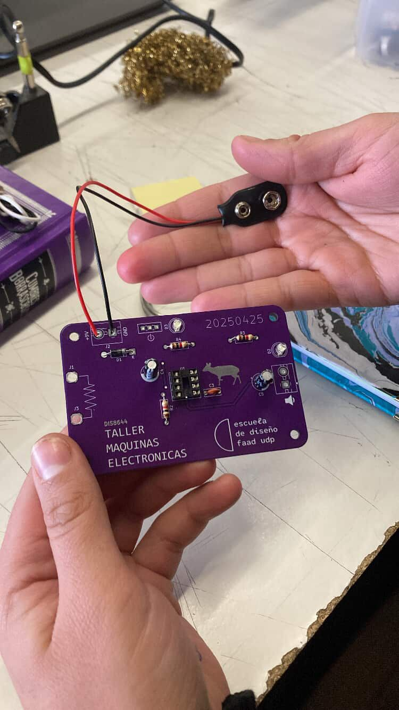

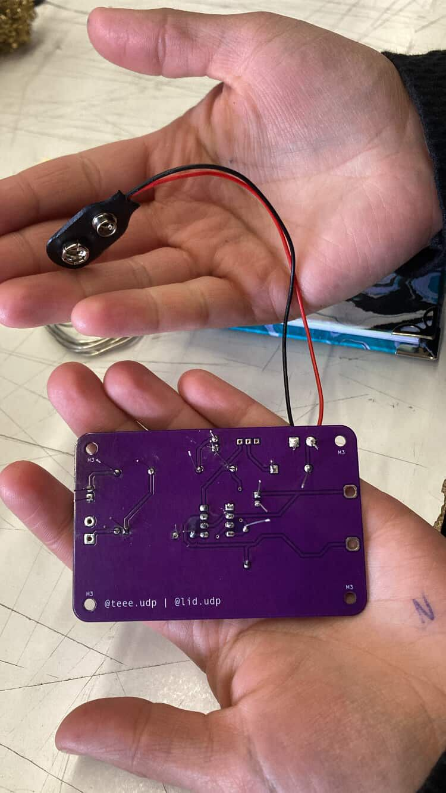

* Paso 10: Usamos una pata de una resistencia para poder simular el interruptor que haría que este estuviera prendido o apagado el circuito entre la pata central y derecha de la serigrafía con un botón encendido, que está justo entremedio del conector broche y el led D3.

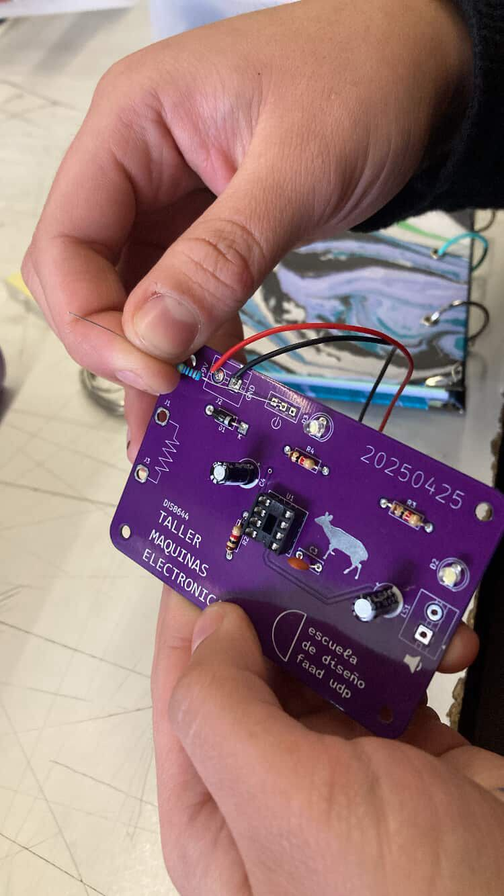

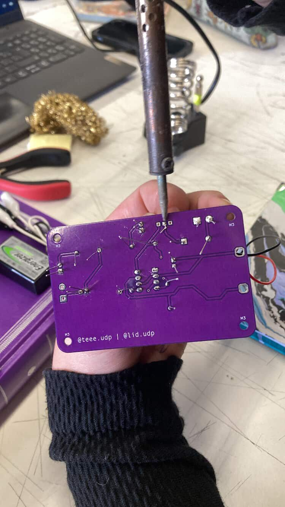

* Paso 11: como también faltó el otro terminal block para la serigrafía LS1 de la parte derecha del circuito, conectaremos de forma manual el parlante, siguiendo lo que hemos aprendido de la simbología del agujero cuadrado y circular para distinguir negativo de positivo.

* Paso 12: Posicionamos el chip 555 en el socket, (luego nos dimos cuenta que a muchos se les olvidó ese paso).

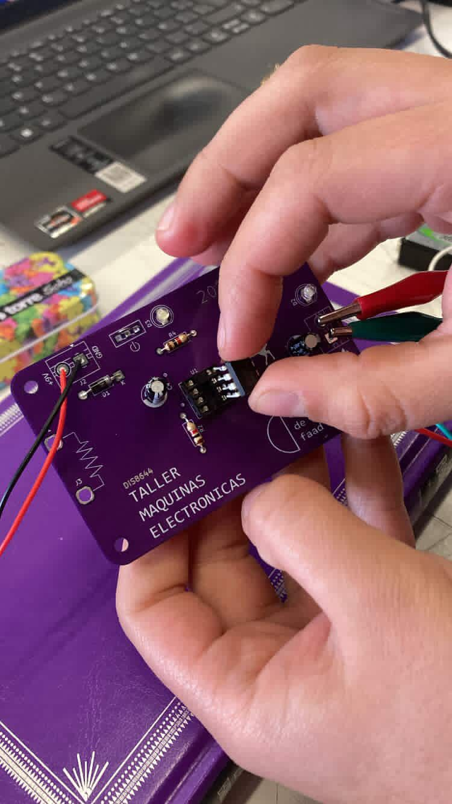

* Paso 13: Finalmente, para probar el circuito conectamos caimanes que nos permitieran conectar una resistencia variable, en este caso usamos un LDR.

