# sesion-07b

CAD Assistant

* library > símbolos para el esquemático
* modules > footprints (huellas) del PCB
* packages3d/ > visualizador de modelos 3D
* añadido -> shapes > forma para el PCB

Librería de símbolos

Añadir biblioteca

Encontrar comprimido y descomprimirlo, open 555_ordenado kicad_sym

Seleccionar R y apretar F, resistencia.

R_Axial_DIN0207_L6 3mm....5mm_P10.16MM

Huellas recomendadas:

Resistor_THT:R_Axial_DIN0207_L6.3mm_D2.5mm_P10.16mm_Horizontal
Capacitor_THT:C_Disc_D6.0mm_W2.5mm_P5.00mm
Capacitor_THT:CP_Radial_D6.3mm_P2.50mm
LED_THT:LED_D5.0mm

Resistencia axial significa que estan en el mismo eje

Resistencia radial propiedad eléctrica encapsulado

Nombre_valor_encapsulado

cdm.link página Cómo referirse a algo de manera no violenta  <https://cdm.link/so-yeah-lets-just-use-plug-and-socket-industry-group-recommends-obvious-change-in-terminology/>

conn > caimán

Diseño de interacción, colocar un LED conectado a corriente y a tierra aparte del circuito para saber si estamos con corriente.

Switch pcb
switch interruptor 2 posiciones SPDT 1P2T

Jack DC 2.1mm
Terminal block 5 (hay que conectarlo bien, no al revés ni tampoco romperlo).

Protección para el Jack. Se le puse colocar un diodo para que nadie se queme.

JST CONN

diodo protection diode
50 unidades vale $790 CLP.

Administración de alimentación y Formato del circuito

Dividir, organizar nuestro esquemático.

Se puede previsualizar el 3D

Importar Logo conversor de imágenes, convertir imagen a huella y cuando sea huella se puede importar al PCB.

Conversor de imágenes en Kicad menú principal.

Silkscreen frontal > texto (ícono T) se añade texto, sirve para indicar especificaciones a la placa, ideal para que la persona que imprima sepa que está imprimiendo. CAPA SILKSCREEN.

Bottom Cu

No se puede tocar cobre con cobre ni serigrafía con serigrafía.

* Saltos de línea

1. Arrastrar borde en 5 mm > hacer un arco, y así se logra un borde circular para la placa PCB. En capa edgecuts.
2. Vía PCB, saltar entre capas de la placa. Presionar "V", cuando le hago click cambia el color de la vía a rojo y eso indica que estamos por debajo de la placa.
3. Trazaar para exportar. Marcar F.cu B.cu F. Sikscreen B. Silkscreen F. Mask B. Mask Edge cuts
4. Archivos .gbr y .drl. Carpeta gerber, lo que se manda a la impresora. Se recibe en .zip JLCPCB.
5. Add gerber file. Indicar Layers, dimensions, PCB Qly, Prdocut Type (indicar para qué es).
6. Se indica el color.
7. PCB Thickness 1.2mm, es más caro hacer placas más delgadas.
8. SMD (se puede pedir soldado).
9. LCSC (Shenzhen).

1 mes antes de la entrega, ver qué vamos a ensamblar. Después interfaz de usuario.

10. Ver envío, sube precio. Por ejemplo 5 PCB salndrían $10 USD.

## encargo-16: cotizar udpudu en JLCPCB de forma productiva

hacerse una cuenta en JLCPCB y cotizar udpudu, para 30 personas, documentar cada parámetro y elección.

## encargo-17: cotizar udpudu en JLCPCB de forma experimental

probar opciones que no entiendan, documentar otros parámetros que no conozcan aún.

### Tipo de encargo

En la página para encargar una PCB en JLCPCB aparecen 4 opciones, todas igual de importantes.
-   **PCB estándar**.
-   **PCB Avanzado/PCBA**.
-   **Plantilla SMT**
-   **Impresión 3D/CNC**

Nos centramos solamente en las PCB.

Éstas dos opciones varían por sus características, aplicaciones y procesos de fabricación.

>La **PCB estándar** logra coneixones eléctricas e integracion funcional entre componentes electrónicos mediante una combinación de materiales conductores y aislantes. Generalmente está compuesta por capas conductoras (como cobre) y capas aislantes (como resina epoxi o fibra de vidrio) y presenta parámetros fijos de tamaño, diseño, ancho de línea y espaciado. Estos parámetros cumplen con los estándares y especificaciones de la industria para garantizar la confiabilidad y estabilidad de la placa de circuito.

La **PCB avanzada**

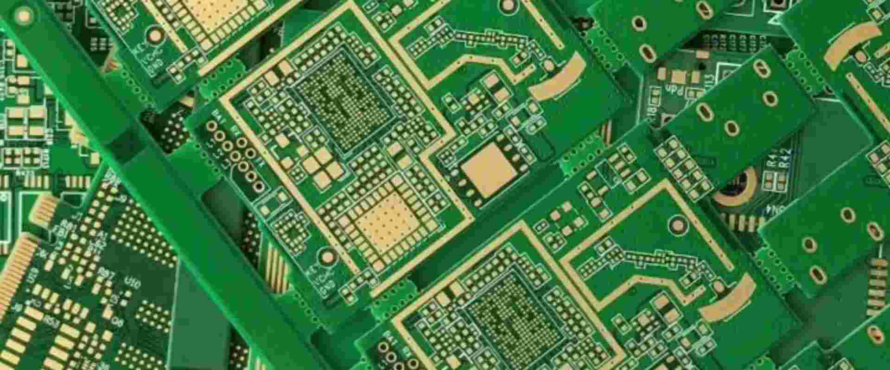

>Una PCB avanzada se refiere a una placa de circuito con mayores requisitos de velocidad de transimisión de señales, frecuencia y rendimiento de datos. Sus procesos de diseño y fabricación exigen consideraciones adicionales, como la integridad de la señal, la compatibilidad electromagnética y la gestión térmica, lo que garantiza un funcionamiento estable y confiable en diversas condiciones complejas.

Fuente: https://www.lstpcb.com/es/news/advanced-pcb-vs-standard-pcb/

### Materiales de base

Luego aparecen los **Materiales de base** los cuales son:

-   **FR4**

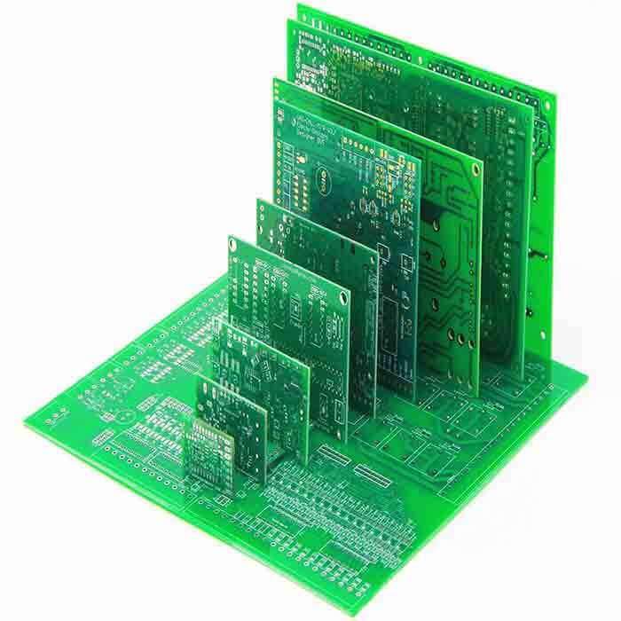

Sustrato de FR4 laminado de resina epoxi reforzado con fibra de vidrio. 'FR4' se refiera a las propiedades ignífugas del material.

Proporciona aislamiento eléctrico y soporte mecánico para los componentes de la PCB. Material resistente y duradero. Protege de la humedad, el calor y otros factores ambientales.

La altura de los componentes afecta directamente al grosor del material de sustrato FR4. Para componentes más altos más gruesos será el sustrato. El grosor también influye en el precio de ser más grueso más caro. Se clasifican por su contenido de fibra de vidrio, el más comun de 70-80% de fibra y su temperatura de transición vítrea (Tg), baja, estándar y de alta función.

Se identifican mediante su clasificación ignífuga a través de códigos siendo los más comunes éstos FR-4, FR-5 y FR-6.

-   **Flexible**

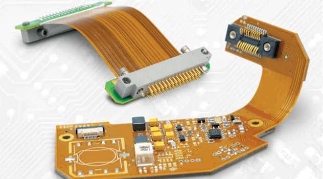

La PCB flexible es un tipo de placa diseñada específicamente para poder doblarse y girarse, adaptándose a múltiples requerimientos. Se diferencian de los PCB rígidos. Utilizan un material polimérico flexible como poliimida o poliéster a modo de sustrato base. Sus pistas de cobre están laminadas sobre la capa de polímero flexible.

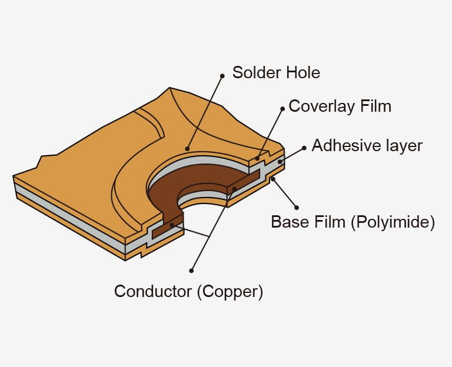

Posee:

1.  Sustrato flexible dieléctrico (poliimida, poliéster, PTFE o polímero de cristal líquido (LCP)).
* PTFE: politetrafluoroetileno.
2.  Capa conductora (lámina de cobre o revestimiento de cobre laminado sobre el sustrato). Conforma los patrones de circuitos deseados (rastros, al mohadillas y vias). Opciones al cobre son Silver Ink, Constantan, Carbón, Aluminio e inconel.
3.  Capa adhesiva.
4.  Superposición protectora (poliimida, máscara de soldadura líquida, fotoimagen, u otros).
5.  Endurecedor (material de refuerzo, poliimida con respaldo adhesivo) que imparte rigidez y soporte estructural.

-   **Aluminio**

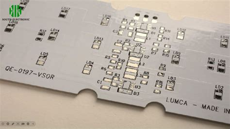

La PCB de aluminio posee una base metálica para una mejor gestión del calor. Su uso habitual es luces LED, automóviles y dispositivos de alta frecuencia.

Son un subconjunto de PCB con núcleo metálico (MCPCB), su proceso de laminación involucra materiales dieléctricos conductores como poliimida o laminados a base de cerámica. Permite la disipación del calor y aplicaciones de gran frecuencia. Resiste a la exposición prolongada a entornos hostiles.

El grado y la pureza del aluminio afectan en el rendimiento de la PCB, se suele utilizar el aluminio 5052-H32.

-   **Base de cobre**

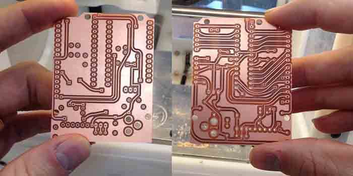

PCB de base metálica fabricada con sustrato de cobre. Tiene una gran conductividad térmica. Cara y de gran rendimiento. Presente en productos de gama alta. Gran capacidad de conducción de corriente. No es adecuado para una PCB multicapa.

-   **Rogers**

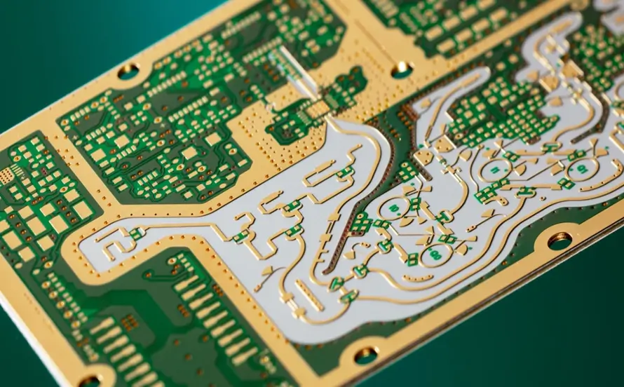

PCB producida con laminados de Rogers Corporation. Capaces de funcionar en entornos rigurosos y hostiles, dispositivos de alta frecuencia. Mayor durabilidad, estabilidad, métodos de fabricación y costo del producto. Aguanta hasta 350°C de temperatura. Su frecuencia de operación es de 500MHz mientras que un FR4 común es de 10MHz o inferior. Resistente a la humedad. Posee estabilidad de impedancia, su constante dieléctrica Dk es de 2.5 a 11, tiene una pérdida deléctrica baja.

+ Rogers 4350B
>El laminado de este material permite un control estricto de la constante dieléctrica y una pérdida dieléctrica baja. Estos materiales se utilizan para laminados de alta potencia g y t está clasificado para UL 94 V-0. Dk es 3.66 y el rango de frecuencia de mejor rendimiento es de 8 a 40 GHz, por lo que se utiliza para antenas de estaciones celulares y enlaces de microondas.
+ Rogers 4003C
>El Rogers 4003C proporciona una constante dieléctrica igual en toda la PCB, ya que el vidrio epoxi o el laminado convencional para microondas son los materiales de base, pero estos materiales requieren un tratamiento especial a través de orificios y procesos de manipulación. Se utilizan etiquetas RF con estas PCB y se utilizan radares y sensores de grado automotriz, ya que el Dk del material es de aproximadamente 3.55.
+ Rogers 4534
>Rogers 4534 ofrece tanto rendimiento como costo, por lo que se utilizan en aplicaciones de diseño de antenas en productos. La composición consta de un relleno de vitrocerámica reforzado que proporciona una menor pérdida y una constante dieléctrica controlada. Proceso de ensamblaje con un proceso de temperatura de reflujo más alta y compatible con casi todas las pastas de soldadura sin HASL.
+ Rogers 3003
>La constante dieléctrica es extremadamente estable y tiene un factor de disipación bajo, lo que es bueno para las PCB de RF. Se pueden diseñar con este material aplicaciones de radar de alta frecuencia que operan cerca de los 77 GHz, aplicaciones inalámbricas 6G y productos de asistencia al conductor.
+ Rogers RT
>Estos materiales se pueden utilizar para aplicaciones de microondas multicapa, ya que proporcionan una constante dieléctrica baja y una menor pérdida. Se utilizan para sistemas de guía de misiles y sistemas de radar militares que requieren una constante dieléctrica baja de 2.20 (Dk). Rogers RT tiene dos tipos: uno es Duroid 6002 y el otro es Duriod 5880. Ambos proporcionan una constante dieléctrica baja y una pérdida dieléctrica baja, lo que permite una excelente precisión en el rendimiento de la placa de circuito impreso.

* Fuente: https://www.viasion.com/es/blog/Propiedades%2C-materiales%2C-ventajas-y-aplicaciones-de-los-PCB-de-Rogers/

-   **PTFE Teflón**

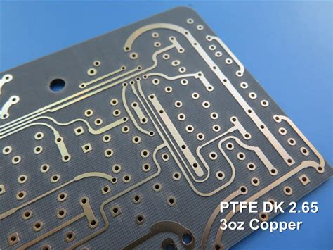

La PCB de politetrafluoroetileno es una placa de alto rendimiento. Capacidad de soportar temperaturas extremas, resistir prácticamente todos los productos químicos y mantener propiedades eléctricas estables en condiciones difíciles.
*   Excelente resistencia química.
*   Durabilidad a baja temperatura. Soporta temperaturas desde -192°C hasta 250°C.
*   Resistencia a la intemperie.
*   Baja pérdida dieléctrica.
*   Superficie antiadherente.
*   Resistencia a la humedad.
*   Excelente propiedad eléctrica.
*   Facilita el control de impedancia.

Algunos modelos son RO3003, RO3035, RO3010.

Especial para condiciones extremas, su coste es 10 veces más que la FR4.

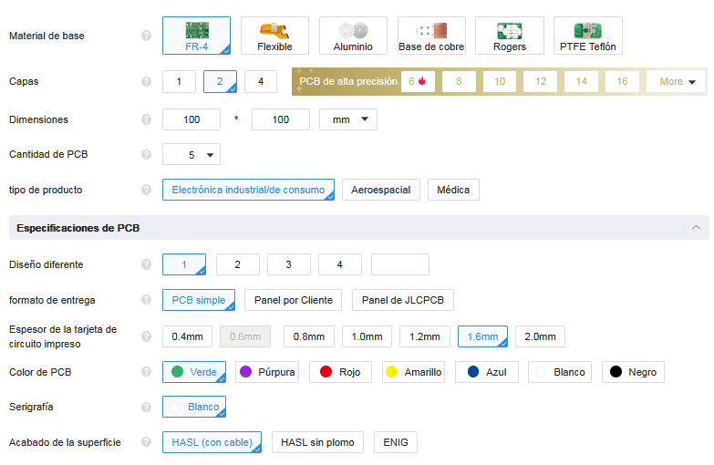

### Número de capas

Varían según nuestras especificaciones, al igual que el resto de parámetros puede identificarse automáticamente al subir un archivo gerber. La cantidad de capas son de 1, 2 y 4 para **PCB comunes**, ya para las **PCB de alta precisión** son de 6, 8, 10, 12, 14, 16, 18, 20, 24, 26, 28, 30 y 32.

### Dimensiones

Uno puede ajustarlas según los requerimientos de nuestra PCB, sin embargo, es recomendable utilizar las medidas ya realizadas en KiCad.

### Cantidad de PCB

Pueden ser de 5, 10, 15, 20, 25, 30, 50, 75, 100, 125, 150, 200, 250, 300, 350, 400, 450, 500, 600, 700, 800, 900, 1000, 1500, 2000, 2500, 3000, 3500, 4000, 4500, 5000, 5500, 6000... hasta 70.000 unidades.

### Tipo de producto

Indicar si es electrónico industrial/de consumo, aereoespacial o médico pues las condiciones de uso son totalmente distintas y su fabricación más compleja.

## Especificaciones de PCB

### Diseño diferente

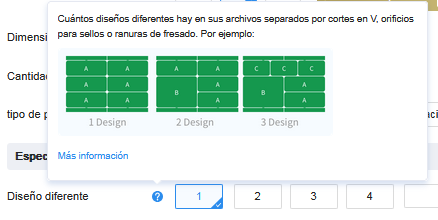

Indica cuántos diseños diferentes varían en el archivo. De este parámetro dependen los demás parámetros de abajo.

### Formato de entrega

*   PCB simple

El diseño tal como está

*   Panel por Cliente

Depende de uno al subir el documento de indicar los datos de panelización. Indicando **Columna** y **Fila**.

*   Panel de JLCPCB

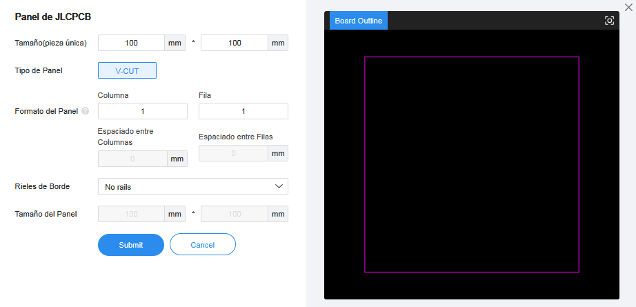

Indica parámetros: 
*   **Tamaño de pieza** (en mm).
*   **Tipo de Panel**
*   **Formato del Panel** (en columnas y filas).
*   **Rieles de Borde** (ubicación de los rieles de borde).
*   **Tamaño del Panel**.

### Espesor de la tarjeta de circuito impreso

Indica el espesor de la PCB, puede ser de 0.4mm, 0.6mm, 0.8mm, 1.0mm, 1.2mm, 1.6mm y 2.00mm. Dependerá de la propuesta y de los componentes de nuestra placa.

### Color de PCB

*   Verde
*   Púrpura
*   Rojo
*   Amarillo
*   Azul
*   Blanco
*   Negro.

Dependiendo de nuestro tipo de placa afectará enormemente este parámetro, además que unos colores de placa son más inusuales y complicados de fabricar que otros, para una PCB estándar se suele usar el color verde.

### Serigrafía

Mayoritariamente de color blanco, sólo en el caso de que la máscara de soldadura sea blanca se imprime en negro.

### Acabado de la superficie

*   HASL (con cable)
*   HASL (sin plomo)

HASL utiliza estaño o plomo para crear una capa protectora para el PCB. Aseiquibles, a considerar que el plomo es tóxico.

*   ENIG

Superficie plana, sin plomo y compatible con RoHS, tiene una vida útil más larga y se pueden mantener tolerancias más estrictas para los orificios enchapados.

## Opciones de alta especificación

### Peso exterior de cobre

Peso de cobre en las capas exteriores de 1 oz o 2 oz. El peso interior del cobre es de 0.5 oz como estándar.

### Vía Cobertura

*   Con carpa
*   Sin carpa
*   Atascado
*   Relleno y tapado con epoxi.

### Tamaño/diámetro mínimo del orificio

Puede ser de 0.3 mm/(0.4/0.45 mm), 0.25 mm/(0.35/0.4mm), 0.2 mm/(0.3/0.35mm) y 0.15 mm/(0.25/0.3mm).

>El tamaño mínimo del orificio y el diámetro de la vía.
El diámetro de la vía debe ser 0,1 mm (preferiblemente 0,15 mm) mayor que el tamaño del orificio de la vía.
p.ej. cuando el tamaño del orificio de la vía es de 0,2 mm, el diámetro de la vía debe ser de 0,3 mm o 0,35 mm.

>Aviso: Se aplicarán cargos adicionales cuando el orificio pasante sea <0,3 mm y el diámetro del orificio pasante sea ≤0,4 mm. No se aplicarán cargos adicionales cuando el orificio pasante sea ≥0,3 mm y el diámetro del orificio pasante sea ≥0,4 mm.
Para placas multicapa, si la vía tiene un diámetro≥0,45 mm, el orificio de 0,2 mm también es gratuito. Por ejemplo, para un orificio de 0,2 mm/0,4 mm de diámetro es necesario un cargo adicional, mientras que un orificio de 0,3 mm/0,40 mm de diámetro es gratuito.

### Tolerancia del contorno del tablero

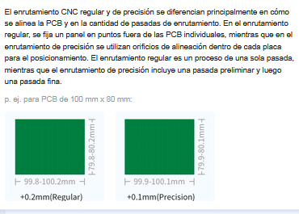

### Confirmar archivo de producción

Los ingenieros de JLCPCB crean un archivo de producción para la fabricación de PCB. Para garantizar la precisión de la producción de PCB y minimizar el riesgo de problemas de PCB que provoquen pérdidas de PCBA, JLCPCB ofrece archivos de producción para su revisión. Se informa mediante correo electrónico.

Opciones: No / Sí

### Marcar en PCB

*   Número de orden
*   Número de pedido (Especifique la posición)
*   Código de barras 2D (Número de serie)
*   Eliminar marca.

### Prueba eléctrica

>En JLCPCB, todas las PCB se someten a una inspección óptica automatizada (AOI) integral para garantizar la calidad. La AOI detecta cualquier rotura o imperfección en las trazas. Las PCB probadas con AOI alcanzan un índice de calidad del 99 % o superior.

"Prueba completa de la sonda voladora."

### Dedos de oro

Columnas chapadas de oro, como el de un cartucho o un disco duro SSD.

Opciones: No / Sí

### Agujeros almenados

>Las placas con castellados se recubren a través de orificios ubicados en los bordes de una placa de circuito impreso y se cortan para formar una serie de medios orificios.

>El diámetro mínimo de los agujeros almenados es de 0.5 mm.

Para placas con castellados.

Opciones: No / Sí

### Revestimiento de bordes

Revestimiento de bordes o enchapado de bordes

>El enchapado de bordes en PCB mejora la durabilidad, el rendimiento EMC y la conexión a tierra. Protege los bordes, reduce la EMI, mejora la integridad de la señal y facilita conexiones eléctricas confiables.

Opciones: No / Sí

Fuente_: jlcpcb.com

### Observaciones

Existe una pestaña en la cual uno puede declarar algunos requerimientos u observaciones para nuestro encargo.

### Ensamblaje de PCB y Plantilla

Procesos adicionales que se pueden solicitar al momento de fabricar nuestras PCB.

## Cotización en forma productiva

Sabiendo todo esto si tuviéramos que cotizar productivamente la placa a la que pertenece el timer-555 de nuestro udpudu y sus respectivos componentes, pues podríamos simplemente ajustarnos al precio de un FR4 debido a que éste posee los requisitos necesarios y es totalmente asequible al momento de fabricar este producto, puesto que, no tenemos complejidades industriales o de situaciones extremas a las que nuestro PCB pudiera enfrentarse.

Con una placa estándar en su tamaño original (nuestro archivo gerber) fabricada 30 veces que a su vez es un producto de consumo, de perfil simple.

Nos llegaría a costar alrededor de $54 USD, sin embargo al ser más específicos y teniendo importado nuestro archivo nos quedaría en $30 USD. Siendo un estimado del envío $39.
