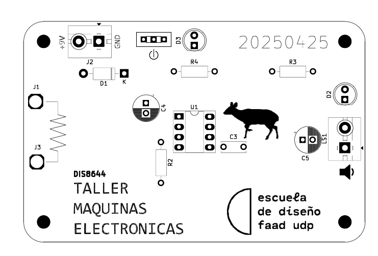

# sesion-10b
##  16-05-2025
###  Circuit bending

(circuit bender) Doblar, customización creativa de dispositivos electrónicos, suele ser para juegos para niños. Tienden a ser robustos y a resistir la destrucción controlada.

###  Nic Collins (circuit bending)

**1  Nicolas Collins performs Christian Marclay's "Sixty-four Bells and a Bow" (2009)**

<https://www.youtube.com/watch?v=Lhs25l8l4yw>

**2  Canal: siliconluthier**

<https://www.youtube.com/@siliconluthier>

**3  Hack of the Month Club -- Project #3: Jumping Speakers**

<https://www.youtube.com/watch?v=6ZxxuDNQuMQ>

**4  speak and spell circuit bending**

<https://youtu.be/Y-M9mXLl9gM?si=XZLm_hF8-91JmpP_>

Cuidado con capacitores, "todo funciona con una batería de 9V".

*  **Libro: The art of handmade electronics - music Nicolas Collins (2006 primera edición)(2020 tercera edición).**

<https://www.nicolascollins.com/handmade.htm>

## udpudu 20250425 - DIS8644

.jpg)
.jpg)

-  Exportar vectores
-  Extraer BOM (bill of materials, lo que hay que comprar para soldarlo)
  Botón : .bom > output file > export > texto (.csv) a excel (o google docs), arreglar excel de entrada > datos > de texto a columnas (agarra las comas y reparte en las columnas siguientees)> 'next' > 'comma' (en **google docs** import file file, import > localtion separation)> se rellena con detalles menos técnicos> se puede exportar en .xsl y .csv entre otros.

*  El .csv se puede abrir con el bloc de notas. Se selecciona el texto del bloc de notas o se importa el archivo directo a google docs.

*  .csv comma separated values, sirve para excel

*  **CSV A MARKDOWN:**  <https://www.convertcsv.com/csv-to-markdown.htm>

**BOM UDPUDU**

|Reference   |Value   |Footprint                |Qty|OBS               |
|------------|--------|-------------------------|---|------------------|
|C3          |100n    |Condensador cerámico     |1  |104               |
|C4          |1u      |Condensador electrolítico|1  |                  |
|C5          |47u     |Condensador electrolítico|1  |                  |
|D1          |1n4007  |Diodo                    |1  |                  |
|D2,D3       |LED     |Led 5mm                  |2  |                  |
|J1,J3       |CAIMAN  |                         |2  |                  |
|J2          |TBLOCK_2|Terminal block 2         |1  |                  |
|LS1         |SPK     |Terminal block 2         |1  |                  |
|R2,R3,R4    |1k      |Resistencias             |3  |                  |
|SW1         |SW_SPDT |Switch spdt              |1  |                  |
|U1          |~       |Socket 8 pines DIP-8     |1  |va en el socket U1|
|Clip batería|9v      |                         |   |                  |
|Parlante    |8ohm    |                         |   |                  |

html, css: Cascading Style Sheets (para editar páginas web).

## encargo-22: documentación textual del proceso de ensamblado de udpudu
Escribir manual con pasos a seguir, receta, de los pasos que siguieron para ensamblar la PCB. Incluir aciertos y errores, aprendizajes y consejos.

## encargo-23: documentación visual del proceso de ensamblado de udpudu
Complementar encargo 22 con fotos explicativas de los materiales usados, de los pasos, etc.

###  Ensamblaje de PCB mediante soldadura de estaño udpudu

**Materiales:** Cautín, estaño, esponja o paño húmedo, alicate de corte, la placa de circuito impreso y sus componentes indicados en el BOM (condensador cerámico, condensadores electrolíticos, diodo, led, caimanes, terminal block, speaker, reistencias, switch spdt, socket de 8 pines y chip 555).

-  Siempre hay que considerar de que al momento de mandar a imprimir la PCB, esté funcionando de manera correcta con una protoboard, que el esquema y las huellas sean correctos, también que los archivos que exportamos para la impresión esten bien. También verificar que nuestros materiales estén en correcto funcionamiento ya que de no ser así es complicado desoldar nuestra PCB, por lo que o podemos utilizar la protoboard para verificar si todo esta "ok" o sino utilizar un multímetro revisando la continuidad de los componentes y si sus valores son los indicados en el BOM.

-  Para emsamblar la PCB necesitamos un BOM (bill of materials) que nos indicará -según la serigrafía impresa en la placa- que elemento cumple que rol en cual ranura específica de la placa a modo de que el input pueda realizarse satisfactoriamente y así llegar al output en nuestra "caja negra".

(Ver el BOM más arriba)

-  Conociendo la cantidad de resistencias, switchs, sockets, speakers, diodos, leds, condensadores, el socket de 8 pines para nuestro chip 555 y sus especificaciones respectivamente (faradios y ohms) o su polaridad (para condensadores) mas la fuente de poder (batería de 9V) procedemos a realizar el ensamblaje.

-  Posicionamos la PCB en un lugar estable en el que sepamos que se mantenga sujeto, también podemos utilizar masking tape para sellarlo.

-  Conectamos a corriente el cautín esperando que se caliente lo suficiente para así limpiar los restos y suciedad con el paño húmedo o esponja respectivamente.

-  Seleccionamos algún componente con el que queramos empezar y lo colocamos en los orificios de la PCB, por ejemplo: una resistencia.

-  Agarramos el estaño con una mano y con la otra mano el cautín.

-  Posicionamos el estaño cerca del cautín y lo calentamos un poco para que mantenga la temperatura y sea más fácil derretirlo.

-  Colocamos el cautín encima de la resistencia calentándola para que no rechaze el estaño un par de segundos.

-  Luego colocamos el estaño y el cautín encima esperando que el estaño pueda derretirse y tomar la forma del orificio, esto lo hacemos por unos 3 segundos aproximadamente.

-  De ser exitoso, la resistencia debería mantenerse firme de un lado, realizamos los mismos procedimientos para el otro orificio sin antes limpiar el cautín con el paño húmedo para que se agilice el derretimiento del estaño y no se quemen los componentes.

Por lo tanto el ciclo que se repite sería: Limpiar el cautín con un paño o esponja > calentar el estaño un par de segundos > calentar el componente o pin un par de segundos > calentar el estaño hasta que se derrita encima del orificio donde entra el componente (3 segundos) > retirar.

*  Observaciones:
-  No excederse con el cautín pues puede quemar la PCB, los componentes o dejar inutilizable el módulo.
-  Tampoco excederse con el estaño ya que puede provocar una obstrucción en el circuito.
