# sesion-12b
Arte de internet

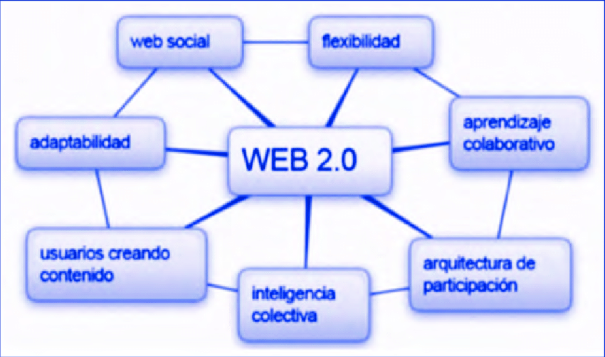

*  Web 1.0 pre 2000,
*  Web 2.0 web social. Navegación de internet, interfaz de usuario.

Diferencia :interactividad y el papel de los usuarios.

1.  Web 1.0 como fuente de información estática
2.  Web 2.0 permite a los usuarios interactuar, crear contenido y colaborar en línea.

**World wide web** :  Sistema de páginas web públicas interconectadas que se pueden acceder a través de Internet.

**RSS feed** (really simple syndication) archivo XML que contiene información de los contenidos de un sitio web, como un blog o un podcast.

net art "el arte ocurre en el medio de entre dos computadores". Internet como plataforma de creación, exhibición y relación.

http://art.teleportacia.org/olla/summer

Summer - Olia Lialina (Rusia) cada frame de la animación está guardada en un sitio distinto. Se columpia entre los links.

Adobe Flash Player.

Obsolete[s] -  Christian Oyarzún

-  drumCircle[] LA Los Ángeles (2017)
-  error404 >  drumCircleLA
-  Servomotor + 4017
-  Código abierto js
-  posternurarecords

Artistas programadores, y gente dedicada a la tecnología. v2021 (en febrero). Chile.

Sean Moscoso compositor percusionista

**Sonic PI**, software de música con código, basado en Ruby. sound of code.

Algorave (rave de algoritmo).

-  **livecoding** Se crea código en tiempo real para medios artísticos.

sample, música concreta (1950) grabaciones y recortes en cinta para reproducirlos.

MIDI :  midi es información no suena, asociación de un número binario, que se mapea internamente.

General MIDI Showdown. General MIDI instrumento virtual.

VST: Virtual Studio Techonlogy. Software que interpreta MIDI y lo convierte en sonido.

Ejemplo de esto :  **Traktor, Arturia Pigments.**

-  TidalCycles.
>  TidalCycles es un entorno live coding diseñado para la improvisación y composición musical. En particular, es un lenguaje específico del dominio incrustado en el lenguaje Haskell. TidalCycles esta centrado en la generación y manipulación de patrones audibles o visuales.​​​
Fuente: Wikipedia.

-  noisk8 (Colombia) https://noisk8.github.io/noisk8/

-  Foxdot, livecoding con python. https://foxdot.org/

-  **Primavera Hacker. 2015 - 2017** - Christian Oyarzún. Daniel Tirado.

-  Francisca Bon.

-  Lógica del diseño tecnológico orientado a startups.

Contexto: Cornershop en la época de la venta de aplicaciones, se intentaban vender productos tecnológicos.

-  Internet tecnologías mediante los afectos. Hackeo a la tarjeta BIP!

-  ONG seguridad digital. Falla en tarjeta BIP! tarjetabip.cl seguimiento.

>  Documental Joshua Teenager vs. Superpower (2017)

Face Recognition Jammer.

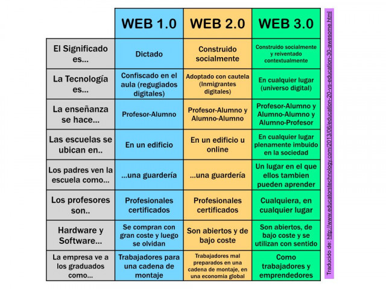

Fuente:  https://www.ceupe.com/blog/que-es-la-web-3-0.html

-  Web 3.0. Descentralización y apertura, y utilizando tecnologías como blockchain para mayor seguridad y transparencia.

-  Webring, anillo web. Anillo de página anterior y después recorrido circular a través de internet.

>  Twitter and tear gas. Libro, primavera árabe. Zeyner Tufekci. The power and fragility of networked protest.

-  Ley Reglamentación General de Protección de Datos (RGPD).

>  Chino/estadounidense. Weiweicam. Transmite 24/7 todo lo que hacía. (Abril 3 de 2012).

>  Wafaa Bilai Irak. Acceso a internet a una pintura de paintball. Domestic Tension.

-  Diseño especulativo.

>  El diseño especulativo es un enfoque creativo y prospectivo que explora futuros posibles en lugar de enfocarse en soluciones inmediatas. Es una herramienta para cuestionar el presente, generar nuevas perspectivas y provocar reflexiones sobre el impacto de las tecnologías y las tendencias en la sociedad.

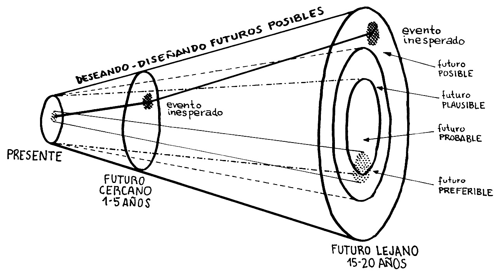

Se compara los futuros posibles entre lo que se espera, y lo que escapa a nuestras predicciones como diseñadores en una proyección entre años. Varían nuestras preferencias en función de la especulatividad.

Marshall McLuhan el contenido de un medio es tan importante como el mensaje que transimitió la bomba atómica.

-  Encargo: 3 ideas de proyecto de diseño con cierta descripción, textual, con un diagrama especulativo.

Ideas de máquinas desde afuera. Sin detalles tan específicos.

###  FUENTE DE PODER: ¿Cuáles conocemos?

Baterías, 9V. Cara contaminante, útil

**Eliminador de pila**

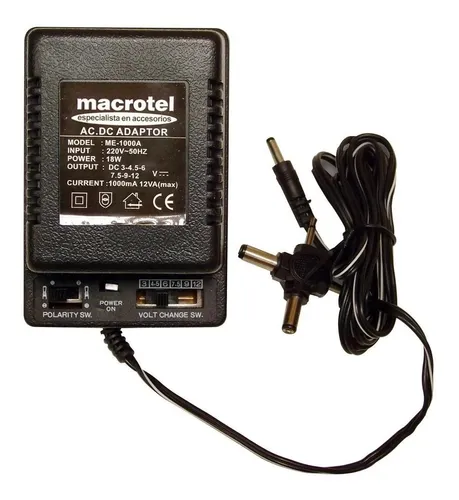

Fuente de poder AC-DC, polaridad.

1.  Voltaje hay de 4,5; 5, 7, 9, 12, 15, 18, 25, VDC, etc. Son DC, voltaje de tipo directo.
2.  Polaridad. Leyenda de polaridad. Polarity Symbol >  IEC 60417
Estándares (que no son tan estándar). Se arregla con diodos (-)__(O)___(+) (+)__(O)__(-)

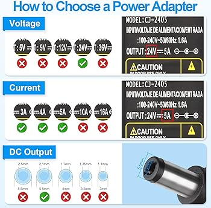

Jack DC centro 2.1 o 2.5.

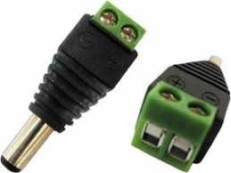

###  **Corriente:** El voltaje se entrega la corriente se pide. El aparato requiere la disposición.

**¡¡Siempre usar una fuente de poder mayor al que se debe utilizar!!.**

El voltaje si tiene que ser igual a la que se utilice.

Ejemplo 5V, 3 Ap, para un Motor.

4.  Dimensiones físicas del conector.
-  Jack de 2.1 Hasta 16VCC y 16 Amperes, un computador pide más que eso, puede ser peligroso.
-  Corriente máxima.

>  La corriente máxima es la máxima intensidad de corriente que puede establecerse de manera constante por un conductor sin sobrepasar los límites de temperatura que afecten las características físicas y eléctricas del mismo. (Wikipedia).

-  Multivoltaje.
Ejemplos:

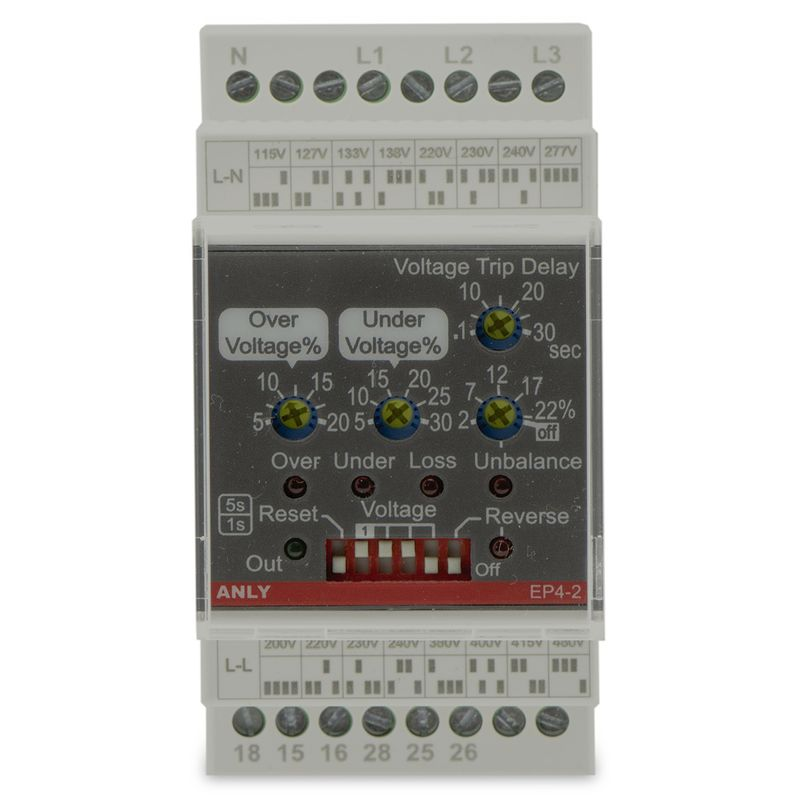

1.  Relé multivoltaje.

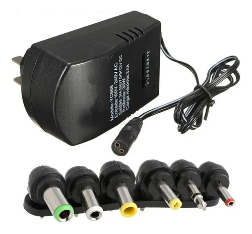

2.  Transformador multivoltaje.

-  Fuente de poder 100-250 multi volt.
-  Enchufe simétrico, enchufe USA spin. Un transformador (adaptador) cambia la forma geométrica de esto. Es peligroso puede provocar ruidos no esperados, se puede llegar a quemar.

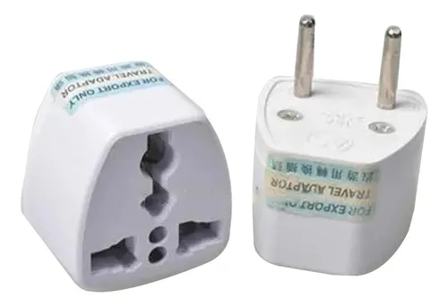

-  ACDC sinusoidal Forma de onda más común en sistemas eléctricos, importante para el rendimiento de dispositivos electrónicos y motores.

-  VAC Hervidores secadores de pelo, calientan una resistencia. Voltaje de corriente alterna.

Powerbank, USB-A o USB-B (impresora) USB-C (complicado, tiene chips, handshake USB-C (USB PD dan mucho poder, pero al revés no, permite que se cargue rápido pero se puede romper).

Sticker SEC, certificación código en Chile, certifica productos electrónicos.

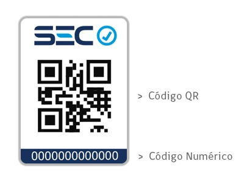

Pantallas solares.

>  @gijsgieskes (en instagram)

-  Máquinas con luz solar.

-  ICE. Es un dispositivo que convierte la electricidad de corriente continua (CC), generada por un panel solar, en corriente alterna (CA), utilizada por la red eléctrica . En la CC, la electricidad se mantiene a un voltaje constante en una dirección.

Mini panel solar. 5V

Pantalla solar 12V. Para cargar baterías de litio requiere utilizar un aparato llamado BMS.

-  BMS. BMS son las siglas en inglés de Battery Management System, por lo que BMS batería significa sistema de gestión de acumuladores. Gracias a estos módulos de control BMS batería es posible prolongar la vida útil del acumulador y proteger el kit solar de autoconsumo fotovoltaico.

Impresora 3D en discord (máquinas). Imprime de hasta 4 colores.

Pilas 1.5 V.

Pilas de reloj. 2032, entrega 3V.

cr2032 socket. La pila CR2032 es una pila de botón de litio de 3 voltios.

>  Tristan Perich.

###  **Iluminación**  (Luces) Sabemos usar LED's, los leds se queman, se necesita usar una resistencia, son útiles para saber si algo está funcionando EN PARALELO, mas no en serie.

-  Ampolleta doméstica 220V (usar con relés)
Relé puede permitir que mediante señal de control controlemos el paso de la corriente por un cable que lleva energía a una ampolleta doméstica.

-Leds de alta potencia. Suelen usarse en bicicletas. de 3 watts o 5 watts. Requieren resistencias de alta potencia.

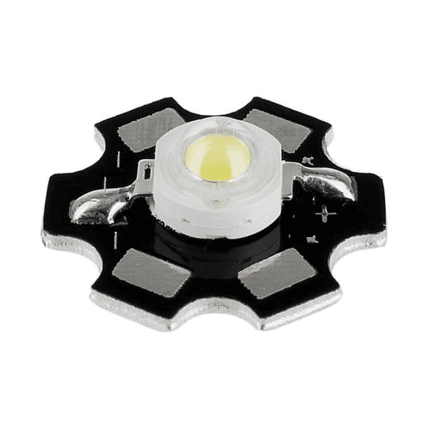

Nota:  Los leds pequeños que utilizamos son 1/4 de watt.

Resistencia de 10 W. Resistencia cerámica.

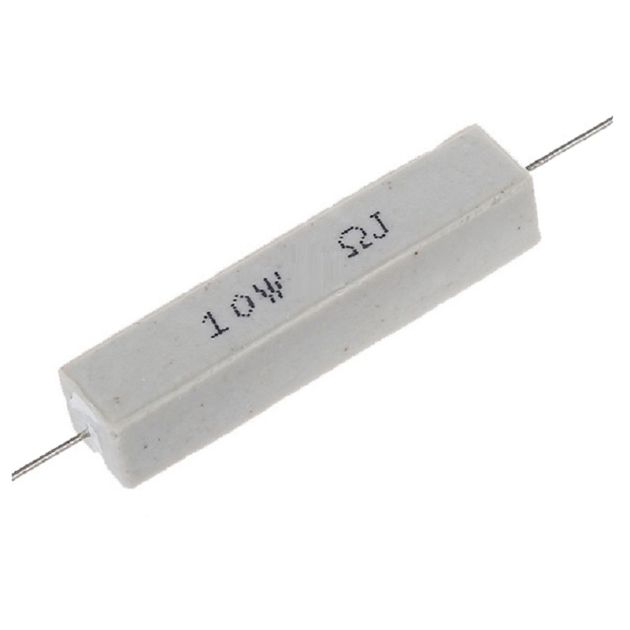

Resistencia 50w. Industriales. Resiste muchísimo. De quemarse estalla en llamas.

-  Luces gamer, tiras led. Son muchos led en fila y suele ser de alta potencia.
-  **Led strip PWM**, se controla mediante pwm y transistor acorde. Triángulos, hexágonos (tiras leds). Cintas led neón, cinta led con un difusor de luz adelante.

Las cintas led se pueden recortar pero depende de la cinta misma, si necesita 1amp se necesita más amp de lo que se indica. Sus características eléctricas se determinan por sus metros.

-  Tira led neopixel. Tira led programable.
-  Muy probablemente lleve varios transistores.

>  Andrea Josch  - Directora de la Escuela de Arte UDP.

###  **Motores** con pwm, transistores. Potencia > pesado eléctricamente, luz, sonido y movimiento para todo eso aparecen transistores, dicen qué y se hace. 555 director de orquesta, transistor músico.

-  Muy probablemente lleve varios transistores.
-  Motores de 5V, 6V. Si le llega electricidad gira, se aplica en juguetes, ruedas, ventiladores, vibradores.
-  Motores DC, motorreductor reduce revoluciones y aumenta la fuerza, se reduce la velocidad pero aumenta el torque.
-  Conservación del momento angular.

>  Machine with artichoke Petal  -  Arthur Ganson.
>  Faster!  -  Arthur Ganson.

Motorreductores cambian su velocidad de giro por principio de conservación por movimiento angulo ejemplo Arthur Ganson.

Secuencias de luces que varían con colores.

>  Lorre mill

>  Afel.cl -  Tienda de Componentes.

**3 tipos de motores:**

- Motor DC. Principio de operación.
- Motor Stepper. Motor paso a paso. Cada vez que empieza un ciclo avanza un poco. Es mucho más lento y preciso, se utiliza para presición. Se utiliza más la impresiona 3D para los carriles. Funciona a partir de ciertos impulsos eléctricos que activan ciertas funciones del motor.

>  555 timer stepper motor driver - Thomas Kim (youtube). https://www.youtube.com/watch?v=Vc2XRVJ9n1o

- Secuencia, 555 4017 transitores.

- Switch final de carrera. Te avisa cuando llega al final, a través de un microcontrolador dice al motor que no tiene que seguir avanzando.
- 2 tipos de motores stepper.

- UNIPOLARES.
- BIPOLARES (impresoras 3D).

- Los motores unipolares tienen un punto central en cada bobina, lo que permite una operación más simple con solo dos cables por fase.
- Los motores bipolares, no tienen este punto central, lo que requiere un control más complejo para invertir la corriente en las bobinas, pero ofrece una mayor eficiencia y potencia.

Motor Driver Board  ULN2003 (28BYJ-48) (afel.cl)

**Servomotor**, motor DC con muchos engranes, sabe dónde está. Se suele utilizar con arduino, sabe dónde está es preciso y puede ser rápido (a veces inestable).

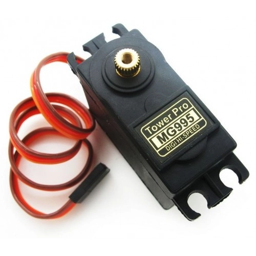

- **Puente H** Permite invertir polaridad de tensión aplicada a una carga. Permite a un Motor DC girar en ambos sentidos. Configuración electrónica de transistores, prende dos switchs al mismo tiempo de positivo a negativo, de negativo a positivo. Se puede hacer a mano o se puede comprar un chip L298N. Permite cambiar la dirección de un motor DC. Se genera con cuatro switches o cuatro transistores o con un circuito intregrado L298N.

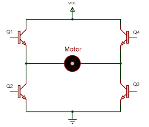

Calor es pérdida, si los materiales se calientan conducen peor.

###  **Solenoides** 

-  Si una bobina se conecta genera un campo magnético a través de sus conductores. Cualquier corriente alrededor genera un campo magnético. Ley de Henry - Faraday. Ejemplo de esto es el **speaker**.

La ley de Faraday-Henry es un principio fundamental de la física que describe cómo la inducción electromagnética genera una corriente eléctrica en un circuito al variar el flujo magnético que lo atraviesa. Establece que la fuerza electromotriz (FEM) inducida en un circuito cerrado es directamente proporcional a la tasa de cambio del flujo magnético que atraviesa ese circuito.

>  Single coil guitar pickup. Guitarra magnética. Usual en el grunge.

Niquel, cobre, fierro.

comercialph.cl/ rollos de alambre. Alambre de cobre esmaltado.

>  Javier bustos. Lutheria experimental. Miniatura para miniatura electromagnética.

Electroválvula de lavadora. Funciona similar al relé.

Solenoide, se le inyecta voltaje y genera movimiento.

Solenoide se suele ocupar en música.

>  Koma solenoid.

Movimiento solenoide tiene mucho que ver con el MIDI.

>  Polyend Perc - The First Drumming Machine in the World (youtube) PERC. https://www.youtube.com/watch?v=tOXJWcyupvA
>  Polyend Perc -  drumming machine. https://www.youtube.com/watch?v=9TdqvEHeatM
>  Polyend Perc Pro.

Solenoide por principio electromagnético, genera movimiento lineal, se usa para percusiones electromagnéticas, en puertas electrónicas (chapas).

-  Valvula Solenoide 12V. 1/2 N/C.

Bomba de agua, motores.

###  **Transistores** BIPOLARES y FET

Se utiliza como amplificador, como switch, como inversor o como compuerta lógica (apaga en vez de prender por ejemplo).

bipolar 2n2222

fet     IRF244

-  Ejemplo  :  Puerta Not

###  **Sonido**  

Pueden ser **SMD.** Dispositivos de montaje superficial.

-  **Parlantes acivos y pasivos.** Activos se enchufan, Pasivos no. Ya que requieren amplificación externa. ¿Qué tan fuerte suena un parlante? Su intensidad sonora depende de su tamaño (en pulgadas, de su potencia (en watts), en su imperancia (en ohm). El parlante es lo que sale.
-  Un parlate es igual a un solenoide, solo que tiene otra aplicación.
-  **Buzzers.** Parlantes muy básicos, principalmente utilizados como señal de alarma o aviso. Puede sonar muy fuerte.

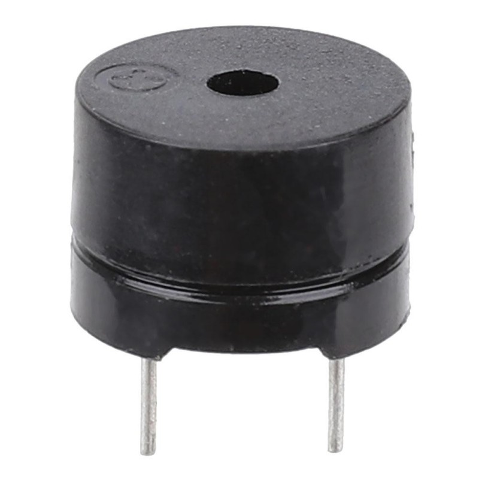

-  Reproductor de audio. Convierte datos digitales en electricidad sonora.
>  Módulo reproductor MP3 (afel.cl). Con lector SD.
-  **Micrófonos.** Dispositivo transductor, captan sonido, el micrófono tiene imanes. Convierte energía acústica en energía eléctrica.  El micrófono es que lo que entra.
> Electrel. Micrófono popular. La señal suele ser débil, hay que acompañarlos de un amplificador. La grabación suena distinta en teléfono porque es una aproximación de la energía acústica.
-  **Piezoeléctrico.** Convierte movimiento en electricidad, un principio del material cerámico, cristal.

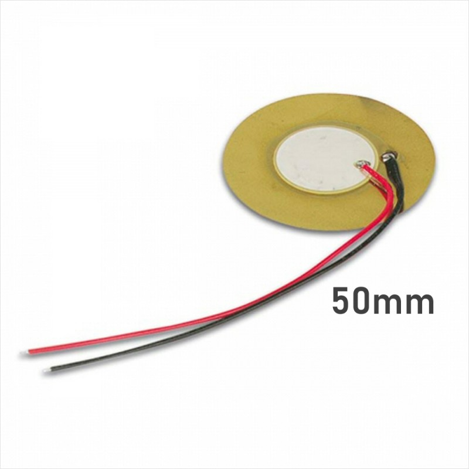
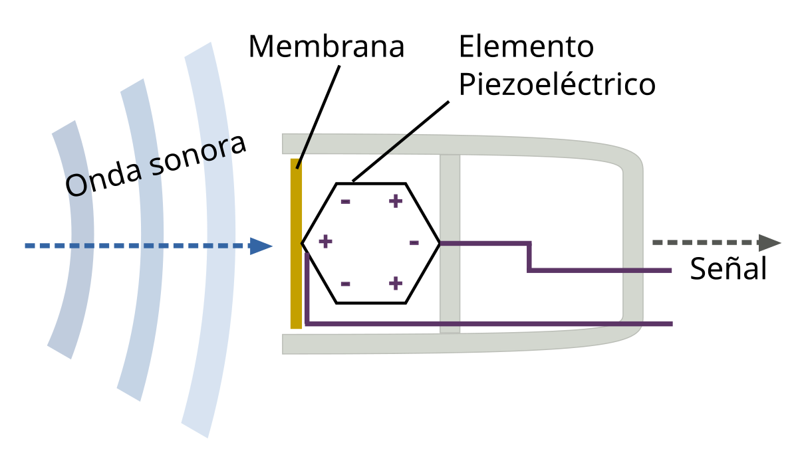

> EF105 Drum Thing -  Perfect Circuit (youtube). V2 Electronic percussion instrument.
>  Artist Transducter Acoustic Pickups.
> perfectcircuit.com
> LAKTIK / AYAYAY / CESAR BERNAL/ DÚO TECER TIEMPO.
> Mónica Bate.
> Tetrax Organ Wooden Analog.

**Investigar: Logic noise HACKADAY. Curso introductorio.**

> Erica Synths Mortis -  Miki x es EDU DIY System Version.
> Pedales de guitarra. tonepad.com
> Gran Mango 3.1416.
> Big muff pit. EHX Big Muff Pi Fuzz (youtube).
###  Repaso
1-Resistencias
2-Condensadores (cerámicos y electrolíticos)
3-Inductores (pronto)
4-CHIPS 555, 4017
5-LM324 como amplificador
6-OP - AM como comparador.

Tener componentes de respaldo, opciones paralelas.

###  Referencias en (proyectos):
Enlaces de proyectos:
>  www.kickstarter.com
> hackaday.io
> adafruit.com (guías)
> crowdsuply

Tienda de referencia:
>  **Etsy:** se pueden comprar objetos propios de una oficina de sonido. Buscar "synth".

## encargo-30

-  Describir 3 proyectos que quieran hacer de forma individual, ordenar por preferencia o interés. 

## encargo-31

-  Dibujar diagrama de comportamiento. No especificar chips. Considerar procesos, de manera especulativa. ¿Cuánto tiempo se usará? ¿Qué encendidos y apagados tiene? ¿Cómo se interactúa?

##  Propuestas
1.  **CAJA NEGRA.**

Caja sensible a estímulos que reproduce sonido y luces (leds en serie). Input detectar sombras output emitir luz.

2.  **INSTRUMENTO EXPERIMENTAL.**

Serie de motores amarrados a instrumentos experimentales que dependen de fotorresistencias en sus oscilaciones. Por lo tanto cualquier cosa puede resultar un instrumento y además la fotorresistencia determina la velocidad de oscilación, similar a un Theremin. Input detectar sombras, output motor encendido, genera movimiento de elementos experimentales.

3.  **MOTOR DE RESISTENCIAS.** (piano)

Dos botones (hacia la izquierda y hacia la derecha)  determinan la posición de un motor el cual conecta un circuito alterno a una serie de resistencias que a su vez reproducen sonido mediante un speaker. Input botones pulsadores. Output motor llega a lugar indicado, output resistencia termina circuito cerrado y emite sonido.

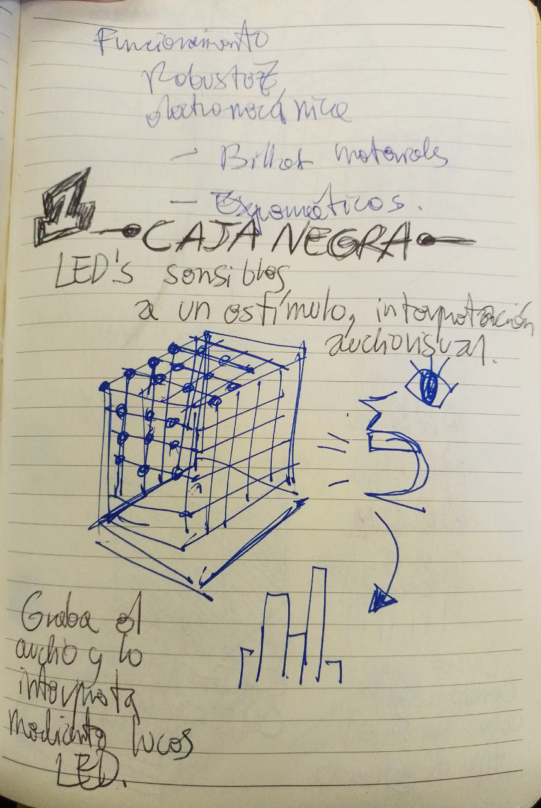

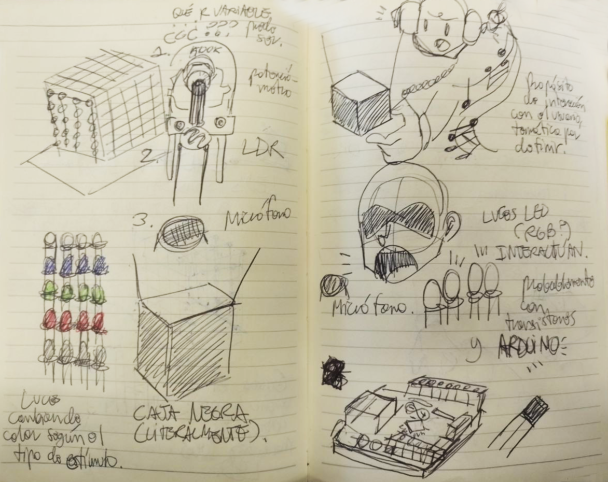

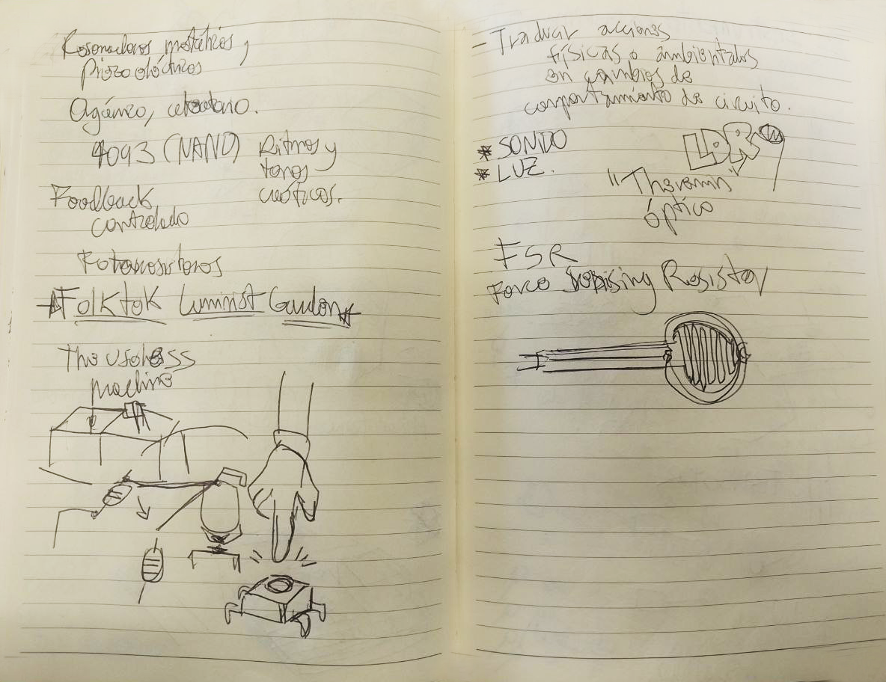

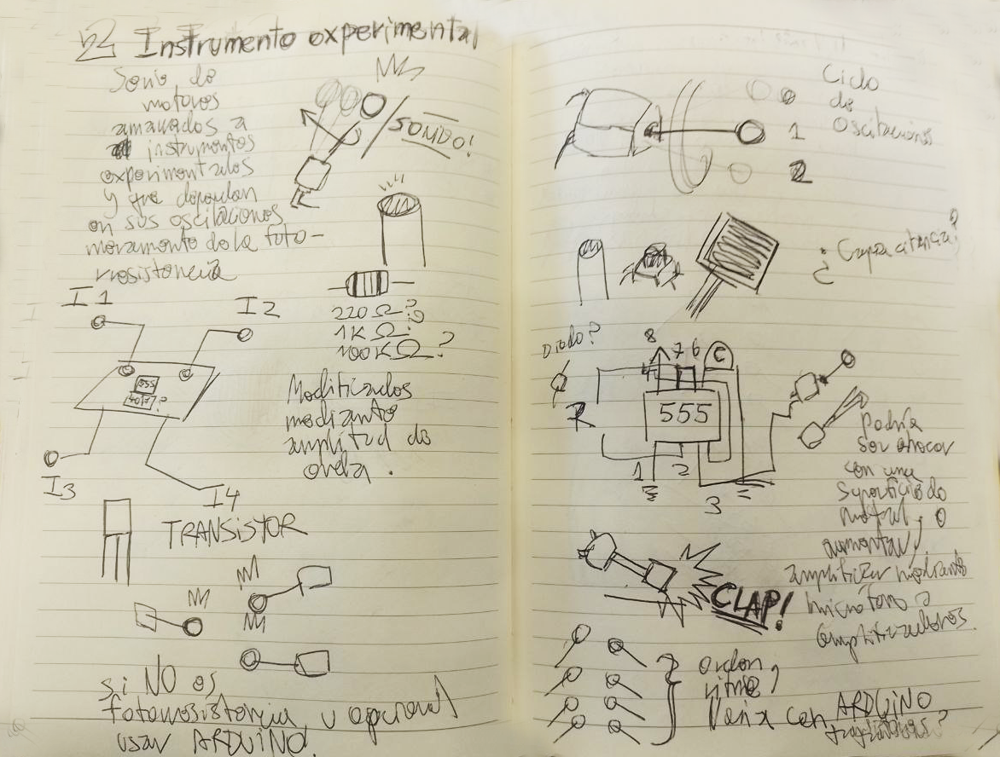

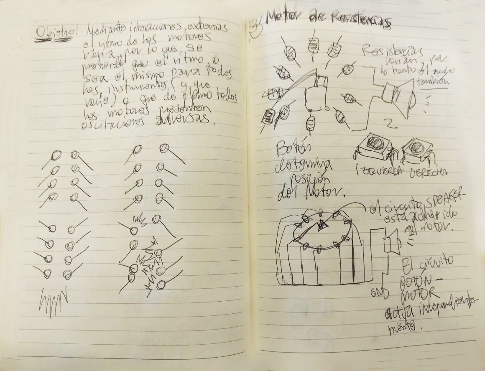

¡No subir muchos videos a github porque sobrecarga el repositorio de github! Opciones: youtube.
